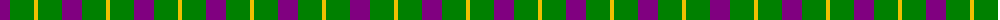
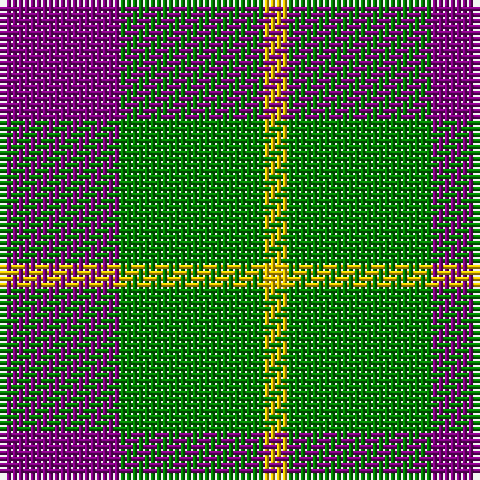

In pattern [BGY](/patterns/bgy/).

This was sourced from weddslist.  It is a [3 stripes tartan](/stripes/stripes3/).

Original link http://www.weddslist.com/cgi-bin/tartans/pg.pl?source=sts

## Thread count
P/20 G24 Y/4

## Palette
Each colour and its ΔE from the base-6 reference it is a variant of.

| Colour | Shade | Base | ΔE (OKLab) |
|---|---|---|---|
| G | <code style="background-color:#008000;">#008000</code> `#008000` | G <code style="background-color:#006100;">#006100</code> | 0.10 |
| P | <code style="background-color:#800080;">#800080</code> `#800080` | B <code style="background-color:#2A418A;">#2A418A</code> | 0.17 |
| Y | <code style="background-color:#F0C000;">#F0C000</code> `#F0C000` | Y <code style="background-color:#F2BF00;">#F2BF00</code> | 0.00 |

# Sample pattern

## Nearest tartans

The nearest existing variants by ΔTartan distance.

1. [Wilson's, No 55](/setts/s3/g24b20ba4-b800080-ba5480b0-g008000/) — ΔT 0.67
1. [Wilson's, No 201](/setts/s3/b8g16y4-b800080-g008000-yf0c000/) — ΔT 1.28
1. [Wilson's No.201](/setts/s3/b8g16y4-b440044-g006818-ye8c000/) — ΔT 1.33
1. [Wilson's No.055](/setts/s3/g24b20ba4-b440044-ba5c8ca8-g006818/) — ΔT 1.43
1. [Dunoon Irish](/setts/s4/w12g78r78w12-g003820-rb84c00-wfcfcfc/) — ΔT 1.51
1. [MacNab 7](/setts/s4/g30r6b22ba4-b800080-ba5480b0-g008000-rc00000/) — ΔT 1.52
1. [Harbison (2015)](/setts/s4/b42g68r28w12-b2c2c80-g006818-rc80000-wfcfcfc/) — ΔT 1.53
1. [Jahore](/setts/s5/b40k10b36y52k12-b304080-k000000-yf0c000/) — ΔT 1.55
1. [Delroeux (Personal)](/setts/s4/b30g60y10r30-b2c2c80-g006818-rc80000-yfccc00/) — ΔT 1.56
1. [Delroeux, John Michael (Personal)](/setts/s4/b30g60y10r30-b0000cd-g125d24-rff0000-yffe600/) — ΔT 1.57

## Neighbour map

Every grey dot is one of 15726 variants placed by the first two principal components of the ΔTartan feature space (44% of its variance). Red is this tartan; blue dots are its nearest — click one to open its page.

<svg viewBox="0 0 640 380" role="img" style="max-width:100%;height:auto;border:1px solid #e0e0e0;border-radius:4px;display:block" xmlns="http://www.w3.org/2000/svg"><image href="/nn/cloud.v1.png" width="640" height="380"/><a href="/setts/s3/g24b20ba4-b800080-ba5480b0-g008000/"><circle cx="274.6" cy="304.3" r="4" fill="#3465a4"><title>Wilson's, No 55</title></circle></a><a href="/setts/s3/b8g16y4-b800080-g008000-yf0c000/"><circle cx="263.4" cy="312.0" r="4" fill="#3465a4"><title>Wilson's, No 201</title></circle></a><a href="/setts/s3/b8g16y4-b440044-g006818-ye8c000/"><circle cx="266.3" cy="317.7" r="4" fill="#3465a4"><title>Wilson's No.201</title></circle></a><a href="/setts/s3/g24b20ba4-b440044-ba5c8ca8-g006818/"><circle cx="290.1" cy="317.0" r="4" fill="#3465a4"><title>Wilson's No.055</title></circle></a><a href="/setts/s4/w12g78r78w12-g003820-rb84c00-wfcfcfc/"><circle cx="233.9" cy="251.6" r="4" fill="#3465a4"><title>Dunoon Irish</title></circle></a><a href="/setts/s4/g30r6b22ba4-b800080-ba5480b0-g008000-rc00000/"><circle cx="251.6" cy="248.0" r="4" fill="#3465a4"><title>MacNab 7</title></circle></a><a href="/setts/s4/b42g68r28w12-b2c2c80-g006818-rc80000-wfcfcfc/"><circle cx="177.9" cy="268.2" r="4" fill="#3465a4"><title>Harbison (2015)</title></circle></a><a href="/setts/s5/b40k10b36y52k12-b304080-k000000-yf0c000/"><circle cx="206.7" cy="267.4" r="4" fill="#3465a4"><title>Jahore</title></circle></a><a href="/setts/s4/b30g60y10r30-b2c2c80-g006818-rc80000-yfccc00/"><circle cx="194.5" cy="269.1" r="4" fill="#3465a4"><title>Delroeux (Personal)</title></circle></a><a href="/setts/s4/b30g60y10r30-b0000cd-g125d24-rff0000-yffe600/"><circle cx="170.5" cy="258.1" r="4" fill="#3465a4"><title>Delroeux, John Michael (Personal)</title></circle></a><circle cx="261.0" cy="296.2" r="5" fill="#c00000"/></svg>

ID: /setts/s3/b20g24y4-b800080-g008000-yf0c000/
