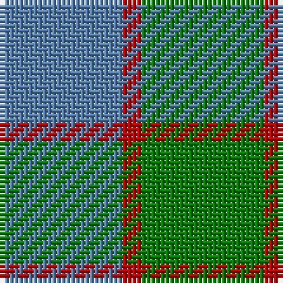

In pattern [BRG](/patterns/brg/).

This was sourced from weddslist.  It is a [3 stripes tartan](/stripes/stripes3/).

Original link http://www.weddslist.com/cgi-bin/tartans/pg.pl?source=sts

## Thread count
B/26 R4 G/26

## Palette
Each colour and its ΔE from the base-6 reference it is a variant of.

| Colour | Shade | Base | ΔE (OKLab) |
|---|---|---|---|
| B | <code style="background-color:#5480B0;">#5480B0</code> `#5480B0` | B <code style="background-color:#2C4084;">#2C4084</code> | 0.20 |
| G | <code style="background-color:#008000;">#008000</code> `#008000` | G <code style="background-color:#006400;">#006400</code> | 0.09 |
| R | <code style="background-color:#C00000;">#C00000</code> `#C00000` | R <code style="background-color:#C80000;">#C80000</code> | 0.02 |

# Sample pattern

## Nearest tartans

The nearest existing variants by ΔTartan distance.

1. [Wilson's No 62, (Ferguson)](/setts/s3/b26r4g26-b304080-g008000-rc00000/) — ΔT 1.23
1. [Wilson's No 84, Ferguson](/setts/s3/b20g24r4-b304080-g008000-rc00000/) — ΔT 1.23
1. [Wilson's No.161](/setts/s4/b26r4g26r4-b5c8ca8-g006818-rc80000/) — ΔT 1.23
1. [Ferguson, (Old)](/setts/s3/g34r4b30-b304080-g008000-rc00000/) — ΔT 1.25
1. [Ferguson](/setts/s3/b24g20r4-b304080-g008000-rc00000/) — ΔT 1.40
1. [Ferguson - 1930 (Old)](/setts/s3/g34r4b30-b2c2c80-g006818-rc80000/) — ΔT 1.70
1. [Unidentified 10](/setts/s4/g28r6b18ba4-b304080-ba5480b0-g008000-rc00000/) — ΔT 1.75
1. [Agnew](/setts/s3/b53g42r14-b304080-g008000-rc00000/) — ΔT 1.85
1. [Ferguson (Old)](/setts/s3/g34r4b30-b2c4084-g005020-rdc0000/) — ΔT 1.86
1. [Ferguson](/setts/s3/b24g20r4-b2c4084-g005020-rdc0000/) — ΔT 1.87

## Neighbour map

Every grey dot is one of 15726 variants placed by the first two principal components of the ΔTartan feature space (44% of its variance). Red is this tartan; blue dots are its nearest — click one to open its page.

<svg viewBox="0 0 640 380" role="img" style="max-width:100%;height:auto;border:1px solid #e0e0e0;border-radius:4px;display:block" xmlns="http://www.w3.org/2000/svg"><image href="/nn/cloud.v1.png" width="640" height="380"/><a href="/setts/s3/b26r4g26-b304080-g008000-rc00000/"><circle cx="288.3" cy="317.1" r="4" fill="#3465a4"><title>Wilson's No 62, (Ferguson)</title></circle></a><a href="/setts/s3/b20g24r4-b304080-g008000-rc00000/"><circle cx="291.6" cy="320.7" r="4" fill="#3465a4"><title>Wilson's No 84, Ferguson</title></circle></a><a href="/setts/s4/b26r4g26r4-b5c8ca8-g006818-rc80000/"><circle cx="288.8" cy="286.5" r="4" fill="#3465a4"><title>Wilson's No.161</title></circle></a><a href="/setts/s3/g34r4b30-b304080-g008000-rc00000/"><circle cx="317.9" cy="305.6" r="4" fill="#3465a4"><title>Ferguson, (Old)</title></circle></a><a href="/setts/s3/b24g20r4-b304080-g008000-rc00000/"><circle cx="293.4" cy="320.7" r="4" fill="#3465a4"><title>Ferguson</title></circle></a><a href="/setts/s3/g34r4b30-b2c2c80-g006818-rc80000/"><circle cx="326.2" cy="309.2" r="4" fill="#3465a4"><title>Ferguson - 1930 (Old)</title></circle></a><a href="/setts/s4/g28r6b18ba4-b304080-ba5480b0-g008000-rc00000/"><circle cx="266.1" cy="267.9" r="4" fill="#3465a4"><title>Unidentified 10</title></circle></a><a href="/setts/s3/b53g42r14-b304080-g008000-rc00000/"><circle cx="248.6" cy="343.9" r="4" fill="#3465a4"><title>Agnew</title></circle></a><a href="/setts/s3/g34r4b30-b2c4084-g005020-rdc0000/"><circle cx="364.8" cy="327.5" r="4" fill="#3465a4"><title>Ferguson (Old)</title></circle></a><a href="/setts/s3/b24g20r4-b2c4084-g005020-rdc0000/"><circle cx="330.7" cy="338.1" r="4" fill="#3465a4"><title>Ferguson</title></circle></a><circle cx="308.2" cy="324.4" r="5" fill="#c00000"/></svg>

ID: /setts/s3/b26r4g26-b5480b0-g008000-rc00000/
