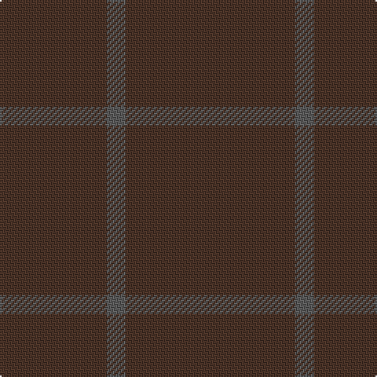

In pattern [BBB](/patterns/bbb/).

This was sourced from register-of-tartans.  It is a [3 stripes tartan](/stripes/stripes3/).

Original link https://www.tartanregister.gov.uk/tartanDetails.aspx?ref=11116

## Thread count
T/68 N12 T/108

## Palette
Each colour and its ΔE from the base-6 reference it is a variant of.

| Colour | Shade | Base | ΔE (OKLab) |
|---|---|---|---|
| N | <code style="background-color:#5C5C5C;">#5C5C5C</code> `#5C5C5C` | B <code style="background-color:#2A418A;">#2A418A</code> | 0.15 |
| T | <code style="background-color:#4C3428;">#4C3428</code> `#4C3428` | B <code style="background-color:#2A418A;">#2A418A</code> | 0.17 |

# Sample pattern

## Nearest tartans

The nearest existing variants by ΔTartan distance.

1. [Outlander #4](/setts/s2/g9b1x12~b5c5c5c-g604000/) — ΔT 2.04
1. [Hallstatt (Artefact)](/setts/s3/g16ga3g2x10~g604000-ga5c6428/) — ΔT 3.02
1. [Ben Dubh (The Black Mount)](/setts/s6/b4k2b16k2b16k1x4~b282828-k101010/) — ΔT 3.20
1. [Staines](/setts/s2/b12k1x10~b202060-k101010/) — ΔT 3.51
1. [Dunbar, John Telfer (Personal)](/setts/s7/b5k2b28k10b26k4b4x2~b441800-k101010/) — ΔT 3.56
1. [Hebridean Cairn Fashion Tartan Tartan Number: 6822. Earliest known date: 2005 For a new House of Edgar Collection in wedding gray. See products available Copyright © Blair Urquhart, Comrie, 2015](/setts/s8/b2g3b3g3b10g2b18g1x4~b484848-g6c6c6c/) — ΔT 4.06
1. [Hebridean Cairn (Fashion)](/setts/s8/b2r3b3r3b10r2b18r1x4~b5c5c5c-r888888/) — ΔT 4.64
1. [Young in Australia (Name)](/setts/s4/y81g6ya8g8x2~g00884c-ya08858-yabc8c00/) — ΔT 4.72
1. [Hebridean Cairn](/setts/s14/b18r2b10r3b3r3b2r3b3r3b10r2b18r1x4~b5c5c5c-r888888/) — ΔT 5.14
1. [Black Shadow (Fashion)](/setts/s2/k20b1x6~b244c74-k101010/) — ΔT 5.18

## Neighbour map

Every grey dot is one of 15726 variants placed by the first two principal components of the ΔTartan feature space (44% of its variance). Red is this tartan; blue dots are its nearest — click one to open its page.

<svg viewBox="0 0 640 380" role="img" style="max-width:100%;height:auto;border:1px solid #e0e0e0;border-radius:4px;display:block" xmlns="http://www.w3.org/2000/svg"><image href="/nn/cloud.v1.png" width="640" height="380"/><a href="/setts/s2/g9b1x12~b5c5c5c-g604000/"><circle cx="626.0" cy="366.0" r="4" fill="#3465a4"><title>Outlander #4</title></circle></a><a href="/setts/s3/g16ga3g2x10~g604000-ga5c6428/"><circle cx="626.0" cy="366.0" r="4" fill="#3465a4"><title>Hallstatt (Artefact)</title></circle></a><a href="/setts/s6/b4k2b16k2b16k1x4~b282828-k101010/"><circle cx="626.0" cy="366.0" r="4" fill="#3465a4"><title>Ben Dubh (The Black Mount)</title></circle></a><a href="/setts/s2/b12k1x10~b202060-k101010/"><circle cx="626.0" cy="366.0" r="4" fill="#3465a4"><title>Staines</title></circle></a><a href="/setts/s7/b5k2b28k10b26k4b4x2~b441800-k101010/"><circle cx="626.0" cy="335.8" r="4" fill="#3465a4"><title>Dunbar, John Telfer (Personal)</title></circle></a><a href="/setts/s8/b2g3b3g3b10g2b18g1x4~b484848-g6c6c6c/"><circle cx="626.0" cy="302.1" r="4" fill="#3465a4"><title>Hebridean Cairn Fashion Tartan Tartan Number: 6822. Earliest known date: 2005 For a new House of Edgar Collection in wedding gray. See products available Copyright © Blair Urquhart, Comrie, 2015</title></circle></a><a href="/setts/s8/b2r3b3r3b10r2b18r1x4~b5c5c5c-r888888/"><circle cx="626.0" cy="282.4" r="4" fill="#3465a4"><title>Hebridean Cairn (Fashion)</title></circle></a><a href="/setts/s4/y81g6ya8g8x2~g00884c-ya08858-yabc8c00/"><circle cx="626.0" cy="296.3" r="4" fill="#3465a4"><title>Young in Australia (Name)</title></circle></a><a href="/setts/s14/b18r2b10r3b3r3b2r3b3r3b10r2b18r1x4~b5c5c5c-r888888/"><circle cx="626.0" cy="263.6" r="4" fill="#3465a4"><title>Hebridean Cairn</title></circle></a><a href="/setts/s2/k20b1x6~b244c74-k101010/"><circle cx="626.0" cy="363.1" r="4" fill="#3465a4"><title>Black Shadow (Fashion)</title></circle></a><circle cx="626.0" cy="366.0" r="5" fill="#c00000"/></svg>

ID: /setts/s3/b27ba3b17x4~b4c3428-ba5c5c5c/
