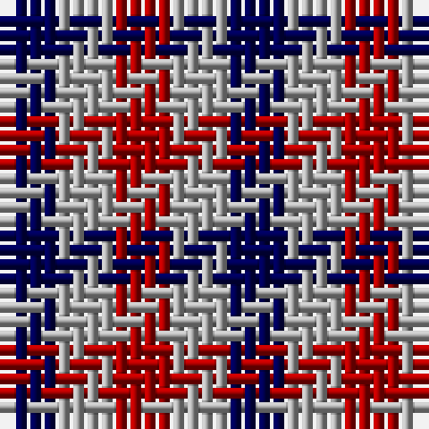

In pattern [BYR](/patterns/byr/).

This was sourced from weddslist.  It is a [3 stripes tartan](/stripes/stripes3/).

Original link http://www.weddslist.com/cgi-bin/tartans/pg.pl?source=x

## Thread count
DB/4 N4 DR/4

## Palette
Each colour and its ΔE from the base-6 reference it is a variant of.

| Colour | Shade | Base | ΔE (OKLab) |
|---|---|---|---|
| DB | <code style="background-color:#000052;">#000052</code> `#000052` | B <code style="background-color:#2C4084;">#2C4084</code> | 0.20 |
| DR | <code style="background-color:#AA0000;">#AA0000</code> `#AA0000` | R <code style="background-color:#C80000;">#C80000</code> | 0.06 |
| LG | <code style="background-color:#AAAA00;">#AAAA00</code> `#AAAA00` | Y <code style="background-color:#E8C000;">#E8C000</code> | 0.11 |
| N | <code style="background-color:#AAAAAA;">#AAAAAA</code> `#AAAAAA` | Y <code style="background-color:#E8C000;">#E8C000</code> | 0.19 |

# Sample pattern

## Nearest tartans

The nearest existing variants by ΔTartan distance.

1. [Dacre Estate Check](/setts/s3/k14w14r14-k101010-r800028-wf0e0c4/) — ΔT 1.00
1. [Aquascutum Trade Tartan Tartan Number: 657. Earliest known date: pre 2003 Named after the district in which it was found. See products available Copyright © Blair Urquhart, Comrie, 2015](/setts/s3/b22w22r22-b2c2c80-rc80000-we0e0e0/) — ΔT 1.14
1. [Coigach Tweed](/setts/s3/k6w6r6-k000000-ra43c14-wc8c8c8/) — ΔT 1.18
1. [Aquascutum](/setts/s3/b22w22r22-b304080-rc00000-we0e0e0/) — ΔT 1.19
1. [Aquascutum](/setts/s3/b22w22r22-b2c2c80-rc80000-wfcfcfc/) — ΔT 1.41
1. [Mothers Pride](/setts/s3/r40b40y40-b304080-rc00000-yf0c000/) — ΔT 1.71
1. [Algarve](/setts/s4/b20w20r20g20-b2c2c80-g285800-rc80000-we0e0e0/) — ΔT 1.76
1. [Wilson's, No 185](/setts/s3/k22b20g18-b800080-g008000-k000000/) — ΔT 1.93
1. [Hogg](/setts/s4/k8w8b8w8-b441800-k101010-we0e0e0/) — ΔT 2.06
1. [Wilson's No.185](/setts/s3/k22g18b20-b780078-g006818-k101010/) — ΔT 2.07

## Neighbour map

Every grey dot is one of 15726 variants placed by the first two principal components of the ΔTartan feature space (44% of its variance). Red is this tartan; blue dots are its nearest — click one to open its page.

<svg viewBox="0 0 640 380" role="img" style="max-width:100%;height:auto;border:1px solid #e0e0e0;border-radius:4px;display:block" xmlns="http://www.w3.org/2000/svg"><image href="/nn/cloud.v1.png" width="640" height="380"/><a href="/setts/s3/k14w14r14-k101010-r800028-wf0e0c4/"><circle cx="14.0" cy="366.0" r="4" fill="#3465a4"><title>Dacre Estate Check</title></circle></a><a href="/setts/s3/b22w22r22-b2c2c80-rc80000-we0e0e0/"><circle cx="14.0" cy="366.0" r="4" fill="#3465a4"><title>Aquascutum Trade Tartan Tartan Number: 657. Earliest known date: pre 2003 Named after the district in which it was found. See products available Copyright © Blair Urquhart, Comrie, 2015</title></circle></a><a href="/setts/s3/k6w6r6-k000000-ra43c14-wc8c8c8/"><circle cx="14.0" cy="366.0" r="4" fill="#3465a4"><title>Coigach Tweed</title></circle></a><a href="/setts/s3/b22w22r22-b304080-rc00000-we0e0e0/"><circle cx="14.0" cy="366.0" r="4" fill="#3465a4"><title>Aquascutum</title></circle></a><a href="/setts/s3/b22w22r22-b2c2c80-rc80000-wfcfcfc/"><circle cx="14.0" cy="366.0" r="4" fill="#3465a4"><title>Aquascutum</title></circle></a><a href="/setts/s3/r40b40y40-b304080-rc00000-yf0c000/"><circle cx="14.0" cy="366.0" r="4" fill="#3465a4"><title>Mothers Pride</title></circle></a><a href="/setts/s4/b20w20r20g20-b2c2c80-g285800-rc80000-we0e0e0/"><circle cx="14.0" cy="366.0" r="4" fill="#3465a4"><title>Algarve</title></circle></a><a href="/setts/s3/k22b20g18-b800080-g008000-k000000/"><circle cx="38.8" cy="366.0" r="4" fill="#3465a4"><title>Wilson's, No 185</title></circle></a><a href="/setts/s4/k8w8b8w8-b441800-k101010-we0e0e0/"><circle cx="40.5" cy="366.0" r="4" fill="#3465a4"><title>Hogg</title></circle></a><a href="/setts/s3/k22g18b20-b780078-g006818-k101010/"><circle cx="80.7" cy="366.0" r="4" fill="#3465a4"><title>Wilson's No.185</title></circle></a><circle cx="14.0" cy="366.0" r="5" fill="#c00000"/></svg>

ID: /setts/s3/b4y4r4-b000052-raa0000-yaaaaaa/
