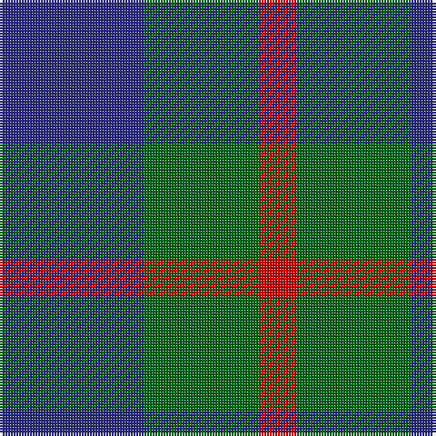

In pattern [BGR](/patterns/bgr/).

This was sourced from house-of-tartan.  It is a [3 stripes tartan](/stripes/stripes3/).

Original link http://www.house-of-tartan.scotland.net/house/TartanViewjs.asp?colr=Def&tnam=182

## Thread count
DB/53 G42 R/14

## Palette
Each colour and its ΔE from the base-6 reference it is a variant of.

| Colour | Shade | Base | ΔE (OKLab) |
|---|---|---|---|
| DB | <code style="background-color:#2C2C80;">#2C2C80</code> `#2C2C80` | B <code style="background-color:#2A418A;">#2A418A</code> | 0.06 |
| G | <code style="background-color:#006818;">#006818</code> `#006818` | G <code style="background-color:#006100;">#006100</code> | 0.02 |
| R | <code style="background-color:#C80000;">#C80000</code> `#C80000` | R <code style="background-color:#CC0000;">#CC0000</code> | 0.01 |

# Sample pattern

## Nearest tartans

The nearest existing variants by ΔTartan distance.

1. [Agnew](/setts/s3/b106g84r28-b2c2c80-g006818-rc80000/) — ΔT 0.00
1. [Agnew](/setts/s3/b53g42r14-b304080-g008000-rc00000/) — ΔT 0.72
1. [Wilson's No.055](/setts/s3/g24b20ba4-b440044-ba5c8ca8-g006818/) — ΔT 1.13
1. [Ferguson](/setts/s3/b24g20r4-b304080-g008000-rc00000/) — ΔT 1.23
1. [MacCurdie (Clan?)](/setts/s4/k20g56b48g16-b2c2c80-g006818-k101010/) — ΔT 1.26
1. [Wilson's, No 55](/setts/s3/g24b20ba4-b800080-ba5480b0-g008000/) — ΔT 1.41
1. [Wilson's, No 209](/setts/s3/b10g8ba4-b800080-ba5480b0-g008000/) — ΔT 1.44
1. [Wilson's No.084](/setts/s3/g24b20r4-b440044-g285800-rc80000/) — ΔT 1.50
1. [Wilson's No 62, (Ferguson)](/setts/s3/b26r4g26-b304080-g008000-rc00000/) — ΔT 1.52
1. [Coleman, Sarah-Louise (Personal)](/setts/s4/g20r10b30r10-b780078-g006818-r888888/) — ΔT 1.53

## Neighbour map

Every grey dot is one of 15726 variants placed by the first two principal components of the ΔTartan feature space (44% of its variance). Red is this tartan; blue dots are its nearest — click one to open its page.

<svg viewBox="0 0 640 380" role="img" style="max-width:100%;height:auto;border:1px solid #e0e0e0;border-radius:4px;display:block" xmlns="http://www.w3.org/2000/svg"><image href="/nn/cloud.v1.png" width="640" height="380"/><a href="/setts/s3/b106g84r28-b2c2c80-g006818-rc80000/"><circle cx="252.6" cy="345.5" r="4" fill="#3465a4"><title>Agnew</title></circle></a><a href="/setts/s3/b53g42r14-b304080-g008000-rc00000/"><circle cx="248.6" cy="343.9" r="4" fill="#3465a4"><title>Agnew</title></circle></a><a href="/setts/s3/g24b20ba4-b440044-ba5c8ca8-g006818/"><circle cx="290.1" cy="317.0" r="4" fill="#3465a4"><title>Wilson's No.055</title></circle></a><a href="/setts/s3/b24g20r4-b304080-g008000-rc00000/"><circle cx="293.4" cy="320.7" r="4" fill="#3465a4"><title>Ferguson</title></circle></a><a href="/setts/s4/k20g56b48g16-b2c2c80-g006818-k101010/"><circle cx="264.7" cy="341.5" r="4" fill="#3465a4"><title>MacCurdie (Clan?)</title></circle></a><a href="/setts/s3/g24b20ba4-b800080-ba5480b0-g008000/"><circle cx="274.6" cy="304.3" r="4" fill="#3465a4"><title>Wilson's, No 55</title></circle></a><a href="/setts/s3/b10g8ba4-b800080-ba5480b0-g008000/"><circle cx="187.4" cy="361.1" r="4" fill="#3465a4"><title>Wilson's, No 209</title></circle></a><a href="/setts/s3/g24b20r4-b440044-g285800-rc80000/"><circle cx="310.2" cy="320.7" r="4" fill="#3465a4"><title>Wilson's No.084</title></circle></a><a href="/setts/s3/b26r4g26-b304080-g008000-rc00000/"><circle cx="288.3" cy="317.1" r="4" fill="#3465a4"><title>Wilson's No 62, (Ferguson)</title></circle></a><a href="/setts/s4/g20r10b30r10-b780078-g006818-r888888/"><circle cx="203.3" cy="326.7" r="4" fill="#3465a4"><title>Coleman, Sarah-Louise (Personal)</title></circle></a><circle cx="252.6" cy="345.5" r="5" fill="#c00000"/></svg>

ID: /setts/s3/b53g42r14-b2c2c80-g006818-rc80000/
