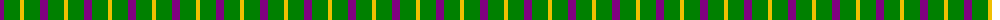

In pattern [BGY](/patterns/bgy/).

This was sourced from weddslist.  It is a [3 stripes tartan](/stripes/stripes3/).

Original link http://www.weddslist.com/cgi-bin/tartans/pg.pl?source=sts

## Thread count
P/8 G16 Y/4

## Palette
Each colour and its ΔE from the base-6 reference it is a variant of.

| Colour | Shade | Base | ΔE (OKLab) |
|---|---|---|---|
| G | <code style="background-color:#008000;">#008000</code> `#008000` | G <code style="background-color:#006400;">#006400</code> | 0.09 |
| P | <code style="background-color:#800080;">#800080</code> `#800080` | B <code style="background-color:#2C4084;">#2C4084</code> | 0.17 |
| Y | <code style="background-color:#F0C000;">#F0C000</code> `#F0C000` | Y <code style="background-color:#E8C000;">#E8C000</code> | 0.01 |

# Sample pattern

## Nearest tartans

The nearest existing variants by ΔTartan distance.

1. [Wilson's No.201](/setts/s3/b8g16y4-b440044-g006818-ye8c000/) — ΔT 0.72
1. [Wilson's, No 81](/setts/s3/b20g24y4-b800080-g008000-yf0c000/) — ΔT 1.28
1. [Wilson's, No 208](/setts/s3/g14b4r8-b5480b0-g008000-rc00000/) — ΔT 1.39
1. [Wilson's, No 55](/setts/s3/g24b20ba4-b800080-ba5480b0-g008000/) — ΔT 1.63
1. [Silvicola (Corporate)](/setts/s3/k30y40w6-k101010-we0e0e0-ye8c000/) — ΔT 1.69
1. [Masai Shuka 04 (Artefact)](/setts/s3/y40b20k6-b2c2c80-k000000-ye8c000/) — ΔT 1.69
1. [Zwijnenberg, Frans (Personal)](/setts/s3/k92g32y32-g006818-k101010-yfccc00/) — ΔT 1.70
1. [Wilson's No.208](/setts/s4/g14b4r8b4-b2888c4-g006818-rc80000/) — ΔT 1.71
1. [Wilson's, No 45](/setts/s3/g16b4k8-b5480b0-g008000-k000000/) — ΔT 1.82
1. [Wilson's No.053 #2](/setts/s4/g8k10g8y2-g006818-k101010-yd8b000/) — ΔT 1.86

## Neighbour map

Every grey dot is one of 15726 variants placed by the first two principal components of the ΔTartan feature space (44% of its variance). Red is this tartan; blue dots are its nearest — click one to open its page.

<svg viewBox="0 0 640 380" role="img" style="max-width:100%;height:auto;border:1px solid #e0e0e0;border-radius:4px;display:block" xmlns="http://www.w3.org/2000/svg"><image href="/nn/cloud.v1.png" width="640" height="380"/><a href="/setts/s3/b8g16y4-b440044-g006818-ye8c000/"><circle cx="266.3" cy="317.7" r="4" fill="#3465a4"><title>Wilson's No.201</title></circle></a><a href="/setts/s3/b20g24y4-b800080-g008000-yf0c000/"><circle cx="261.0" cy="296.2" r="4" fill="#3465a4"><title>Wilson's, No 81</title></circle></a><a href="/setts/s3/g14b4r8-b5480b0-g008000-rc00000/"><circle cx="270.8" cy="338.1" r="4" fill="#3465a4"><title>Wilson's, No 208</title></circle></a><a href="/setts/s3/g24b20ba4-b800080-ba5480b0-g008000/"><circle cx="274.6" cy="304.3" r="4" fill="#3465a4"><title>Wilson's, No 55</title></circle></a><a href="/setts/s3/k30y40w6-k101010-we0e0e0-ye8c000/"><circle cx="246.0" cy="271.9" r="4" fill="#3465a4"><title>Silvicola (Corporate)</title></circle></a><a href="/setts/s3/y40b20k6-b2c2c80-k000000-ye8c000/"><circle cx="290.4" cy="264.5" r="4" fill="#3465a4"><title>Masai Shuka 04 (Artefact)</title></circle></a><a href="/setts/s3/k92g32y32-g006818-k101010-yfccc00/"><circle cx="243.0" cy="321.4" r="4" fill="#3465a4"><title>Zwijnenberg, Frans (Personal)</title></circle></a><a href="/setts/s4/g14b4r8b4-b2888c4-g006818-rc80000/"><circle cx="226.3" cy="314.8" r="4" fill="#3465a4"><title>Wilson's No.208</title></circle></a><a href="/setts/s3/g16b4k8-b5480b0-g008000-k000000/"><circle cx="242.9" cy="318.8" r="4" fill="#3465a4"><title>Wilson's, No 45</title></circle></a><a href="/setts/s4/g8k10g8y2-g006818-k101010-yd8b000/"><circle cx="280.2" cy="326.2" r="4" fill="#3465a4"><title>Wilson's No.053 #2</title></circle></a><circle cx="263.4" cy="312.0" r="5" fill="#c00000"/></svg>

ID: /setts/s3/b8g16y4-b800080-g008000-yf0c000/
