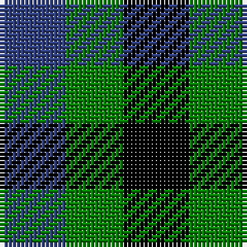

In pattern [BGK](/patterns/bgk/).

This was sourced from weddslist.  It is a [3 stripes tartan](/stripes/stripes3/).

Original link http://www.weddslist.com/cgi-bin/tartans/pg.pl?source=sts

## Thread count
B/16 G14 K/16

## Palette
Each colour and its ΔE from the base-6 reference it is a variant of.

| Colour | Shade | Base | ΔE (OKLab) |
|---|---|---|---|
| B | <code style="background-color:#304080;">#304080</code> `#304080` | B <code style="background-color:#2A418A;">#2A418A</code> | 0.02 |
| G | <code style="background-color:#008000;">#008000</code> `#008000` | G <code style="background-color:#006100;">#006100</code> | 0.10 |
| K | <code style="background-color:#000000;">#000000</code> `#000000` | K <code style="background-color:#000000;">#000000</code> | 0.00 |

# Sample pattern

## Nearest tartans

The nearest existing variants by ΔTartan distance.

1. [Wilson's, No 185](/setts/s3/k11b10g9x2~b800080-g008000-k000000/) — ΔT 1.25
1. [Glen Lyon](/setts/s3/g3k2b2x4~b304080-g30a010-k000000/) — ΔT 1.82
1. [Wilson's No.185](/setts/s3/k11g9b10x2~b780078-g006818-k101010/) — ΔT 1.82
1. [Glen Lyon (District)](/setts/s3/k5g4b3x2~b2888c4-g006818-k101010/) — ΔT 1.83
1. [Glenlyon #2](/setts/s3/g3k2b2x4~b0000cd-g008b00-k101010/) — ΔT 1.87
1. [Mull (District)](/setts/s3/k5g4b3x2~b5c8ca8-g006818-k101010/) — ΔT 1.88
1. [Wilson's, No 204](/setts/s3/r10k11g9x2~g008000-k000000-rc00000/) — ΔT 2.04
1. [Wilson's, No 187](/setts/s3/k1g1r1x8~g008000-k000000-rc00000/) — ΔT 2.15
1. [Kazakhstan Relic (Artefact)](/setts/s3/y5b5k3x4~b202060-k101010-ybc8c00/) — ΔT 2.16
1. [Wilson's No.204](/setts/s3/k11g9r10x2~g006818-k101010-rc80000/) — ΔT 2.24

## Neighbour map

Every grey dot is one of 15726 variants placed by the first two principal components of the ΔTartan feature space (44% of its variance). Red is this tartan; blue dots are its nearest — click one to open its page.

<svg viewBox="0 0 640 380" role="img" style="max-width:100%;height:auto;border:1px solid #e0e0e0;border-radius:4px;display:block" xmlns="http://www.w3.org/2000/svg"><image href="/nn/cloud.v1.png" width="640" height="380"/><a href="/setts/s3/k11b10g9x2~b800080-g008000-k000000/"><circle cx="33.2" cy="366.0" r="4" fill="#3465a4"><title>Wilson's, No 185</title></circle></a><a href="/setts/s3/g3k2b2x4~b304080-g30a010-k000000/"><circle cx="73.4" cy="366.0" r="4" fill="#3465a4"><title>Glen Lyon</title></circle></a><a href="/setts/s3/k11g9b10x2~b780078-g006818-k101010/"><circle cx="75.8" cy="366.0" r="4" fill="#3465a4"><title>Wilson's No.185</title></circle></a><a href="/setts/s3/k5g4b3x2~b2888c4-g006818-k101010/"><circle cx="108.6" cy="366.0" r="4" fill="#3465a4"><title>Glen Lyon (District)</title></circle></a><a href="/setts/s3/g3k2b2x4~b0000cd-g008b00-k101010/"><circle cx="85.4" cy="366.0" r="4" fill="#3465a4"><title>Glenlyon #2</title></circle></a><a href="/setts/s3/k5g4b3x2~b5c8ca8-g006818-k101010/"><circle cx="110.8" cy="366.0" r="4" fill="#3465a4"><title>Mull (District)</title></circle></a><a href="/setts/s3/r10k11g9x2~g008000-k000000-rc00000/"><circle cx="32.8" cy="366.0" r="4" fill="#3465a4"><title>Wilson's, No 204</title></circle></a><a href="/setts/s3/k1g1r1x8~g008000-k000000-rc00000/"><circle cx="14.0" cy="366.0" r="4" fill="#3465a4"><title>Wilson's, No 187</title></circle></a><a href="/setts/s3/y5b5k3x4~b202060-k101010-ybc8c00/"><circle cx="91.9" cy="366.0" r="4" fill="#3465a4"><title>Kazakhstan Relic (Artefact)</title></circle></a><a href="/setts/s3/k11g9r10x2~g006818-k101010-rc80000/"><circle cx="62.5" cy="366.0" r="4" fill="#3465a4"><title>Wilson's No.204</title></circle></a><circle cx="19.2" cy="366.0" r="5" fill="#c00000"/></svg>

ID: /setts/s3/b8g7k8x2~b304080-g008000-k000000/
