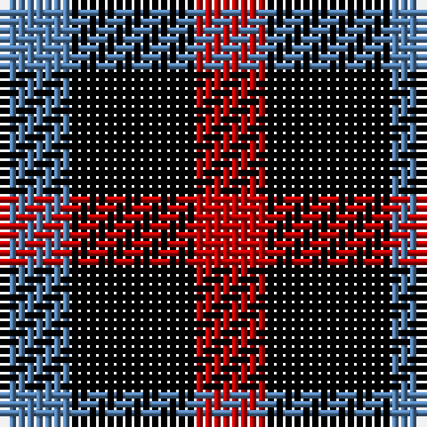

In pattern [BKR](/patterns/bkr/).

This was sourced from weddslist.  It is a [3 stripes tartan](/stripes/stripes3/).

Original link http://www.weddslist.com/cgi-bin/tartans/pg.pl?source=sts

## Thread count
B/8 K14 R/8

## Palette
Each colour and its ΔE from the base-6 reference it is a variant of.

| Colour | Shade | Base | ΔE (OKLab) |
|---|---|---|---|
| B | <code style="background-color:#5480B0;">#5480B0</code> `#5480B0` | B <code style="background-color:#2C4084;">#2C4084</code> | 0.20 |
| K | <code style="background-color:#000000;">#000000</code> `#000000` | K <code style="background-color:#000000;">#000000</code> | 0.00 |
| R | <code style="background-color:#C00000;">#C00000</code> `#C00000` | R <code style="background-color:#C80000;">#C80000</code> | 0.02 |

# Sample pattern

## Nearest tartans

The nearest existing variants by ΔTartan distance.

1. [Wilson's No.198](/setts/s3/b8k14r8-b2888c4-k101010-rc80000/) — ΔT 0.98
1. [Wilson's, No 200](/setts/s3/g8k14r8-g008000-k000000-rc00000/) — ΔT 1.25
1. [Kazakhstan Relic (Artefact)](/setts/s3/y20b20k12-b202060-k101010-ybc8c00/) — ΔT 1.55
1. [Wilson's No.200](/setts/s3/g8k14r8-g006818-k101010-rc80000/) — ΔT 1.60
1. [Allen, Nicholas (Personal)](/setts/s3/b42k84r42-b003c64-k101010-rc80000/) — ΔT 1.71
1. [Wilson's, No 94](/setts/s3/k10g8r4-g008000-k000000-rc00000/) — ΔT 1.81
1. [Kazakhstan Relic](/setts/s4/b20k12b20y20-b202060-k101010-ybc8c00/) — ΔT 1.88
1. [Daks, Black (Fashion)](/setts/s5/r6k12g8k12y6-g604000-k101010-rb03000-ye8d880/) — ΔT 1.88
1. [Daks - Black House Check, C.6700.06](/setts/s5/r6k14ra8k12y6-k000000-rb05000-ra806050-yf0f020/) — ΔT 2.01
1. [Wilson's, No 185](/setts/s3/k22b20g18-b800080-g008000-k000000/) — ΔT 2.02

## Neighbour map

Every grey dot is one of 15726 variants placed by the first two principal components of the ΔTartan feature space (44% of its variance). Red is this tartan; blue dots are its nearest — click one to open its page.

<svg viewBox="0 0 640 380" role="img" style="max-width:100%;height:auto;border:1px solid #e0e0e0;border-radius:4px;display:block" xmlns="http://www.w3.org/2000/svg"><image href="/nn/cloud.v1.png" width="640" height="380"/><a href="/setts/s3/b8k14r8-b2888c4-k101010-rc80000/"><circle cx="144.7" cy="366.0" r="4" fill="#3465a4"><title>Wilson's No.198</title></circle></a><a href="/setts/s3/g8k14r8-g008000-k000000-rc00000/"><circle cx="131.3" cy="366.0" r="4" fill="#3465a4"><title>Wilson's, No 200</title></circle></a><a href="/setts/s3/y20b20k12-b202060-k101010-ybc8c00/"><circle cx="96.5" cy="366.0" r="4" fill="#3465a4"><title>Kazakhstan Relic (Artefact)</title></circle></a><a href="/setts/s3/g8k14r8-g006818-k101010-rc80000/"><circle cx="161.7" cy="366.0" r="4" fill="#3465a4"><title>Wilson's No.200</title></circle></a><a href="/setts/s3/b42k84r42-b003c64-k101010-rc80000/"><circle cx="209.6" cy="366.0" r="4" fill="#3465a4"><title>Allen, Nicholas (Personal)</title></circle></a><a href="/setts/s3/k10g8r4-g008000-k000000-rc00000/"><circle cx="149.5" cy="356.0" r="4" fill="#3465a4"><title>Wilson's, No 94</title></circle></a><a href="/setts/s4/b20k12b20y20-b202060-k101010-ybc8c00/"><circle cx="174.3" cy="366.0" r="4" fill="#3465a4"><title>Kazakhstan Relic</title></circle></a><a href="/setts/s5/r6k12g8k12y6-g604000-k101010-rb03000-ye8d880/"><circle cx="148.8" cy="328.9" r="4" fill="#3465a4"><title>Daks, Black (Fashion)</title></circle></a><a href="/setts/s5/r6k14ra8k12y6-k000000-rb05000-ra806050-yf0f020/"><circle cx="154.3" cy="313.5" r="4" fill="#3465a4"><title>Daks - Black House Check, C.6700.06</title></circle></a><a href="/setts/s3/k22b20g18-b800080-g008000-k000000/"><circle cx="38.8" cy="366.0" r="4" fill="#3465a4"><title>Wilson's, No 185</title></circle></a><circle cx="131.4" cy="366.0" r="5" fill="#c00000"/></svg>

ID: /setts/s3/b8k14r8-b5480b0-k000000-rc00000/
