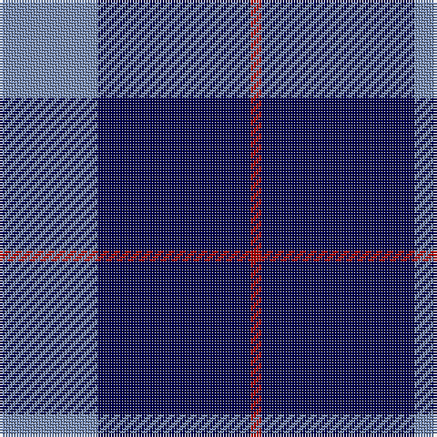

In pattern [BBR](/patterns/bbr/).

This was sourced from tartans-authority.  It is a [3 stripes tartan](/stripes/stripes3/).

Original link http://www.tartansauthority.com/tartan-ferret/display/4169/

## Thread count
B/36 DB56 DR/4

## Palette
Each colour and its ΔE from the base-6 reference it is a variant of.

| Colour | Shade | Base | ΔE (OKLab) |
|---|---|---|---|
| B | <code style="background-color:#788CB4;">#788CB4</code> `#788CB4` | B <code style="background-color:#2A418A;">#2A418A</code> | 0.25 |
| DB | <code style="background-color:#000050;">#000050</code> `#000050` | B <code style="background-color:#2A418A;">#2A418A</code> | 0.21 |
| DR | <code style="background-color:#B00000;">#B00000</code> `#B00000` | R <code style="background-color:#CC0000;">#CC0000</code> | 0.06 |

# Sample pattern

## Nearest tartans

The nearest existing variants by ΔTartan distance.

1. [Gallaecia (Unofficial) (District)](/setts/s5/b24ba13b4ba4w2x2~b1c1c50-ba2888c4-we0e0e0/) — ΔT 1.45
1. [McKerrell of Hillhouse](/setts/s4/w4b28ba49y3x2~b2888c4-ba202060-we0e0e0-ye8c000/) — ΔT 1.55
1. [McNiff, Kevin (Personal)](/setts/s4/g20r7b40w2x2~b1c0070-g006818-ra00000-wfcfcfc/) — ΔT 1.69
1. [Burberry Blue](/setts/s5/y3k3y3k10r1x6~k000034-r8c0000-yb0b0b0/) — ΔT 1.71
1. [Scottish Nuclear](/setts/s4/r4b32k15w2x2~b304080-k000000-rc00000-we0e0e0/) — ΔT 1.73
1. [Mirror (Corporate)](/setts/s4/r5b26k12w2x4~b2c2c80-k101010-rc80000-wfcfcfc/) — ΔT 1.75
1. [Fong Wedding (Personal)](/setts/s4/r21b43ba86w10~b0000cd-ba26264f-rff0000-wffffff/) — ΔT 1.82
1. [Swan, Brian E](/setts/s6/k6b17k6b17k27w3x2~b0000cd-k101010-wffffff/) — ΔT 1.83
1. [Brazell (Personal)](/setts/s5/b7y1b7ba11r2x6~b1c1c50-ba2888c4-rc80000-ye8c000/) — ΔT 1.86
1. [Scottish Nuclear (Corporate)](/setts/s4/r1b9k4w1x4~b2c2c80-k101010-rc80000-wc0c0c0/) — ΔT 1.93

## Neighbour map

Every grey dot is one of 15726 variants placed by the first two principal components of the ΔTartan feature space (44% of its variance). Red is this tartan; blue dots are its nearest — click one to open its page.

<svg viewBox="0 0 640 380" role="img" style="max-width:100%;height:auto;border:1px solid #e0e0e0;border-radius:4px;display:block" xmlns="http://www.w3.org/2000/svg"><image href="/nn/cloud.v1.png" width="640" height="380"/><a href="/setts/s5/b24ba13b4ba4w2x2~b1c1c50-ba2888c4-we0e0e0/"><circle cx="362.7" cy="236.4" r="4" fill="#3465a4"><title>Gallaecia (Unofficial) (District)</title></circle></a><a href="/setts/s4/w4b28ba49y3x2~b2888c4-ba202060-we0e0e0-ye8c000/"><circle cx="342.9" cy="212.3" r="4" fill="#3465a4"><title>McKerrell of Hillhouse</title></circle></a><a href="/setts/s4/g20r7b40w2x2~b1c0070-g006818-ra00000-wfcfcfc/"><circle cx="343.4" cy="212.7" r="4" fill="#3465a4"><title>McNiff, Kevin (Personal)</title></circle></a><a href="/setts/s5/y3k3y3k10r1x6~k000034-r8c0000-yb0b0b0/"><circle cx="348.7" cy="242.4" r="4" fill="#3465a4"><title>Burberry Blue</title></circle></a><a href="/setts/s4/r4b32k15w2x2~b304080-k000000-rc00000-we0e0e0/"><circle cx="343.6" cy="212.3" r="4" fill="#3465a4"><title>Scottish Nuclear</title></circle></a><a href="/setts/s4/r5b26k12w2x4~b2c2c80-k101010-rc80000-wfcfcfc/"><circle cx="327.9" cy="227.8" r="4" fill="#3465a4"><title>Mirror (Corporate)</title></circle></a><a href="/setts/s4/r21b43ba86w10~b0000cd-ba26264f-rff0000-wffffff/"><circle cx="256.6" cy="239.4" r="4" fill="#3465a4"><title>Fong Wedding (Personal)</title></circle></a><a href="/setts/s6/k6b17k6b17k27w3x2~b0000cd-k101010-wffffff/"><circle cx="287.7" cy="259.3" r="4" fill="#3465a4"><title>Swan, Brian E</title></circle></a><a href="/setts/s5/b7y1b7ba11r2x6~b1c1c50-ba2888c4-rc80000-ye8c000/"><circle cx="262.5" cy="236.3" r="4" fill="#3465a4"><title>Brazell (Personal)</title></circle></a><a href="/setts/s4/r1b9k4w1x4~b2c2c80-k101010-rc80000-wc0c0c0/"><circle cx="344.3" cy="243.7" r="4" fill="#3465a4"><title>Scottish Nuclear (Corporate)</title></circle></a><circle cx="343.8" cy="267.2" r="5" fill="#c00000"/></svg>

ID: /setts/s3/b9ba14r1x4~b788cb4-ba000050-rb00000/
