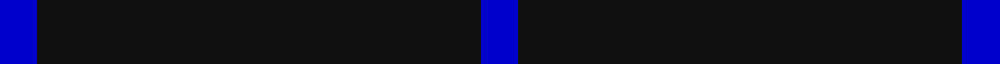

In pattern [BKB](/stripes/bkb/).

This was sourced from register-of-tartans.  It is a [3 stripe tartan](/stripes/stripes3/).

Original link https://www.tartanregister.gov.uk/tartanDetails.aspx?ref=10857

## Register references

External register numbers recorded for this tartan.

- Scottish Register of Tartans: [10857](https://www.tartanregister.gov.uk/tartanDetails.aspx?ref=10857)

## Thread count
B/10 K120 B/10

## Palette
Each colour and the base-6 reference it is a variant of.

| Colour | Shade | Base |
|---|---|---|
| B | <code style="background-color:#0000CD;">#0000CD</code> `oklch(38.3% 0.266 264.1)` <small>#0000CD</small> | B <code style="background-color:#2A418A;">#2A418A</code> |
| K | <code style="background-color:#101010;">#101010</code> `oklch(17.3% 0.000 89.9)` <small>#101010</small> | K <code style="background-color:#000000;">#000000</code> |

# Sample pattern

## Nearest tartans

The nearest existing variants by ΔTartan distance.

1. [Loevenstein Castle 2 (Artefact)](/setts/s4/k20db1k4db3~x4/) — ΔT 1.70
1. [Dunnotar (School)](/setts/s4/k72w3k11db9/) — ΔT 1.76
1. [Wallington (Corporate?)](/setts/s4/k60t3k9g7/) — ΔT 2.06
1. [Freedom of Scotland](/setts/s6/k15n7k6n11k50n4~x2/) — ΔT 2.17
1. [Crombie House Check](/setts/s6/k4k12k3o7k26o3~x2/) — ΔT 2.22
1. [Elliott](/setts/s4/db16dr4db3r1~x2/) — ΔT 2.26
1. [Joy's Fancy, Allen (Personal)](/setts/s2/k15lb1~x12/) — ΔT 2.33
1. [MacNathair Sgianach](/setts/s4/db1r1k12g1~x4/) — ΔT 2.34
1. [Brooks Brothers Tattersall Blue](/setts/s5/r1db9lo2db9lo1~x4/) — ΔT 2.41
1. [Gem](/setts/s4/db140r11db14ly11/) — ΔT 2.42

## Neighbour map

Every grey dot is one of 14299 variants placed by the first two principal components of the ΔTartan feature space (44% of its variance). Red is this tartan; blue dots are its nearest — click one to open its page.

<svg viewBox="0 0 640 380" role="img" style="max-width:100%;height:auto;border:1px solid #e0e0e0;border-radius:4px;display:block" xmlns="http://www.w3.org/2000/svg"><image href="/nn/cloud.v1.png" width="640" height="380"/><a href="/setts/s4/k20db1k4db3~x4/"><circle cx="626.0" cy="278.9" r="4" fill="#3465a4"><title>Loevenstein Castle 2 (Artefact)</title></circle></a><a href="/setts/s4/k72w3k11db9/"><circle cx="626.0" cy="233.0" r="4" fill="#3465a4"><title>Dunnotar (School)</title></circle></a><a href="/setts/s4/k60t3k9g7/"><circle cx="626.0" cy="231.3" r="4" fill="#3465a4"><title>Wallington (Corporate?)</title></circle></a><a href="/setts/s6/k15n7k6n11k50n4~x2/"><circle cx="565.0" cy="265.8" r="4" fill="#3465a4"><title>Freedom of Scotland</title></circle></a><a href="/setts/s6/k4k12k3o7k26o3~x2/"><circle cx="552.8" cy="280.2" r="4" fill="#3465a4"><title>Crombie House Check</title></circle></a><a href="/setts/s4/db16dr4db3r1~x2/"><circle cx="603.0" cy="279.8" r="4" fill="#3465a4"><title>Elliott</title></circle></a><a href="/setts/s2/k15lb1~x12/"><circle cx="626.0" cy="308.8" r="4" fill="#3465a4"><title>Joy's Fancy, Allen (Personal)</title></circle></a><a href="/setts/s4/db1r1k12g1~x4/"><circle cx="567.4" cy="237.6" r="4" fill="#3465a4"><title>MacNathair Sgianach</title></circle></a><a href="/setts/s5/r1db9lo2db9lo1~x4/"><circle cx="543.9" cy="269.1" r="4" fill="#3465a4"><title>Brooks Brothers Tattersall Blue</title></circle></a><a href="/setts/s4/db140r11db14ly11/"><circle cx="616.0" cy="230.9" r="4" fill="#3465a4"><title>Gem</title></circle></a><circle cx="626.0" cy="299.7" r="5" fill="#c00000"/></svg>

ID: /setts/s3/db1k12db1~x10/
