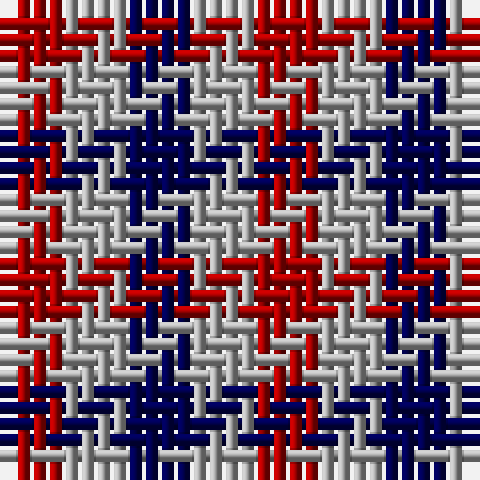

In pattern [BYR](/stripes/byr/).

This was sourced from weddslist.  It is a [3 stripe tartan](/stripes/stripes3/).

Original link http://www.weddslist.com/cgi-bin/tartans/pg.pl?source=x

## Thread count
DR/4 N4 DB/4

## Palette
Each colour and the base-6 reference it is a variant of.

| Colour | Shade | Base |
|---|---|---|
| DB | <code style="background-color:#000052;">#000052</code> `oklch(19.8% 0.137 264.1)` <small>#000052</small> | B <code style="background-color:#2A418A;">#2A418A</code> |
| DR | <code style="background-color:#AA0000;">#AA0000</code> `oklch(46.3% 0.190 29.2)` <small>#AA0000</small> | R <code style="background-color:#CC0000;">#CC0000</code> |
| LG | <code style="background-color:#AAAA00;">#AAAA00</code> `oklch(71.4% 0.156 109.8)` <small>#AAAA00</small> | Y <code style="background-color:#F2BF00;">#F2BF00</code> |
| N | <code style="background-color:#AAAAAA;">#AAAAAA</code> `oklch(73.8% 0.000 89.9)` <small>#AAAAAA</small> | Y <code style="background-color:#F2BF00;">#F2BF00</code> |

# Sample pattern

## Nearest tartans

The nearest existing variants by ΔTartan distance.

1. [Dacre Estate Check](/setts/s3/k1w1r1~x14/) — ΔT 1.00
1. [Coigach Tweed](/setts/s3/k1lb1o1~x6/) — ΔT 1.19
1. [Aquascutum](/setts/s3/db1w1r1~x22/) — ΔT 1.42
1. [Mothers Pride](/setts/s3/r1db1ly1~x40/) — ΔT 1.71
1. [Algarve](/setts/s4/dg1r1w1db1~x20/) — ΔT 1.76
1. [Wilson's, No 185](/setts/s3/k11p10g9~x2/) — ΔT 1.94
1. [Hogg](/setts/s4/k1w1do1~x8/) — ΔT 2.07
1. [Wilson's No.185](/setts/s3/k11g9dp10~x2/) — ΔT 2.09
1. [Wilson's No.204](/setts/s3/k11g9r10~x2/) — ΔT 2.16
1. [Glen Moriston Estate Check](/setts/s3/dt1lb1w1~x8/) — ΔT 2.18

## Neighbour map

Every grey dot is one of 14299 variants placed by the first two principal components of the ΔTartan feature space (44% of its variance). Red is this tartan; blue dots are its nearest — click one to open its page.

<svg viewBox="0 0 640 380" role="img" style="max-width:100%;height:auto;border:1px solid #e0e0e0;border-radius:4px;display:block" xmlns="http://www.w3.org/2000/svg"><image href="/nn/cloud.v1.png" width="640" height="380"/><a href="/setts/s3/k1w1r1~x14/"><circle cx="14.0" cy="366.0" r="4" fill="#3465a4"><title>Dacre Estate Check</title></circle></a><a href="/setts/s3/k1lb1o1~x6/"><circle cx="14.0" cy="366.0" r="4" fill="#3465a4"><title>Coigach Tweed</title></circle></a><a href="/setts/s3/db1w1r1~x22/"><circle cx="14.0" cy="366.0" r="4" fill="#3465a4"><title>Aquascutum</title></circle></a><a href="/setts/s3/r1db1ly1~x40/"><circle cx="14.0" cy="366.0" r="4" fill="#3465a4"><title>Mothers Pride</title></circle></a><a href="/setts/s4/dg1r1w1db1~x20/"><circle cx="14.0" cy="366.0" r="4" fill="#3465a4"><title>Algarve</title></circle></a><a href="/setts/s3/k11p10g9~x2/"><circle cx="36.2" cy="366.0" r="4" fill="#3465a4"><title>Wilson's, No 185</title></circle></a><a href="/setts/s4/k1w1do1~x8/"><circle cx="35.5" cy="366.0" r="4" fill="#3465a4"><title>Hogg</title></circle></a><a href="/setts/s3/k11g9dp10~x2/"><circle cx="78.1" cy="366.0" r="4" fill="#3465a4"><title>Wilson's No.185</title></circle></a><a href="/setts/s3/k11g9r10~x2/"><circle cx="64.1" cy="366.0" r="4" fill="#3465a4"><title>Wilson's No.204</title></circle></a><a href="/setts/s3/dt1lb1w1~x8/"><circle cx="14.0" cy="366.0" r="4" fill="#3465a4"><title>Glen Moriston Estate Check</title></circle></a><circle cx="14.0" cy="366.0" r="5" fill="#c00000"/></svg>

ID: /setts/s3/db1lr1r1~x4/
