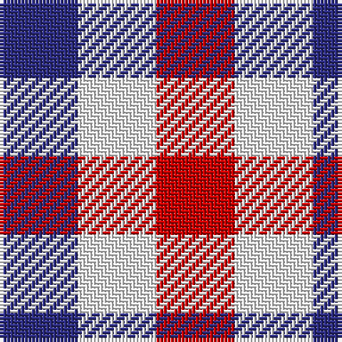

This page is one **sett** — a single exact thread-count. It belongs to the [tartan](/tartans/db1w1r1/)
(the same proportion at any scale), whose colour order is pattern [BWR](/stripes/bwr/).

Sourced from tartans-authority.  It is a [3 stripe tartan](/stripes/stripes3/).

Original link http://www.tartansauthority.com/tartan-ferret/display/8978/

3 attestations — the source records this cloth was collapsed from (oldest owns this page)

<ul>
<li>pre 2015 — Aquascutum (tartans-authority, <a href="http://www.tartansauthority.com/tartan-ferret/display/8978/">record</a>)</li>
<li>undated — Aquascutum (weddslist, <a href="http://www.weddslist.com/cgi-bin/tartans/pg.pl?source=sts">record</a>)</li>
<li>undated — Aquascutum Trade Tartan Tartan Number: 657. Earliest known date: pre 2003 Named after the district in which it was found. See products available Copyright © Blair Urquhart, Comrie, 2015 (house-of-tartan, <a href="http://www.house-of-tartan.scotland.net/house/TartanViewjs.asp?colr=Def&tnam=657">record</a>)</li>
</ul>

## Register references

External register numbers recorded for this tartan.

- Scottish Register of Tartans: [8978](https://www.tartanregister.gov.uk/tartanDetails?ref=8978)
- Scottish Tartans Authority (ITI): 8978

## Thread count
DB/22 W22 R/22

## Palette

Palette: <strong>Tartan Register</strong>
<table><thead><tr><th>Colour</th><th>Threads</th><th>Shade</th><th>Base</th><th>OKLCh</th></tr></thead><tbody><tr><td>DB/</td><td style="text-align:right;font-variant-numeric:tabular-nums">22</td><td><code style="background-color:#2C2C80;">#2C2C80</code> <small style="color:#888">#2C2C80</small></td><td>B <code style="background-color:#2A418A;">#2A418A</code></td><td><small style="color:#888">oklch(35.0% 0.138 276.6)</small></td></tr><tr><td>W</td><td style="text-align:right;font-variant-numeric:tabular-nums">22</td><td><code style="background-color:#FCFCFC;">#FCFCFC</code> <small style="color:#888">#FCFCFC</small></td><td>W <code style="background-color:#F7F7F7;">#F7F7F7</code></td><td><small style="color:#888">oklch(99.1% 0.000 89.9)</small></td></tr><tr><td>R/</td><td style="text-align:right;font-variant-numeric:tabular-nums">22</td><td><code style="background-color:#C80000;">#C80000</code> <small style="color:#888">#C80000</small></td><td>R <code style="background-color:#CC0000;">#CC0000</code></td><td><small style="color:#888">oklch(52.3% 0.215 29.2)</small></td></tr></tbody></table>

# Sample pattern

## Nearest tartans

The nearest existing variants by ΔTartan distance, with this tartan at the top so the swatches line up against it.

ΔTartan

Tartan

Sett

—

<a href="/ttd/edit/#slug=db1w1r1~x22">Aquascutum</a> <a class="nn-out" href="/setts/s3/db1w1r1~x22/" title="open its dictionary page">↗</a>

1.40

<a href="/ttd/edit/#slug=k1w1r1~x14">Dacre Estate Check</a> <a class="nn-out" href="/setts/s3/k1w1r1~x14/" title="open its dictionary page">↗</a>

1.42

<a href="/ttd/edit/#slug=db1lr1r1~x4">Usa</a> <a class="nn-out" href="/setts/s3/db1lr1r1~x4/" title="open its dictionary page">↗</a>

1.53

<a href="/ttd/edit/#slug=r1db1ly1~x40">Mothers Pride</a> <a class="nn-out" href="/setts/s3/r1db1ly1~x40/" title="open its dictionary page">↗</a>

1.77

<a href="/ttd/edit/#slug=dt1lb1w1~x8">Glen Moriston Estate Check</a> <a class="nn-out" href="/setts/s3/dt1lb1w1~x8/" title="open its dictionary page">↗</a>

1.86

<a href="/ttd/edit/#slug=k1lb1o1~x6">Coigach Tweed</a> <a class="nn-out" href="/setts/s3/k1lb1o1~x6/" title="open its dictionary page">↗</a>

1.89

<a href="/ttd/edit/#slug=dg1r1w1db1~x20">Algarve</a> <a class="nn-out" href="/setts/s4/dg1r1w1db1~x20/" title="open its dictionary page">↗</a>

2.02

<a href="/setts/s4/k1w1do1~x8/">Hogg</a>

2.54

<a href="/ttd/edit/#slug=k1r1w1k1w1k1db1~x16">Border Bell</a> <a class="nn-out" href="/setts/s7/k1r1w1k1w1k1db1~x16/" title="open its dictionary page">↗</a>

2.54

<a href="/ttd/edit/#slug=k1r1w1k1w1k1db1~x14">Bell, Border (Name)</a> <a class="nn-out" href="/setts/s7/k1r1w1k1w1k1db1~x14/" title="open its dictionary page">↗</a>

2.77

<a href="/setts/s4/k1w1~x6/">Shepherd or Falkirk</a>

## Neighbour map

Every grey dot is one of 14359 variants placed by the first two principal components of the ΔTartan feature space (44% of its variance). Red is this tartan; blue dots are its nearest — click one to open its page.

<svg viewBox="0 0 640 380" role="img" style="max-width:100%;height:auto;border:1px solid #e0e0e0;border-radius:4px;display:block" xmlns="http://www.w3.org/2000/svg"><image href="/nn/cloud.v1.png" width="640" height="380"/><a href="/setts/s3/k1w1r1~x14/"><circle cx="14.0" cy="366.0" r="4" fill="#3465a4"><title>Dacre Estate Check</title></circle></a><a href="/setts/s3/db1lr1r1~x4/"><circle cx="14.0" cy="366.0" r="4" fill="#3465a4"><title>Usa</title></circle></a><a href="/setts/s3/r1db1ly1~x40/"><circle cx="14.0" cy="366.0" r="4" fill="#3465a4"><title>Mothers Pride</title></circle></a><a href="/setts/s3/dt1lb1w1~x8/"><circle cx="14.0" cy="366.0" r="4" fill="#3465a4"><title>Glen Moriston Estate Check</title></circle></a><a href="/setts/s3/k1lb1o1~x6/"><circle cx="14.0" cy="366.0" r="4" fill="#3465a4"><title>Coigach Tweed</title></circle></a><a href="/setts/s4/dg1r1w1db1~x20/"><circle cx="14.0" cy="366.0" r="4" fill="#3465a4"><title>Algarve</title></circle></a><a href="/setts/s4/k1w1do1~x8/"><circle cx="35.0" cy="366.0" r="4" fill="#3465a4"><title>Hogg</title></circle></a><a href="/setts/s7/k1r1w1k1w1k1db1~x16/"><circle cx="14.0" cy="366.0" r="4" fill="#3465a4"><title>Border Bell</title></circle></a><a href="/setts/s7/k1r1w1k1w1k1db1~x14/"><circle cx="14.0" cy="366.0" r="4" fill="#3465a4"><title>Bell, Border (Name)</title></circle></a><a href="/setts/s4/k1w1~x6/"><circle cx="95.2" cy="366.0" r="4" fill="#3465a4"><title>Shepherd or Falkirk</title></circle></a><circle cx="14.0" cy="366.0" r="5" fill="#c00000"/></svg>

ID: /setts/s3/db1w1r1~x22/
