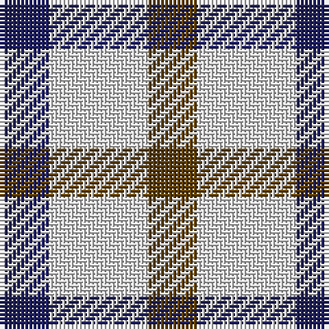

**Bands:** [BWG](/stripes/bwg/) · **Stripes:** [DB W DY](/stripes/stripes3/) DB W DY

This was sourced from register-of-tartans.  It is a [3 band tartan](/bands/bands3/).

Original link https://www.tartanregister.gov.uk/tartanDetails.aspx?ref=103

## Register references

External register numbers recorded for this tartan.

- Scottish Register of Tartans: [103](https://www.tartanregister.gov.uk/tartanDetails.aspx?ref=103)
- Scottish Tartans Authority (ITI): 657
- Scottish Tartans World Register: 657

## Thread count
DB/12 LN24 T/12

## Palette
Each colour and its ΔE from the base-6 reference it is a variant of.

| Colour | Shade | Base | ΔE (OKLab) |
|---|---|---|---|
| DB | <code style="background-color:#202060;">#202060</code> `#202060` | B <code style="background-color:#2A418A;">#2A418A</code> | 0.11 |
| LN | <code style="background-color:#E0E0E0;">#E0E0E0</code> `#E0E0E0` | W <code style="background-color:#F7F7F7;">#F7F7F7</code> | 0.07 |
| T | <code style="background-color:#604000;">#604000</code> `#604000` | G <code style="background-color:#006100;">#006100</code> | 0.14 |

# Sample pattern

## Nearest tartans

The nearest existing variants by ΔTartan distance.

1. [Daks (House Check)](/setts/s5/k3w6k4w6lo3~x2/) — ΔT 1.40
1. [Daks - House Check, C.6700.03](/setts/s5/k3w7k4w6o3~x2/) — ΔT 1.44
1. [Havel](/setts/s5/r21k21w10k10w21~x2/) — ΔT 2.03
1. [Wilson's, No 209](/setts/s3/p5g4t2~x2/) — ΔT 2.04
1. [MacLeod, of Argentina](/setts/s5/db10w3db12ly14r4~x2/) — ΔT 2.13
1. [Gold Country (California)](/setts/s4/db18t18lo28dt13~x2/) — ΔT 2.16
1. [Bedford Check](/setts/s4/t3o6k4t2~x2/) — ΔT 2.20
1. [Quaboos Pipers Plaid](/setts/s4/w9g23r23w9~x2/) — ΔT 2.21
1. [Wilson's, No 113](/setts/s4/r1g3p3w1~x4/) — ΔT 2.23
1. [Ikelman No 3](/setts/s5/y5k2r2ly2y5~x10/) — ΔT 2.27

## Neighbour map

Every grey dot is one of 14313 variants placed by the first two principal components of the ΔTartan feature space (44% of its variance). Red is this tartan; blue dots are its nearest — click one to open its page.

<svg viewBox="0 0 640 380" role="img" style="max-width:100%;height:auto;border:1px solid #e0e0e0;border-radius:4px;display:block" xmlns="http://www.w3.org/2000/svg"><image href="/nn/cloud.v1.png" width="640" height="380"/><a href="/setts/s5/k3w6k4w6lo3~x2/"><circle cx="142.8" cy="315.7" r="4" fill="#3465a4"><title>Daks (House Check)</title></circle></a><a href="/setts/s5/k3w7k4w6o3~x2/"><circle cx="168.2" cy="308.9" r="4" fill="#3465a4"><title>Daks - House Check, C.6700.03</title></circle></a><a href="/setts/s5/r21k21w10k10w21~x2/"><circle cx="75.7" cy="306.1" r="4" fill="#3465a4"><title>Havel</title></circle></a><a href="/setts/s3/p5g4t2~x2/"><circle cx="185.6" cy="361.5" r="4" fill="#3465a4"><title>Wilson's, No 209</title></circle></a><a href="/setts/s5/db10w3db12ly14r4~x2/"><circle cx="187.1" cy="255.3" r="4" fill="#3465a4"><title>MacLeod, of Argentina</title></circle></a><a href="/setts/s4/db18t18lo28dt13~x2/"><circle cx="54.6" cy="329.8" r="4" fill="#3465a4"><title>Gold Country (California)</title></circle></a><a href="/setts/s4/t3o6k4t2~x2/"><circle cx="149.3" cy="333.9" r="4" fill="#3465a4"><title>Bedford Check</title></circle></a><a href="/setts/s4/w9g23r23w9~x2/"><circle cx="121.3" cy="307.1" r="4" fill="#3465a4"><title>Quaboos Pipers Plaid</title></circle></a><a href="/setts/s4/r1g3p3w1~x4/"><circle cx="119.6" cy="284.9" r="4" fill="#3465a4"><title>Wilson's, No 113</title></circle></a><a href="/setts/s5/y5k2r2ly2y5~x10/"><circle cx="224.8" cy="289.5" r="4" fill="#3465a4"><title>Ikelman No 3</title></circle></a><circle cx="143.1" cy="336.5" r="5" fill="#c00000"/></svg>

ID: /setts/s3/db1w2dy1~x12/
