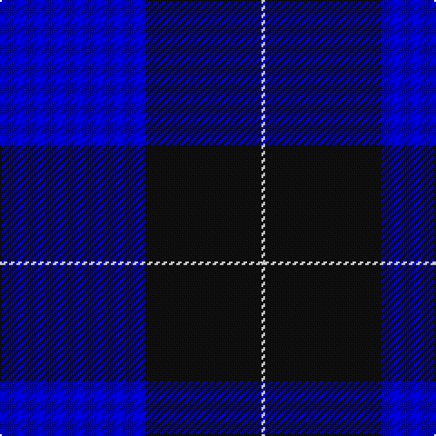

In pattern [BKW](/stripes/bkw/).

This was sourced from register-of-tartans.  It is a [3 stripe tartan](/stripes/stripes3/).

Original link https://www.tartanregister.gov.uk/tartanDetails.aspx?ref=10930

## Attestations

This cloth appears in 2 source records; the oldest owns this page.

- 08/10/2013 — Shirra (2013) (register-of-tartans, [record](https://www.tartanregister.gov.uk/tartanDetails.aspx?ref=10930))
- 2013 — Shirra (2013) (tartans-authority, [record](http://www.tartansauthority.com/tartan-ferret/display/10930/))

## Register references

External register numbers recorded for this tartan.

- Scottish Register of Tartans: [10930](https://www.tartanregister.gov.uk/tartanDetails.aspx?ref=10930)

## Thread count
B/80 K64 W/2

## Palette
Each colour and the base-6 reference it is a variant of.

| Colour | Shade | Base |
|---|---|---|
| B | <code style="background-color:#0000CD;">#0000CD</code> `oklch(38.3% 0.266 264.1)` <small>#0000CD</small> | B <code style="background-color:#2A418A;">#2A418A</code> |
| K | <code style="background-color:#101010;">#101010</code> `oklch(17.3% 0.000 89.9)` <small>#101010</small> | K <code style="background-color:#000000;">#000000</code> |
| W | <code style="background-color:#FFFFFF;">#FFFFFF</code> `oklch(100.0% 0.000 89.9)` <small>#FFFFFF</small> | W <code style="background-color:#F7F7F7;">#F7F7F7</code> |

# Sample pattern

## Nearest tartans

The nearest existing variants by ΔTartan distance.

1. [Stakis Hotels (Corporate)](/setts/s3/t9db14r1~x4/) — ΔT 2.09
1. [Fenston/Morris (Personal)](/setts/s5/k33db8k4db35p3~x2/) — ΔT 2.25
1. [St Andrews, Earl of](/setts/s6/db52k28w5k3w2k10/) — ΔT 2.34
1. [Westwater (Personal)](/setts/s3/k62b33ly1~x2/) — ΔT 2.41
1. [McNiff, Kevin (Personal)](/setts/s4/g20r7db40w2~x2/) — ΔT 2.49
1. [McKerrell of Hillhouse](/setts/s4/w4t28db49ly3~x2/) — ΔT 2.49
1. [St. Andrews, Earl of (District)](/setts/s6/b52db28w5db3w2db10~x2/) — ΔT 2.50
1. [Edzell, U.S. Navy](/setts/s6/db104db16w8db66r3db16/) — ΔT 2.50
1. [Swan 2015, Brian E (Personal)](/setts/s7/k2db9k2db9k13w1k2~x4/) — ΔT 2.54
1. [MacKerral Family Tartan Tartan Number: 1757. Earliest known date: 1975 A sample was presented to the Scottish Tartans Society by John Drummond Bowman. This version of the tartan has the unusual feature of exchanging red for yellow in the weft. It is larger than the sett recorded in the Lyon Court Books in 1982. The name, MacKerral or MacKerrell, is recorded in Ayrshire in the 12th century. See products available Copyright © Blair Urquhart, Comrie, 2015](/setts/s4/w4t34db60ly3~x2/) — ΔT 2.54

## Neighbour map

Every grey dot is one of 14299 variants placed by the first two principal components of the ΔTartan feature space (44% of its variance). Red is this tartan; blue dots are its nearest — click one to open its page.

<svg viewBox="0 0 640 380" role="img" style="max-width:100%;height:auto;border:1px solid #e0e0e0;border-radius:4px;display:block" xmlns="http://www.w3.org/2000/svg"><image href="/nn/cloud.v1.png" width="640" height="380"/><a href="/setts/s3/t9db14r1~x4/"><circle cx="347.0" cy="263.2" r="4" fill="#3465a4"><title>Stakis Hotels (Corporate)</title></circle></a><a href="/setts/s5/k33db8k4db35p3~x2/"><circle cx="346.8" cy="249.8" r="4" fill="#3465a4"><title>Fenston/Morris (Personal)</title></circle></a><a href="/setts/s6/db52k28w5k3w2k10/"><circle cx="369.2" cy="188.6" r="4" fill="#3465a4"><title>St Andrews, Earl of</title></circle></a><a href="/setts/s3/k62b33ly1~x2/"><circle cx="459.6" cy="220.7" r="4" fill="#3465a4"><title>Westwater (Personal)</title></circle></a><a href="/setts/s4/g20r7db40w2~x2/"><circle cx="346.3" cy="211.5" r="4" fill="#3465a4"><title>McNiff, Kevin (Personal)</title></circle></a><a href="/setts/s4/w4t28db49ly3~x2/"><circle cx="346.0" cy="210.7" r="4" fill="#3465a4"><title>McKerrell of Hillhouse</title></circle></a><a href="/setts/s6/b52db28w5db3w2db10~x2/"><circle cx="361.8" cy="183.5" r="4" fill="#3465a4"><title>St. Andrews, Earl of (District)</title></circle></a><a href="/setts/s6/db104db16w8db66r3db16/"><circle cx="387.3" cy="186.3" r="4" fill="#3465a4"><title>Edzell, U.S. Navy</title></circle></a><a href="/setts/s7/k2db9k2db9k13w1k2~x4/"><circle cx="322.6" cy="229.1" r="4" fill="#3465a4"><title>Swan 2015, Brian E (Personal)</title></circle></a><a href="/setts/s4/w4t34db60ly3~x2/"><circle cx="380.8" cy="207.1" r="4" fill="#3465a4"><title>MacKerral Family Tartan Tartan Number: 1757. Earliest known date: 1975 A sample was presented to the Scottish Tartans Society by John Drummond Bowman. This version of the tartan has the unusual feature of exchanging red for yellow in the weft. It is larger than the sett recorded in the Lyon Court Books in 1982. The name, MacKerral or MacKerrell, is recorded in Ayrshire in the 12th century. See products available Copyright © Blair Urquhart, Comrie, 2015</title></circle></a><circle cx="399.8" cy="242.4" r="5" fill="#c00000"/></svg>

ID: /setts/s3/db40k32w1~x2/
