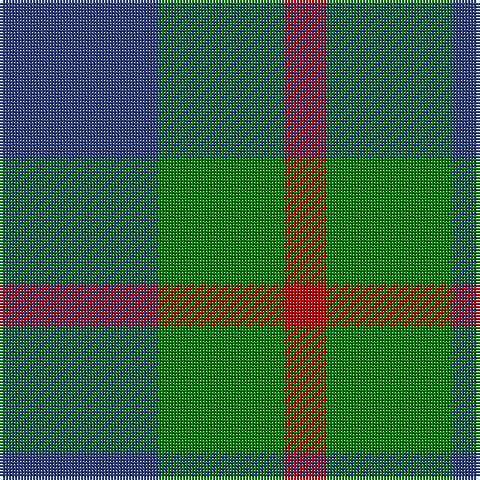

This page is one **sett** — a single exact thread-count. It belongs to the [tartan](/tartans/b53g42r14/)
(the same proportion at any scale), whose colour order is pattern [BGR](/stripes/bgr/).

Sourced from weddslist.  It is a [3 stripe tartan](/stripes/stripes3/).

Original link http://www.weddslist.com/cgi-bin/tartans/pg.pl?source=sts

2 attestations — the source records this cloth was collapsed from (oldest owns this page)

<ul>
<li>undated — Agnew (weddslist, <a href="http://www.weddslist.com/cgi-bin/tartans/pg.pl?source=sts">record</a>)</li>
<li>undated — Agnew Family Tartan Tartan Number: 182. Earliest known date: 1978 Nothing See products available Copyright © Blair Urquhart, Comrie, 2015 (house-of-tartan, <a href="http://www.house-of-tartan.scotland.net/house/TartanViewjs.asp?colr=Def&tnam=182">record</a>)</li>
</ul>

## Thread count
B/53 G42 R/14

## Palette
Each colour and the base-6 reference it is a variant of.

| Colour | Shade | Base |
|---|---|---|
| B | <code style="background-color:#304080;">#304080</code> `oklch(39.4% 0.109 270.2)` <small>#304080</small> | B <code style="background-color:#2A418A;">#2A418A</code> |
| G | <code style="background-color:#008000;">#008000</code> `oklch(52.0% 0.177 142.5)` <small>#008000</small> | G <code style="background-color:#006100;">#006100</code> |
| R | <code style="background-color:#C00000;">#C00000</code> `oklch(50.7% 0.208 29.2)` <small>#C00000</small> | R <code style="background-color:#CC0000;">#CC0000</code> |

# Sample pattern

## Nearest tartans

The nearest existing variants by ΔTartan distance, with this tartan at the top so the swatches line up against it.

ΔTartan

Tartan

Sett

—

<a href="/ttd/edit/#slug=db53g42r14">Agnew</a> <a class="nn-out" href="/setts/s3/db53g42r14/" title="open its dictionary page">↗</a>

0.73

<a href="/ttd/edit/#slug=db53g42r14~x2">Agnew</a> <a class="nn-out" href="/setts/s3/db53g42r14~x2/" title="open its dictionary page">↗</a>

0.93

<a href="/ttd/edit/#slug=db6g5r1~x4">Ferguson</a> <a class="nn-out" href="/setts/s3/db6g5r1~x4/" title="open its dictionary page">↗</a>

1.08

<a href="/ttd/edit/#slug=db5g6r1~x4">Wilson's No 84, Ferguson</a> <a class="nn-out" href="/setts/s3/db5g6r1~x4/" title="open its dictionary page">↗</a>

1.13

<a href="/ttd/edit/#slug=g6dp5t1~x4">Wilson's No.055</a> <a class="nn-out" href="/setts/s3/g6dp5t1~x4/" title="open its dictionary page">↗</a>

1.15

<a href="/ttd/edit/#slug=db13r2g13~x2">Wilson's No 62, (Ferguson)</a> <a class="nn-out" href="/setts/s3/db13r2g13~x2/" title="open its dictionary page">↗</a>

1.17

<a href="/ttd/edit/#slug=k5g14db12g4~x4">MacCurdie (Clan?)</a> <a class="nn-out" href="/setts/s4/k5g14db12g4~x4/" title="open its dictionary page">↗</a>

1.24

<a href="/setts/s4/g7t2r4~x2/">Wilson's No.208</a>

1.29

<a href="/ttd/edit/#slug=g6p5t1~x4">Wilson's, No 55</a> <a class="nn-out" href="/setts/s3/g6p5t1~x4/" title="open its dictionary page">↗</a>

1.44

<a href="/ttd/edit/#slug=g4dp5g4t2~x2">Wilson's No.209</a> <a class="nn-out" href="/setts/s4/g4dp5g4t2~x2/" title="open its dictionary page">↗</a>

1.57

<a href="/ttd/edit/#slug=k5g4t2~x2">Mull</a> <a class="nn-out" href="/setts/s3/k5g4t2~x2/" title="open its dictionary page">↗</a>

## Neighbour map

Every grey dot is one of 14299 variants placed by the first two principal components of the ΔTartan feature space (44% of its variance). Red is this tartan; blue dots are its nearest — click one to open its page.

<svg viewBox="0 0 640 380" role="img" style="max-width:100%;height:auto;border:1px solid #e0e0e0;border-radius:4px;display:block" xmlns="http://www.w3.org/2000/svg"><image href="/nn/cloud.v1.png" width="640" height="380"/><a href="/setts/s3/db53g42r14~x2/"><circle cx="252.2" cy="348.1" r="4" fill="#3465a4"><title>Agnew</title></circle></a><a href="/setts/s3/db6g5r1~x4/"><circle cx="293.4" cy="323.6" r="4" fill="#3465a4"><title>Ferguson</title></circle></a><a href="/setts/s3/db5g6r1~x4/"><circle cx="291.6" cy="323.6" r="4" fill="#3465a4"><title>Wilson's No 84, Ferguson</title></circle></a><a href="/setts/s3/g6dp5t1~x4/"><circle cx="289.9" cy="319.0" r="4" fill="#3465a4"><title>Wilson's No.055</title></circle></a><a href="/setts/s3/db13r2g13~x2/"><circle cx="288.7" cy="320.2" r="4" fill="#3465a4"><title>Wilson's No 62, (Ferguson)</title></circle></a><a href="/setts/s4/k5g14db12g4~x4/"><circle cx="265.3" cy="345.9" r="4" fill="#3465a4"><title>MacCurdie (Clan?)</title></circle></a><a href="/setts/s4/g7t2r4~x2/"><circle cx="225.9" cy="316.4" r="4" fill="#3465a4"><title>Wilson's No.208</title></circle></a><a href="/setts/s3/g6p5t1~x4/"><circle cx="273.8" cy="304.5" r="4" fill="#3465a4"><title>Wilson's, No 55</title></circle></a><a href="/setts/s4/g4dp5g4t2~x2/"><circle cx="217.4" cy="366.0" r="4" fill="#3465a4"><title>Wilson's No.209</title></circle></a><a href="/setts/s3/k5g4t2~x2/"><circle cx="178.2" cy="366.0" r="4" fill="#3465a4"><title>Mull</title></circle></a><circle cx="248.0" cy="346.2" r="5" fill="#c00000"/></svg>

ID: /setts/s3/db53g42r14/
