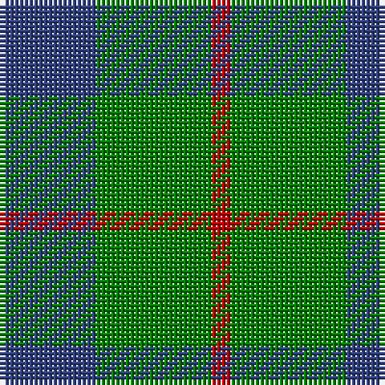

In pattern [BGR](/stripes/bgr/).

This was sourced from weddslist.  It is a [3 stripe tartan](/stripes/stripes3/).

Original link http://www.weddslist.com/cgi-bin/tartans/pg.pl?source=sts

## Thread count
B/20 G24 R/4

## Palette
Each colour and the base-6 reference it is a variant of.

| Colour | Shade | Base |
|---|---|---|
| B | <code style="background-color:#304080;">#304080</code> `oklch(39.4% 0.109 270.2)` <small>#304080</small> | B <code style="background-color:#2A418A;">#2A418A</code> |
| G | <code style="background-color:#008000;">#008000</code> `oklch(52.0% 0.177 142.5)` <small>#008000</small> | G <code style="background-color:#006100;">#006100</code> |
| R | <code style="background-color:#C00000;">#C00000</code> `oklch(50.7% 0.208 29.2)` <small>#C00000</small> | R <code style="background-color:#CC0000;">#CC0000</code> |

# Sample pattern

## Nearest tartans

The nearest existing variants by ΔTartan distance, with this tartan at the top so the swatches line up against it.

ΔTartan

Tartan

Sett

—

<a href="/ttd/edit/#slug=db5g6r1~x4">Wilson's No 84, Ferguson</a> <a class="nn-out" href="/setts/s3/db5g6r1~x4/" title="open its dictionary page">↗</a>

0.39

<a href="/ttd/edit/#slug=db13r2g13~x2">Wilson's No 62, (Ferguson)</a> <a class="nn-out" href="/setts/s3/db13r2g13~x2/" title="open its dictionary page">↗</a>

0.46

<a href="/ttd/edit/#slug=db6g5r1~x4">Ferguson</a> <a class="nn-out" href="/setts/s3/db6g5r1~x4/" title="open its dictionary page">↗</a>

1.06

<a href="/ttd/edit/#slug=g17r2db15~x2">Ferguson - 1930 (Old)</a> <a class="nn-out" href="/setts/s3/g17r2db15~x2/" title="open its dictionary page">↗</a>

1.08

<a href="/ttd/edit/#slug=db53g42r14">Agnew</a> <a class="nn-out" href="/setts/s3/db53g42r14/" title="open its dictionary page">↗</a>

1.12

<a href="/ttd/edit/#slug=g6dp5t1~x4">Wilson's No.055</a> <a class="nn-out" href="/setts/s3/g6dp5t1~x4/" title="open its dictionary page">↗</a>

1.16

<a href="/ttd/edit/#slug=k5g6t1~x4">Wilson's No.050</a> <a class="nn-out" href="/setts/s3/k5g6t1~x4/" title="open its dictionary page">↗</a>

1.20

<a href="/ttd/edit/#slug=db2g7db7w1~x2">Unnamed No 78</a> <a class="nn-out" href="/setts/s4/db2g7db7w1~x2/" title="open its dictionary page">↗</a>

1.25

<a href="/ttd/edit/#slug=g13r2t13~x2">Wilson's, No 161</a> <a class="nn-out" href="/setts/s3/g13r2t13~x2/" title="open its dictionary page">↗</a>

1.34

<a href="/ttd/edit/#slug=db5g2db5g8w1~x8">Hamilton, hunting</a> <a class="nn-out" href="/setts/s5/db5g2db5g8w1~x8/" title="open its dictionary page">↗</a>

1.39

<a href="/ttd/edit/#slug=g14r3db9t2~x2">Unidentified 10</a> <a class="nn-out" href="/setts/s4/g14r3db9t2~x2/" title="open its dictionary page">↗</a>

## Neighbour map

Every grey dot is one of 14299 variants placed by the first two principal components of the ΔTartan feature space (44% of its variance). Red is this tartan; blue dots are its nearest — click one to open its page.

<svg viewBox="0 0 640 380" role="img" style="max-width:100%;height:auto;border:1px solid #e0e0e0;border-radius:4px;display:block" xmlns="http://www.w3.org/2000/svg"><image href="/nn/cloud.v1.png" width="640" height="380"/><a href="/setts/s3/db13r2g13~x2/"><circle cx="288.7" cy="320.2" r="4" fill="#3465a4"><title>Wilson's No 62, (Ferguson)</title></circle></a><a href="/setts/s3/db6g5r1~x4/"><circle cx="293.4" cy="323.6" r="4" fill="#3465a4"><title>Ferguson</title></circle></a><a href="/setts/s3/g17r2db15~x2/"><circle cx="326.9" cy="313.2" r="4" fill="#3465a4"><title>Ferguson - 1930 (Old)</title></circle></a><a href="/setts/s3/db53g42r14/"><circle cx="248.0" cy="346.2" r="4" fill="#3465a4"><title>Agnew</title></circle></a><a href="/setts/s3/g6dp5t1~x4/"><circle cx="289.9" cy="319.0" r="4" fill="#3465a4"><title>Wilson's No.055</title></circle></a><a href="/setts/s3/k5g6t1~x4/"><circle cx="284.7" cy="325.3" r="4" fill="#3465a4"><title>Wilson's No.050</title></circle></a><a href="/setts/s4/db2g7db7w1~x2/"><circle cx="304.3" cy="287.4" r="4" fill="#3465a4"><title>Unnamed No 78</title></circle></a><a href="/setts/s3/g13r2t13~x2/"><circle cx="308.4" cy="329.2" r="4" fill="#3465a4"><title>Wilson's, No 161</title></circle></a><a href="/setts/s5/db5g2db5g8w1~x8/"><circle cx="285.4" cy="282.8" r="4" fill="#3465a4"><title>Hamilton, hunting</title></circle></a><a href="/setts/s4/g14r3db9t2~x2/"><circle cx="267.6" cy="271.4" r="4" fill="#3465a4"><title>Unidentified 10</title></circle></a><circle cx="291.6" cy="323.6" r="5" fill="#c00000"/></svg>

ID: /setts/s3/db5g6r1~x4/
