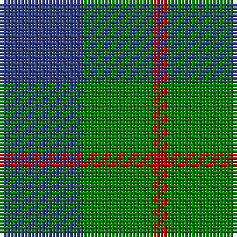

In pattern [BGR](/stripes/bgr/).

This was sourced from weddslist.  It is a [3 stripe tartan](/stripes/stripes3/).

Original link http://www.weddslist.com/cgi-bin/tartans/pg.pl?source=sts

## Thread count
B/24 G20 R/4

## Palette
Each colour and the base-6 reference it is a variant of.

| Colour | Shade | Base |
|---|---|---|
| B | <code style="background-color:#304080;">#304080</code> `oklch(39.4% 0.109 270.2)` <small>#304080</small> | B <code style="background-color:#2A418A;">#2A418A</code> |
| G | <code style="background-color:#008000;">#008000</code> `oklch(52.0% 0.177 142.5)` <small>#008000</small> | G <code style="background-color:#006100;">#006100</code> |
| R | <code style="background-color:#C00000;">#C00000</code> `oklch(50.7% 0.208 29.2)` <small>#C00000</small> | R <code style="background-color:#CC0000;">#CC0000</code> |

# Sample pattern

## Nearest tartans

The nearest existing variants by ΔTartan distance.

1. [Wilson's No 62, (Ferguson)](/setts/s3/db13r2g13~x2/) — ΔT 0.41
1. [Wilson's No 84, Ferguson](/setts/s3/db5g6r1~x4/) — ΔT 0.46
1. [Ferguson - 1930 (Old)](/setts/s3/g17r2db15~x2/) — ΔT 0.79
1. [Wilson's No.055](/setts/s3/g6dp5t1~x4/) — ΔT 0.90
1. [Agnew](/setts/s3/db53g42r14/) — ΔT 0.93
1. [Unnamed No 78](/setts/s4/db2g7db7w1~x2/) — ΔT 1.12
1. [Wilson's, No 55](/setts/s3/g6p5t1~x4/) — ΔT 1.22
1. [Agnew](/setts/s3/db53g42r14~x2/) — ΔT 1.24
1. [Unidentified No 78](/setts/s4/db2dg7db7w1~x2/) — ΔT 1.32
1. [MacCurdie (Clan?)](/setts/s4/k5g14db12g4~x4/) — ΔT 1.32

## Neighbour map

Every grey dot is one of 14299 variants placed by the first two principal components of the ΔTartan feature space (44% of its variance). Red is this tartan; blue dots are its nearest — click one to open its page.

<svg viewBox="0 0 640 380" role="img" style="max-width:100%;height:auto;border:1px solid #e0e0e0;border-radius:4px;display:block" xmlns="http://www.w3.org/2000/svg"><image href="/nn/cloud.v1.png" width="640" height="380"/><a href="/setts/s3/db13r2g13~x2/"><circle cx="288.7" cy="320.2" r="4" fill="#3465a4"><title>Wilson's No 62, (Ferguson)</title></circle></a><a href="/setts/s3/db5g6r1~x4/"><circle cx="291.6" cy="323.6" r="4" fill="#3465a4"><title>Wilson's No 84, Ferguson</title></circle></a><a href="/setts/s3/g17r2db15~x2/"><circle cx="326.9" cy="313.2" r="4" fill="#3465a4"><title>Ferguson - 1930 (Old)</title></circle></a><a href="/setts/s3/g6dp5t1~x4/"><circle cx="289.9" cy="319.0" r="4" fill="#3465a4"><title>Wilson's No.055</title></circle></a><a href="/setts/s3/db53g42r14/"><circle cx="248.0" cy="346.2" r="4" fill="#3465a4"><title>Agnew</title></circle></a><a href="/setts/s4/db2g7db7w1~x2/"><circle cx="304.3" cy="287.4" r="4" fill="#3465a4"><title>Unnamed No 78</title></circle></a><a href="/setts/s3/g6p5t1~x4/"><circle cx="273.8" cy="304.5" r="4" fill="#3465a4"><title>Wilson's, No 55</title></circle></a><a href="/setts/s3/db53g42r14~x2/"><circle cx="252.2" cy="348.1" r="4" fill="#3465a4"><title>Agnew</title></circle></a><a href="/setts/s4/db2dg7db7w1~x2/"><circle cx="333.1" cy="303.9" r="4" fill="#3465a4"><title>Unidentified No 78</title></circle></a><a href="/setts/s4/k5g14db12g4~x4/"><circle cx="265.3" cy="345.9" r="4" fill="#3465a4"><title>MacCurdie (Clan?)</title></circle></a><circle cx="293.4" cy="323.6" r="5" fill="#c00000"/></svg>

ID: /setts/s3/db6g5r1~x4/
