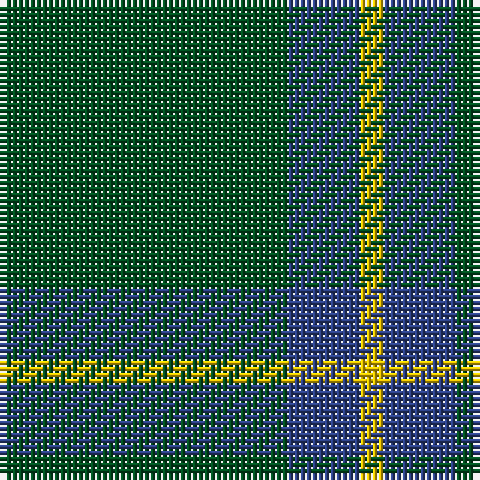

In pattern [GBY](/stripes/gby/).

This was sourced from register-of-tartans.  It is a [3 stripe tartan](/stripes/stripes3/).

Original link https://www.tartanregister.gov.uk/tartanDetails.aspx?ref=4338

## Also known as

This cloth is also recorded under:

- Unidentified, pattern

## Register references

External register numbers recorded for this tartan.

- Scottish Register of Tartans: [4338](https://www.tartanregister.gov.uk/tartanDetails.aspx?ref=4338)
- Scottish Tartans World Register: 750

## Thread count
G/48 B12 Y/4

## Palette
Each colour and the base-6 reference it is a variant of.

| Colour | Shade | Base |
|---|---|---|
| B | <code style="background-color:#2C4084;">#2C4084</code> `oklch(39.4% 0.117 268.3)` <small>#2C4084</small> | B <code style="background-color:#2A418A;">#2A418A</code> |
| G | <code style="background-color:#005020;">#005020</code> `oklch(37.7% 0.105 149.6)` <small>#005020</small> | G <code style="background-color:#006100;">#006100</code> |
| Y | <code style="background-color:#E8C000;">#E8C000</code> `oklch(81.9% 0.168 93.7)` <small>#E8C000</small> | Y <code style="background-color:#F2BF00;">#F2BF00</code> |

# Sample pattern

## Nearest tartans

The nearest existing variants by ΔTartan distance.

1. [Highland Spring (1997) (Corporate)](/setts/s4/dp7g23r3g7~x2/) — ΔT 1.34
1. [Peterhead (Personal)](/setts/s5/g9n1g2k4g2~x4/) — ΔT 1.40
1. [Montgomerie](/setts/s4/g12db3g1~x2/) — ΔT 1.49
1. [Unidentified, pattern](/setts/s3/g12db3ly1~x4/) — ΔT 1.58
1. [Jodi Williams (Personal)](/setts/s4/g8r1db1n1~x10/) — ΔT 1.58
1. [Ledford](/setts/s3/dg9y4lo1~x8/) — ΔT 1.64
1. [Tyrconnell (Personal)](/setts/s5/g44db9r2db9g2~x2/) — ΔT 1.70
1. [O'Neill, Red (Corporate?)](/setts/s4/g9o20g46lg5~x2/) — ΔT 1.77
1. [Highland Spring (Green)](/setts/s4/g7r3g23m7~x2/) — ΔT 1.83
1. [Welsh National District Tartan Tartan Number: 1523. Earliest known date: 1968 The Welsh Tartan owes its origin to a Society formed in Cardiff in 1967. Its aims were cultural and political - to strengthen Celtic ties and give visible signs of being an individual nation in culture, language and dress. The colours are those of the Welsh flag. It is said that the design was based on the Lord of the Isles tartan because the present Lord is also Prince of Wales. However comparison reveals similarity only to MacDonald, MacDonald of the Isles, or perhaps Applecross district. See products available Copyright © Blair Urquhart, Comrie, 2015](/setts/s5/m2g1m1g10w1~x4/) — ΔT 1.92

## Neighbour map

Every grey dot is one of 14299 variants placed by the first two principal components of the ΔTartan feature space (44% of its variance). Red is this tartan; blue dots are its nearest — click one to open its page.

<svg viewBox="0 0 640 380" role="img" style="max-width:100%;height:auto;border:1px solid #e0e0e0;border-radius:4px;display:block" xmlns="http://www.w3.org/2000/svg"><image href="/nn/cloud.v1.png" width="640" height="380"/><a href="/setts/s4/dp7g23r3g7~x2/"><circle cx="471.7" cy="289.2" r="4" fill="#3465a4"><title>Highland Spring (1997) (Corporate)</title></circle></a><a href="/setts/s5/g9n1g2k4g2~x4/"><circle cx="461.6" cy="274.4" r="4" fill="#3465a4"><title>Peterhead (Personal)</title></circle></a><a href="/setts/s4/g12db3g1~x2/"><circle cx="486.0" cy="285.2" r="4" fill="#3465a4"><title>Montgomerie</title></circle></a><a href="/setts/s3/g12db3ly1~x4/"><circle cx="495.9" cy="275.1" r="4" fill="#3465a4"><title>Unidentified, pattern</title></circle></a><a href="/setts/s4/g8r1db1n1~x10/"><circle cx="477.1" cy="261.8" r="4" fill="#3465a4"><title>Jodi Williams (Personal)</title></circle></a><a href="/setts/s3/dg9y4lo1~x8/"><circle cx="421.5" cy="306.5" r="4" fill="#3465a4"><title>Ledford</title></circle></a><a href="/setts/s5/g44db9r2db9g2~x2/"><circle cx="512.9" cy="221.1" r="4" fill="#3465a4"><title>Tyrconnell (Personal)</title></circle></a><a href="/setts/s4/g9o20g46lg5~x2/"><circle cx="463.7" cy="288.5" r="4" fill="#3465a4"><title>O'Neill, Red (Corporate?)</title></circle></a><a href="/setts/s4/g7r3g23m7~x2/"><circle cx="474.2" cy="288.5" r="4" fill="#3465a4"><title>Highland Spring (Green)</title></circle></a><a href="/setts/s5/m2g1m1g10w1~x4/"><circle cx="479.5" cy="228.3" r="4" fill="#3465a4"><title>Welsh National District Tartan Tartan Number: 1523. Earliest known date: 1968 The Welsh Tartan owes its origin to a Society formed in Cardiff in 1967. Its aims were cultural and political - to strengthen Celtic ties and give visible signs of being an individual nation in culture, language and dress. The colours are those of the Welsh flag. It is said that the design was based on the Lord of the Isles tartan because the present Lord is also Prince of Wales. However comparison reveals similarity only to MacDonald, MacDonald of the Isles, or perhaps Applecross district. See products available Copyright © Blair Urquhart, Comrie, 2015</title></circle></a><circle cx="516.3" cy="286.5" r="5" fill="#c00000"/></svg>

ID: /setts/s3/dg12db3ly1~x4/
