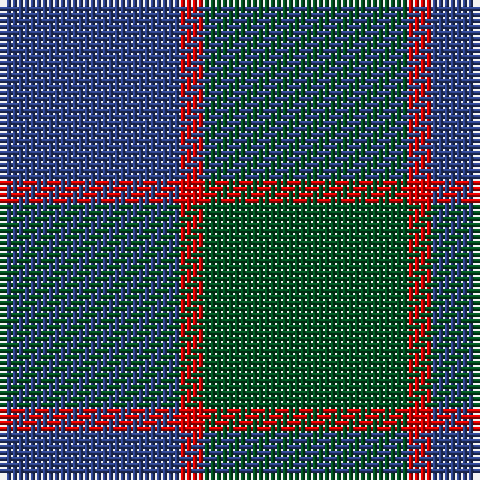

**Bands:** [BRG](/stripes/brg/) · **Stripes:** [DB R DG](/stripes/stripes3/) DB R DG

This was sourced from register-of-tartans.  It is a [3 band tartan](/bands/bands3/).

Original link https://www.tartanregister.gov.uk/tartanDetails.aspx?ref=1160

## Register references

External register numbers recorded for this tartan.

- Scottish Register of Tartans: [1160](https://www.tartanregister.gov.uk/tartanDetails.aspx?ref=1160)
- Scottish Tartans World Register: 503

## Thread count
B/30 R4 G/34

## Palette
Each colour and its ΔE from the base-6 reference it is a variant of.

| Colour | Shade | Base | ΔE (OKLab) |
|---|---|---|---|
| B | <code style="background-color:#2C4084;">#2C4084</code> `#2C4084` | B <code style="background-color:#2A418A;">#2A418A</code> | 0.01 |
| G | <code style="background-color:#005020;">#005020</code> `#005020` | G <code style="background-color:#006100;">#006100</code> | 0.07 |
| R | <code style="background-color:#DC0000;">#DC0000</code> `#DC0000` | R <code style="background-color:#CC0000;">#CC0000</code> | 0.03 |

# Sample pattern

## Nearest tartans

The nearest existing variants by ΔTartan distance.

1. [Ferguson](/setts/s3/db6dg5r1~x4/) — ΔT 0.77
1. [Ferguson - 1930 (Old)](/setts/s3/g17r2db15~x2/) — ΔT 1.44
1. [Hamilton Hunting](/setts/s5/db11dg2db15dg18w2~x2/) — ΔT 1.48
1. [Unidentified No 78](/setts/s4/db2dg7db7w1~x2/) — ΔT 1.54
1. [Unidentified #4](/setts/s4/dg14r3db9t2~x2/) — ΔT 1.66
1. [Unidentified #24](/setts/s5/db16dy2db16dy19r4~x3/) — ΔT 1.66
1. [Innes (Miniature)](/setts/s4/k6t1dg7k1~x2/) — ΔT 1.71
1. [Unidentified Tweed](/setts/s6/db4w1db12dg12db1dg4~x2/) — ΔT 1.84
1. [Ferguson](/setts/s3/db6g5r1~x4/) — ΔT 1.86
1. [Wilson's, No 161](/setts/s3/g13r2t13~x2/) — ΔT 1.87

## Neighbour map

Every grey dot is one of 14313 variants placed by the first two principal components of the ΔTartan feature space (44% of its variance). Red is this tartan; blue dots are its nearest — click one to open its page.

<svg viewBox="0 0 640 380" role="img" style="max-width:100%;height:auto;border:1px solid #e0e0e0;border-radius:4px;display:block" xmlns="http://www.w3.org/2000/svg"><image href="/nn/cloud.v1.png" width="640" height="380"/><a href="/setts/s3/db6dg5r1~x4/"><circle cx="331.0" cy="344.3" r="4" fill="#3465a4"><title>Ferguson</title></circle></a><a href="/setts/s3/g17r2db15~x2/"><circle cx="326.8" cy="313.4" r="4" fill="#3465a4"><title>Ferguson - 1930 (Old)</title></circle></a><a href="/setts/s5/db11dg2db15dg18w2~x2/"><circle cx="365.8" cy="291.6" r="4" fill="#3465a4"><title>Hamilton Hunting</title></circle></a><a href="/setts/s4/db2dg7db7w1~x2/"><circle cx="333.0" cy="304.1" r="4" fill="#3465a4"><title>Unidentified No 78</title></circle></a><a href="/setts/s4/dg14r3db9t2~x2/"><circle cx="292.1" cy="284.6" r="4" fill="#3465a4"><title>Unidentified #4</title></circle></a><a href="/setts/s5/db16dy2db16dy19r4~x3/"><circle cx="399.4" cy="306.2" r="4" fill="#3465a4"><title>Unidentified #24</title></circle></a><a href="/setts/s4/k6t1dg7k1~x2/"><circle cx="336.3" cy="308.1" r="4" fill="#3465a4"><title>Innes (Miniature)</title></circle></a><a href="/setts/s6/db4w1db12dg12db1dg4~x2/"><circle cx="385.7" cy="269.6" r="4" fill="#3465a4"><title>Unidentified Tweed</title></circle></a><a href="/setts/s3/db6g5r1~x4/"><circle cx="293.4" cy="323.9" r="4" fill="#3465a4"><title>Ferguson</title></circle></a><a href="/setts/s3/g13r2t13~x2/"><circle cx="308.5" cy="329.3" r="4" fill="#3465a4"><title>Wilson's, No 161</title></circle></a><circle cx="365.6" cy="334.8" r="5" fill="#c00000"/></svg>

ID: /setts/s3/dg17r2db15~x2/
