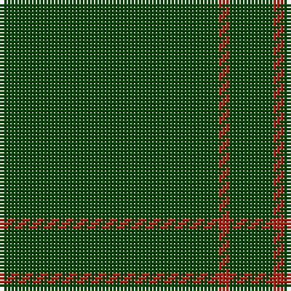

In pattern [GRG](/stripes/grg/).

This was sourced from register-of-tartans.  It is a [3 stripe tartan](/stripes/stripes3/).

Original link https://www.tartanregister.gov.uk/tartanDetails.aspx?ref=592

## Also known as

This cloth is also recorded under:

- Castle Fraser Check

## Attestations

This cloth appears in 2 source records; the oldest owns this page.

- 01/01/2002 — Castle Fraser Check (register-of-tartans, [record](https://www.tartanregister.gov.uk/tartanDetails.aspx?ref=592))
- pre 2002 — Castle Fraser (Estate Check) (tartans-authority, [record](http://www.tartansauthority.com/tartan-ferret/display/4476/))

## Register references

External register numbers recorded for this tartan.

- Scottish Register of Tartans: [592](https://www.tartanregister.gov.uk/tartanDetails.aspx?ref=592)
- Scottish Tartans Authority (ITI): 4476

## Thread count
G/60 R3 G/12

## Palette
Each colour and its ΔE from the base-6 reference it is a variant of.

| Colour | Shade | Base | ΔE (OKLab) |
|---|---|---|---|
| G | <code style="background-color:#004C00;">#004C00</code> `#004C00` | G <code style="background-color:#006100;">#006100</code> | 0.07 |
| R | <code style="background-color:#C02000;">#C02000</code> `#C02000` | R <code style="background-color:#CC0000;">#CC0000</code> | 0.03 |

# Sample pattern

## Nearest tartans

The nearest existing variants by ΔTartan distance.

1. [Kenmore Hunting](/setts/s7/r2g19g2g2g19g2lo2~x2/) — ΔT 2.80
1. [Campbell Simpson](/setts/s4/dg22k3dg25k4~x2/) — ΔT 2.87
1. [MacNab, Ancient](/setts/s5/dg62r7k4r4dg62~x2/) — ΔT 3.02
1. [Walters (Personal)](/setts/s6/g2dp2g20g2g2dp1~x4/) — ΔT 3.16
1. [St. David's (District)](/setts/s6/dg60r2dg8r1dg5k2/) — ΔT 3.21
1. [Black Shadow (Fashion)](/setts/s2/k20n1~x6/) — ΔT 3.22
1. [Walters (Personal)](/setts/s10/g2dp2g20g2g2g1~x4/) — ΔT 3.35
1. [Kenmore Hunting (Fashion)](/setts/s7/k2g2g19g2g2g19r2~x2/) — ΔT 3.52
1. [Pasteur](/setts/s4/dy10ly1dy30y3~x4/) — ΔT 3.57
1. [Dunbar of Pitgaveny](/setts/s4/o19w1o19m1~x2/) — ΔT 3.59

## Neighbour map

Every grey dot is one of 14299 variants placed by the first two principal components of the ΔTartan feature space (44% of its variance). Red is this tartan; blue dots are its nearest — click one to open its page.

<svg viewBox="0 0 640 380" role="img" style="max-width:100%;height:auto;border:1px solid #e0e0e0;border-radius:4px;display:block" xmlns="http://www.w3.org/2000/svg"><image href="/nn/cloud.v1.png" width="640" height="380"/><a href="/setts/s7/r2g19g2g2g19g2lo2~x2/"><circle cx="626.0" cy="276.2" r="4" fill="#3465a4"><title>Kenmore Hunting</title></circle></a><a href="/setts/s4/dg22k3dg25k4~x2/"><circle cx="626.0" cy="362.6" r="4" fill="#3465a4"><title>Campbell Simpson</title></circle></a><a href="/setts/s5/dg62r7k4r4dg62~x2/"><circle cx="626.0" cy="264.4" r="4" fill="#3465a4"><title>MacNab, Ancient</title></circle></a><a href="/setts/s6/g2dp2g20g2g2dp1~x4/"><circle cx="626.0" cy="226.1" r="4" fill="#3465a4"><title>Walters (Personal)</title></circle></a><a href="/setts/s6/dg60r2dg8r1dg5k2/"><circle cx="626.0" cy="200.1" r="4" fill="#3465a4"><title>St. David's (District)</title></circle></a><a href="/setts/s2/k20n1~x6/"><circle cx="626.0" cy="366.0" r="4" fill="#3465a4"><title>Black Shadow (Fashion)</title></circle></a><a href="/setts/s10/g2dp2g20g2g2g1~x4/"><circle cx="626.0" cy="219.1" r="4" fill="#3465a4"><title>Walters (Personal)</title></circle></a><a href="/setts/s7/k2g2g19g2g2g19r2~x2/"><circle cx="626.0" cy="256.6" r="4" fill="#3465a4"><title>Kenmore Hunting (Fashion)</title></circle></a><a href="/setts/s4/dy10ly1dy30y3~x4/"><circle cx="626.0" cy="239.0" r="4" fill="#3465a4"><title>Pasteur</title></circle></a><a href="/setts/s4/o19w1o19m1~x2/"><circle cx="626.0" cy="275.8" r="4" fill="#3465a4"><title>Dunbar of Pitgaveny</title></circle></a><circle cx="626.0" cy="326.5" r="5" fill="#c00000"/></svg>

ID: /setts/s3/dg20r1dg4~x3/
