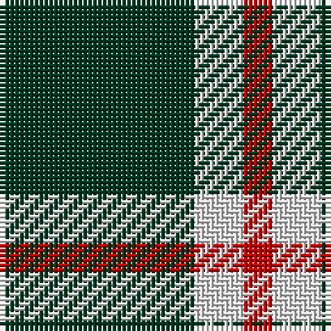

**Bands:** [GWR](/stripes/gwr/) · **Stripes:** [DG W R](/stripes/stripes3/) DG W R

This was sourced from tartans-authority.  It is a [3 band tartan](/bands/bands3/).

Original link http://www.tartansauthority.com/tartan-ferret/display/3092/

## Thread count
DG/40 LN10 R/6

## Palette
Each colour and its ΔE from the base-6 reference it is a variant of.

| Colour | Shade | Base | ΔE (OKLab) |
|---|---|---|---|
| DG | <code style="background-color:#003820;">#003820</code> `#003820` | G <code style="background-color:#006100;">#006100</code> | 0.15 |
| LN | <code style="background-color:#E0E0E0;">#E0E0E0</code> `#E0E0E0` | W <code style="background-color:#F7F7F7;">#F7F7F7</code> | 0.07 |
| R | <code style="background-color:#C80000;">#C80000</code> `#C80000` | R <code style="background-color:#CC0000;">#CC0000</code> | 0.01 |

# Sample pattern

## Nearest tartans

The nearest existing variants by ΔTartan distance.

1. [Special Saffron (Fashion)](/setts/s4/dg21lo44dg86t10/) — ΔT 1.12
1. [Special Saffron Tartan Tartan Number: 201. Earliest known date: pre 2003 Y = Saffron See products available Copyright © Blair Urquhart, Comrie, 2015](/setts/s4/dg21ly43dg86t10/) — ΔT 1.18
1. [Special, Saffron](/setts/s4/dg21lo43dg86b10/) — ΔT 1.33
1. [Lords of Skye (Fashion?)](/setts/s4/k46dy7k8w20~x2/) — ΔT 1.34
1. [Juchter (Personal)](/setts/s4/dg20w5r3w5~x2/) — ΔT 1.48
1. [Cowie, Justine (Personal)](/setts/s3/g9k18r2~x4/) — ΔT 1.50
1. [Takla Makan #2 (Artefact)](/setts/s4/k4lo15k4w2~x2/) — ΔT 1.63
1. [Wilson's, No 211](/setts/s4/g8p4g1p2~x4/) — ΔT 1.78
1. [Wilson's No.189](/setts/s4/dp4g10r1w1~x2/) — ΔT 1.80
1. [Justus #2 (Personal)](/setts/s4/k5lo1k1lo1~x20/) — ΔT 1.84

## Neighbour map

Every grey dot is one of 14313 variants placed by the first two principal components of the ΔTartan feature space (44% of its variance). Red is this tartan; blue dots are its nearest — click one to open its page.

<svg viewBox="0 0 640 380" role="img" style="max-width:100%;height:auto;border:1px solid #e0e0e0;border-radius:4px;display:block" xmlns="http://www.w3.org/2000/svg"><image href="/nn/cloud.v1.png" width="640" height="380"/><a href="/setts/s4/dg21lo44dg86t10/"><circle cx="372.8" cy="262.4" r="4" fill="#3465a4"><title>Special Saffron (Fashion)</title></circle></a><a href="/setts/s4/dg21ly43dg86t10/"><circle cx="357.7" cy="255.2" r="4" fill="#3465a4"><title>Special Saffron Tartan Tartan Number: 201. Earliest known date: pre 2003 Y = Saffron See products available Copyright © Blair Urquhart, Comrie, 2015</title></circle></a><a href="/setts/s4/dg21lo43dg86b10/"><circle cx="379.2" cy="263.9" r="4" fill="#3465a4"><title>Special, Saffron</title></circle></a><a href="/setts/s4/k46dy7k8w20~x2/"><circle cx="335.8" cy="250.0" r="4" fill="#3465a4"><title>Lords of Skye (Fashion?)</title></circle></a><a href="/setts/s4/dg20w5r3w5~x2/"><circle cx="306.6" cy="242.9" r="4" fill="#3465a4"><title>Juchter (Personal)</title></circle></a><a href="/setts/s3/g9k18r2~x4/"><circle cx="343.2" cy="277.9" r="4" fill="#3465a4"><title>Cowie, Justine (Personal)</title></circle></a><a href="/setts/s4/k4lo15k4w2~x2/"><circle cx="308.4" cy="235.9" r="4" fill="#3465a4"><title>Takla Makan #2 (Artefact)</title></circle></a><a href="/setts/s4/g8p4g1p2~x4/"><circle cx="375.5" cy="281.9" r="4" fill="#3465a4"><title>Wilson's, No 211</title></circle></a><a href="/setts/s4/dp4g10r1w1~x2/"><circle cx="343.4" cy="223.9" r="4" fill="#3465a4"><title>Wilson's No.189</title></circle></a><a href="/setts/s4/k5lo1k1lo1~x20/"><circle cx="443.5" cy="284.1" r="4" fill="#3465a4"><title>Justus #2 (Personal)</title></circle></a><circle cx="390.3" cy="268.7" r="5" fill="#c00000"/></svg>

ID: /setts/s3/dg20w5r3~x2/
