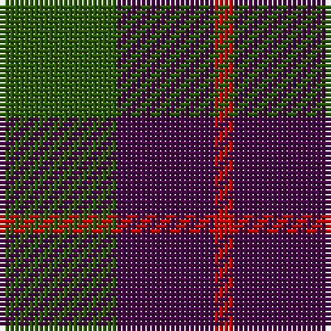

**Bands:** [GBR](/stripes/gbr/) · **Stripes:** [DG DP R](/stripes/stripes3/) DG DP R

This was sourced from register-of-tartans.  It is a [3 band tartan](/bands/bands3/).

Original link https://www.tartanregister.gov.uk/tartanDetails.aspx?ref=4670

## Register references

External register numbers recorded for this tartan.

- Scottish Register of Tartans: [4670](https://www.tartanregister.gov.uk/tartanDetails.aspx?ref=4670)
- Scottish Tartans Authority (ITI): 1953
- Scottish Tartans World Register: 1953

## Thread count
G/24 DP20 R/4

## Palette
Each colour and its ΔE from the base-6 reference it is a variant of.

| Colour | Shade | Base | ΔE (OKLab) |
|---|---|---|---|
| DG | <code style="background-color:#003820;">#003820</code> `#003820` | G <code style="background-color:#006100;">#006100</code> | 0.15 |
| DP | <code style="background-color:#440044;">#440044</code> `#440044` | B <code style="background-color:#2A418A;">#2A418A</code> | 0.18 |
| G | <code style="background-color:#285800;">#285800</code> `#285800` | G <code style="background-color:#006100;">#006100</code> | 0.03 |
| P | <code style="background-color:#780078;">#780078</code> `#780078` | B <code style="background-color:#2A418A;">#2A418A</code> | 0.17 |
| R | <code style="background-color:#C80000;">#C80000</code> `#C80000` | R <code style="background-color:#CC0000;">#CC0000</code> | 0.01 |
| Ra | <code style="background-color:#C80000;">#C80000</code> `#C80000` | R <code style="background-color:#CC0000;">#CC0000</code> | 0.01 |

# Sample pattern

## Nearest tartans

The nearest existing variants by ΔTartan distance.

1. [Wilson's No.055](/setts/s3/g6dp5t1~x4/) — ΔT 0.94
1. [Red Watch (Fashion) #1](/setts/s4/g6k2r3k1~x4/) — ΔT 1.43
1. [Royal Guard of Oman 4th Band Squadron](/setts/s4/g38r24k9r9~x2/) — ΔT 1.46
1. [Agnew](/setts/s3/db53g42r14~x2/) — ΔT 1.51
1. [Wilson's, No 55](/setts/s3/g6p5t1~x4/) — ΔT 1.52
1. [Wilson's No.062](/setts/s4/g13r2db13r2~x2/) — ΔT 1.56
1. [Ferguson](/setts/s3/db6g5r1~x4/) — ΔT 1.60
1. [Ferguson - 1930 (Old)](/setts/s3/g17r2db15~x2/) — ΔT 1.62
1. [Mayer, Chris (Personal)](/setts/s4/db1n6k6r1~x10/) — ΔT 1.63
1. [Agnew](/setts/s3/db53g42r14/) — ΔT 1.65

## Neighbour map

Every grey dot is one of 14313 variants placed by the first two principal components of the ΔTartan feature space (44% of its variance). Red is this tartan; blue dots are its nearest — click one to open its page.

<svg viewBox="0 0 640 380" role="img" style="max-width:100%;height:auto;border:1px solid #e0e0e0;border-radius:4px;display:block" xmlns="http://www.w3.org/2000/svg"><image href="/nn/cloud.v1.png" width="640" height="380"/><a href="/setts/s3/g6dp5t1~x4/"><circle cx="289.8" cy="319.3" r="4" fill="#3465a4"><title>Wilson's No.055</title></circle></a><a href="/setts/s4/g6k2r3k1~x4/"><circle cx="283.6" cy="301.6" r="4" fill="#3465a4"><title>Red Watch (Fashion) #1</title></circle></a><a href="/setts/s4/g38r24k9r9~x2/"><circle cx="286.7" cy="317.7" r="4" fill="#3465a4"><title>Royal Guard of Oman 4th Band Squadron</title></circle></a><a href="/setts/s3/db53g42r14~x2/"><circle cx="252.0" cy="348.3" r="4" fill="#3465a4"><title>Agnew</title></circle></a><a href="/setts/s3/g6p5t1~x4/"><circle cx="273.8" cy="304.7" r="4" fill="#3465a4"><title>Wilson's, No 55</title></circle></a><a href="/setts/s4/g13r2db13r2~x2/"><circle cx="273.1" cy="284.6" r="4" fill="#3465a4"><title>Wilson's No.062</title></circle></a><a href="/setts/s3/db6g5r1~x4/"><circle cx="293.4" cy="323.9" r="4" fill="#3465a4"><title>Ferguson</title></circle></a><a href="/setts/s3/g17r2db15~x2/"><circle cx="326.8" cy="313.4" r="4" fill="#3465a4"><title>Ferguson - 1930 (Old)</title></circle></a><a href="/setts/s4/db1n6k6r1~x10/"><circle cx="253.7" cy="274.7" r="4" fill="#3465a4"><title>Mayer, Chris (Personal)</title></circle></a><a href="/setts/s3/db53g42r14/"><circle cx="247.9" cy="346.4" r="4" fill="#3465a4"><title>Agnew</title></circle></a><circle cx="309.2" cy="323.3" r="5" fill="#c00000"/></svg>

ID: /setts/s3/dg6dp5r1~x4/
