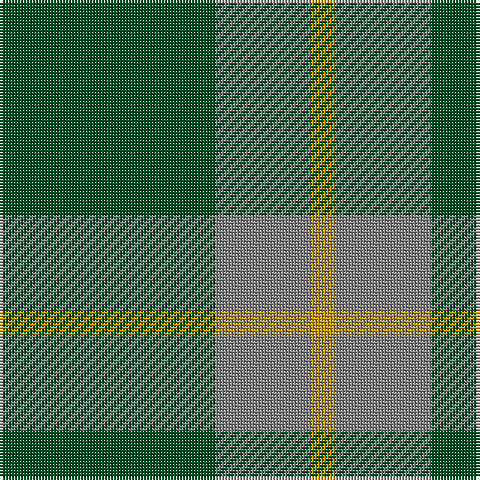

In pattern [GGY](/stripes/ggy/).

This was sourced from register-of-tartans.  It is a [3 stripe tartan](/stripes/stripes3/).

Original link https://www.tartanregister.gov.uk/tartanDetails.aspx?ref=2079

## Register references

External register numbers recorded for this tartan.

- Scottish Register of Tartans: [2079](https://www.tartanregister.gov.uk/tartanDetails.aspx?ref=2079)
- Scottish Tartans Authority (ITI): 835
- Scottish Tartans World Register: 835

## Thread count
G/72 N32 DY/8

## Palette
Each colour and the base-6 reference it is a variant of.

| Colour | Shade | Base |
|---|---|---|
| DY | <code style="background-color:#C89600;">#C89600</code> `oklch(70.2% 0.144 84.7)` <small>#C89600</small> | Y <code style="background-color:#F2BF00;">#F2BF00</code> |
| G | <code style="background-color:#005020;">#005020</code> `oklch(37.7% 0.105 149.6)` <small>#005020</small> | G <code style="background-color:#006100;">#006100</code> |
| N | <code style="background-color:#808080;">#808080</code> `oklch(60.0% 0.000 89.9)` <small>#808080</small> | G <code style="background-color:#006100;">#006100</code> |

# Sample pattern

## Nearest tartans

The nearest existing variants by ΔTartan distance.

1. [Ledford Family Tartan Tartan Number: 835. Earliest known date: 1987 A quantity of this cloth was woven in 1998 for a Ledford family in the USA. See products available Copyright © Blair Urquhart, Comrie, 2015](/setts/s3/g9o4ly1~x4/) — ΔT 0.78
1. [O'Neill (Australia) (Name)](/setts/s4/g9o20g40w5~x2/) — ΔT 1.07
1. [O'Neill, Red (Corporate?)](/setts/s4/g9o20g46lg5~x2/) — ΔT 1.19
1. [Wilson's, No 212](/setts/s3/g9r2t2~x4/) — ΔT 1.53
1. [Montgomery](/setts/s4/g6db2g1~x4/) — ΔT 1.61
1. [Montgomery - 1842 (VS](/setts/s4/g6db2g1~x8/) — ΔT 1.61
1. [Unidentified pattern #2](/setts/s3/dg12db3ly1~x4/) — ΔT 1.64
1. [Scotch Tape (Corporate)](/setts/s3/g30k20g3~x2/) — ΔT 1.68
1. [Highland Spring (1997) (Corporate)](/setts/s4/dp7g23r3g7~x2/) — ΔT 1.68
1. [Peterhead (Personal)](/setts/s5/g9n1g2k4g2~x4/) — ΔT 1.69

## Neighbour map

Every grey dot is one of 14299 variants placed by the first two principal components of the ΔTartan feature space (44% of its variance). Red is this tartan; blue dots are its nearest — click one to open its page.

<svg viewBox="0 0 640 380" role="img" style="max-width:100%;height:auto;border:1px solid #e0e0e0;border-radius:4px;display:block" xmlns="http://www.w3.org/2000/svg"><image href="/nn/cloud.v1.png" width="640" height="380"/><a href="/setts/s3/g9o4ly1~x4/"><circle cx="415.8" cy="303.5" r="4" fill="#3465a4"><title>Ledford Family Tartan Tartan Number: 835. Earliest known date: 1987 A quantity of this cloth was woven in 1998 for a Ledford family in the USA. See products available Copyright © Blair Urquhart, Comrie, 2015</title></circle></a><a href="/setts/s4/g9o20g40w5~x2/"><circle cx="413.2" cy="286.9" r="4" fill="#3465a4"><title>O'Neill (Australia) (Name)</title></circle></a><a href="/setts/s4/g9o20g46lg5~x2/"><circle cx="463.7" cy="288.5" r="4" fill="#3465a4"><title>O'Neill, Red (Corporate?)</title></circle></a><a href="/setts/s3/g9r2t2~x4/"><circle cx="414.8" cy="318.5" r="4" fill="#3465a4"><title>Wilson's, No 212</title></circle></a><a href="/setts/s4/g6db2g1~x4/"><circle cx="426.5" cy="330.6" r="4" fill="#3465a4"><title>Montgomery</title></circle></a><a href="/setts/s4/g6db2g1~x8/"><circle cx="426.5" cy="330.6" r="4" fill="#3465a4"><title>Montgomery - 1842 (VS</title></circle></a><a href="/setts/s3/dg12db3ly1~x4/"><circle cx="516.3" cy="286.5" r="4" fill="#3465a4"><title>Unidentified pattern #2</title></circle></a><a href="/setts/s3/g30k20g3~x2/"><circle cx="420.2" cy="323.5" r="4" fill="#3465a4"><title>Scotch Tape (Corporate)</title></circle></a><a href="/setts/s4/dp7g23r3g7~x2/"><circle cx="471.7" cy="289.2" r="4" fill="#3465a4"><title>Highland Spring (1997) (Corporate)</title></circle></a><a href="/setts/s5/g9n1g2k4g2~x4/"><circle cx="461.6" cy="274.4" r="4" fill="#3465a4"><title>Peterhead (Personal)</title></circle></a><circle cx="421.5" cy="306.5" r="5" fill="#c00000"/></svg>

ID: /setts/s3/dg9y4lo1~x8/
