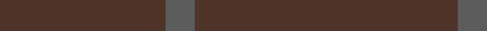
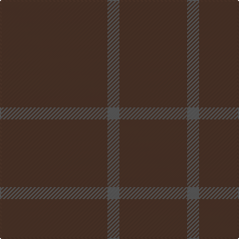

In pattern [BBB](/stripes/bbb/).

This was sourced from register-of-tartans.  It is a [3 stripe tartan](/stripes/stripes3/).

Original link https://www.tartanregister.gov.uk/tartanDetails.aspx?ref=11116

## Register references

External register numbers recorded for this tartan.

- Scottish Register of Tartans: [11116](https://www.tartanregister.gov.uk/tartanDetails.aspx?ref=11116)

## Thread count
T/108 N12 T/68

## Palette
Each colour and the base-6 reference it is a variant of.

| Colour | Shade | Base |
|---|---|---|
| N | <code style="background-color:#5C5C5C;">#5C5C5C</code> `oklch(47.5% 0.000 89.9)` <small>#5C5C5C</small> | B <code style="background-color:#2A418A;">#2A418A</code> |
| T | <code style="background-color:#4C3428;">#4C3428</code> `oklch(34.9% 0.040 47.5)` <small>#4C3428</small> | B <code style="background-color:#2A418A;">#2A418A</code> |

# Sample pattern

## Nearest tartans

The nearest existing variants by ΔTartan distance, with this tartan at the top so the swatches line up against it.

ΔTartan

Tartan

Sett

—

<a href="/ttd/edit/#slug=do27n3do17~x4">Outlander #4</a> <a class="nn-out" href="/setts/s3/do27n3do17~x4/" title="open its dictionary page">↗</a>

2.03

<a href="/ttd/edit/#slug=dy9n1~x12">Outlander #4</a> <a class="nn-out" href="/setts/s2/dy9n1~x12/" title="open its dictionary page">↗</a>

3.01

<a href="/ttd/edit/#slug=dy16y3dy2~x10">Hallstatt (Artefact)</a> <a class="nn-out" href="/setts/s3/dy16y3dy2~x10/" title="open its dictionary page">↗</a>

3.20

<a href="/ttd/edit/#slug=dt4k2dt16k2dt16k1~x4">Ben Dubh (The Black Mount)</a> <a class="nn-out" href="/setts/s6/dt4k2dt16k2dt16k1~x4/" title="open its dictionary page">↗</a>

3.50

<a href="/ttd/edit/#slug=db12k1~x10">Staines</a> <a class="nn-out" href="/setts/s2/db12k1~x10/" title="open its dictionary page">↗</a>

3.55

<a href="/ttd/edit/#slug=do5k2do28k10do26k4do4~x2">Dunbar, John Telfer (Personal)</a> <a class="nn-out" href="/setts/s7/do5k2do28k10do26k4do4~x2/" title="open its dictionary page">↗</a>

4.05

<a href="/ttd/edit/#slug=n2y3n3y3n10y2n18y1~x4">Hebridean Cairn Fashion Tartan Tartan Number: 6822. Earliest known date: 2005 For a new House of Edgar Collection in wedding gray. See products available Copyright © Blair Urquhart, Comrie, 2015</a> <a class="nn-out" href="/setts/s8/n2y3n3y3n10y2n18y1~x4/" title="open its dictionary page">↗</a>

4.63

<a href="/ttd/edit/#slug=n2o3n3o3n10o2n18o1~x4">Hebridean Cairn (Fashion)</a> <a class="nn-out" href="/setts/s8/n2o3n3o3n10o2n18o1~x4/" title="open its dictionary page">↗</a>

4.72

<a href="/ttd/edit/#slug=lo81g6lo8g8~x2">Young in Australia (Name)</a> <a class="nn-out" href="/setts/s4/lo81g6lo8g8~x2/" title="open its dictionary page">↗</a>

## Neighbour map

Every grey dot is one of 14299 variants placed by the first two principal components of the ΔTartan feature space (44% of its variance). Red is this tartan; blue dots are its nearest — click one to open its page.

<svg viewBox="0 0 640 380" role="img" style="max-width:100%;height:auto;border:1px solid #e0e0e0;border-radius:4px;display:block" xmlns="http://www.w3.org/2000/svg"><image href="/nn/cloud.v1.png" width="640" height="380"/><a href="/setts/s2/dy9n1~x12/"><circle cx="626.0" cy="366.0" r="4" fill="#3465a4"><title>Outlander #4</title></circle></a><a href="/setts/s3/dy16y3dy2~x10/"><circle cx="626.0" cy="366.0" r="4" fill="#3465a4"><title>Hallstatt (Artefact)</title></circle></a><a href="/setts/s6/dt4k2dt16k2dt16k1~x4/"><circle cx="626.0" cy="366.0" r="4" fill="#3465a4"><title>Ben Dubh (The Black Mount)</title></circle></a><a href="/setts/s2/db12k1~x10/"><circle cx="626.0" cy="366.0" r="4" fill="#3465a4"><title>Staines</title></circle></a><a href="/setts/s7/do5k2do28k10do26k4do4~x2/"><circle cx="626.0" cy="356.2" r="4" fill="#3465a4"><title>Dunbar, John Telfer (Personal)</title></circle></a><a href="/setts/s8/n2y3n3y3n10y2n18y1~x4/"><circle cx="626.0" cy="322.6" r="4" fill="#3465a4"><title>Hebridean Cairn Fashion Tartan Tartan Number: 6822. Earliest known date: 2005 For a new House of Edgar Collection in wedding gray. See products available Copyright © Blair Urquhart, Comrie, 2015</title></circle></a><a href="/setts/s8/n2o3n3o3n10o2n18o1~x4/"><circle cx="626.0" cy="297.9" r="4" fill="#3465a4"><title>Hebridean Cairn (Fashion)</title></circle></a><a href="/setts/s4/lo81g6lo8g8~x2/"><circle cx="626.0" cy="314.0" r="4" fill="#3465a4"><title>Young in Australia (Name)</title></circle></a><circle cx="626.0" cy="366.0" r="5" fill="#c00000"/></svg>

ID: /setts/s3/do27n3do17~x4/
