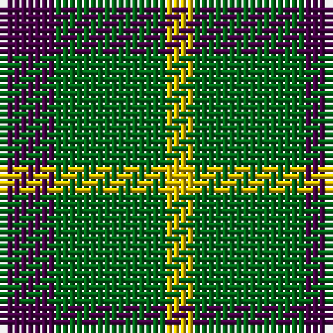

**Bands:** [BGY](/stripes/bgy/) · **Stripes:** [DP G LY](/stripes/stripes3/) DP G LY

This was sourced from register-of-tartans.  It is a [3 band tartan](/bands/bands3/).

Original link https://www.tartanregister.gov.uk/tartanDetails.aspx?ref=4733

## Register references

External register numbers recorded for this tartan.

- Scottish Register of Tartans: [4733](https://www.tartanregister.gov.uk/tartanDetails.aspx?ref=4733)
- Scottish Tartans Authority (ITI): 1937
- Scottish Tartans World Register: 1937

## Variants

Other setts woven to the same stripe pattern.

- [Wilson's No.081](/setts/s3/dp10g12ly1~x2/)

## Thread count
DP/8 G16 Y/4

## Palette
Each colour and its ΔE from the base-6 reference it is a variant of.

| Colour | Shade | Base | ΔE (OKLab) |
|---|---|---|---|
| DG | <code style="background-color:#003820;">#003820</code> `#003820` | G <code style="background-color:#006100;">#006100</code> | 0.15 |
| DP | <code style="background-color:#440044;">#440044</code> `#440044` | B <code style="background-color:#2A418A;">#2A418A</code> | 0.18 |
| G | <code style="background-color:#006818;">#006818</code> `#006818` | G <code style="background-color:#006100;">#006100</code> | 0.02 |
| LR | <code style="background-color:#E8CCB8;">#E8CCB8</code> `#E8CCB8` | W <code style="background-color:#F7F7F7;">#F7F7F7</code> | 0.12 |
| Y | <code style="background-color:#E8C000;">#E8C000</code> `#E8C000` | Y <code style="background-color:#F2BF00;">#F2BF00</code> | 0.02 |
| Ya | <code style="background-color:#D8B000;">#D8B000</code> `#D8B000` | Y <code style="background-color:#F2BF00;">#F2BF00</code> | 0.06 |

# Sample pattern

## Nearest tartans

The nearest existing variants by ΔTartan distance.

1. [Wilson's, No 201](/setts/s3/p2g4ly1~x4/) — ΔT 0.72
1. [Zwijnenberg, Frans (Personal)](/setts/s3/k23g8ly8~x4/) — ΔT 1.24
1. [Wilson's, No 81](/setts/s3/p5g6ly1~x4/) — ΔT 1.33
1. [Wilson's, No 45](/setts/s3/g4t1k2~x4/) — ΔT 1.35
1. [Wilson's No.053 #2](/setts/s4/g4k5g4ly1~x2/) — ΔT 1.39
1. [Wilson's, No 55](/setts/s3/g6p5t1~x4/) — ΔT 1.56
1. [Kincaid, of Kincaid](/setts/s3/k4g6r1~x10/) — ΔT 1.57
1. [Wilson's, No 208](/setts/s3/g7t2r4~x2/) — ΔT 1.57
1. [Wilson's No.050](/setts/s3/k5g6t1~x4/) — ΔT 1.60
1. [Wilson's No.055](/setts/s3/g6dp5t1~x4/) — ΔT 1.67

## Neighbour map

Every grey dot is one of 14313 variants placed by the first two principal components of the ΔTartan feature space (44% of its variance). Red is this tartan; blue dots are its nearest — click one to open its page.

<svg viewBox="0 0 640 380" role="img" style="max-width:100%;height:auto;border:1px solid #e0e0e0;border-radius:4px;display:block" xmlns="http://www.w3.org/2000/svg"><image href="/nn/cloud.v1.png" width="640" height="380"/><a href="/setts/s3/p2g4ly1~x4/"><circle cx="261.6" cy="310.8" r="4" fill="#3465a4"><title>Wilson's, No 201</title></circle></a><a href="/setts/s3/k23g8ly8~x4/"><circle cx="241.2" cy="319.3" r="4" fill="#3465a4"><title>Zwijnenberg, Frans (Personal)</title></circle></a><a href="/setts/s3/p5g6ly1~x4/"><circle cx="259.8" cy="295.2" r="4" fill="#3465a4"><title>Wilson's, No 81</title></circle></a><a href="/setts/s3/g4t1k2~x4/"><circle cx="242.4" cy="318.4" r="4" fill="#3465a4"><title>Wilson's, No 45</title></circle></a><a href="/setts/s4/g4k5g4ly1~x2/"><circle cx="279.4" cy="327.8" r="4" fill="#3465a4"><title>Wilson's No.053 #2</title></circle></a><a href="/setts/s3/g6p5t1~x4/"><circle cx="273.8" cy="304.7" r="4" fill="#3465a4"><title>Wilson's, No 55</title></circle></a><a href="/setts/s3/k4g6r1~x10/"><circle cx="258.0" cy="299.3" r="4" fill="#3465a4"><title>Kincaid, of Kincaid</title></circle></a><a href="/setts/s3/g7t2r4~x2/"><circle cx="268.8" cy="339.2" r="4" fill="#3465a4"><title>Wilson's, No 208</title></circle></a><a href="/setts/s3/k5g6t1~x4/"><circle cx="284.5" cy="325.5" r="4" fill="#3465a4"><title>Wilson's No.050</title></circle></a><a href="/setts/s3/g6dp5t1~x4/"><circle cx="289.8" cy="319.3" r="4" fill="#3465a4"><title>Wilson's No.055</title></circle></a><circle cx="264.9" cy="317.3" r="5" fill="#c00000"/></svg>

ID: /setts/s3/dp2g4ly1~x4/
