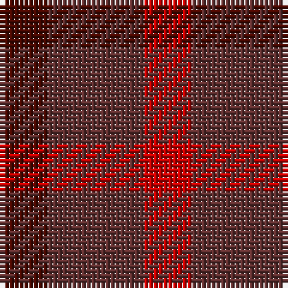

In pattern [BBR](/stripes/bbr/).

This was sourced from house-of-tartan.  It is a [3 stripe tartan](/stripes/stripes3/).

Original link http://www.house-of-tartan.scotland.net/house/TartanViewjs.asp?colr=Def&tnam=1663

## Thread count
R/10 DR20 DRa/10

## Palette
Each colour and the base-6 reference it is a variant of.

| Colour | Shade | Base |
|---|---|---|
| DR | <code style="background-color:#603030;">#603030</code> `oklch(37.2% 0.070 21.0)` <small>#603030</small> | B <code style="background-color:#2A418A;">#2A418A</code> |
| DRa | <code style="background-color:#480800;">#480800</code> `oklch(26.1% 0.096 33.1)` <small>#480800</small> | B <code style="background-color:#2A418A;">#2A418A</code> |
| R | <code style="background-color:#C80000;">#C80000</code> `oklch(52.3% 0.215 29.2)` <small>#C80000</small> | R <code style="background-color:#CC0000;">#CC0000</code> |

# Sample pattern

## Nearest tartans

The nearest existing variants by ΔTartan distance, with this tartan at the top so the swatches line up against it.

ΔTartan

Tartan

Sett

—

<a href="/ttd/edit/#slug=dr1dr2r1~x10">Glenmorangie Check Corporate Tartan Tartan Number: 1663. Earliest known date: 1988 Accredited by the Scottish Tartans Society in 1988. Glenmorangie is a well known malt whisky. See products available Copyright © Blair Urquhart, Comrie, 2015</a> <a class="nn-out" href="/setts/s3/dr1dr2r1~x10/" title="open its dictionary page">↗</a>

0.76

<a href="/ttd/edit/#slug=dy1dy2r1~x10">Glenmorangie Check</a> <a class="nn-out" href="/setts/s3/dy1dy2r1~x10/" title="open its dictionary page">↗</a>

2.24

<a href="/ttd/edit/#slug=dy1lo2r1~x10">Glenmorangie Check (Corporate)</a> <a class="nn-out" href="/setts/s3/dy1lo2r1~x10/" title="open its dictionary page">↗</a>

2.68

<a href="/ttd/edit/#slug=r10t5o5n4~x8">Haggis Hostels</a> <a class="nn-out" href="/setts/s4/r10t5o5n4~x8/" title="open its dictionary page">↗</a>

2.73

<a href="/ttd/edit/#slug=dr1r3r1g1dp1~x8">Blairgowrie Berries and Cherries</a> <a class="nn-out" href="/setts/s5/dr1r3r1g1dp1~x8/" title="open its dictionary page">↗</a>

2.87

<a href="/ttd/edit/#slug=dr1r3r1y1dp1~x4">Blairgowrie Berries and Cherries</a> <a class="nn-out" href="/setts/s5/dr1r3r1y1dp1~x4/" title="open its dictionary page">↗</a>

3.09

<a href="/ttd/edit/#slug=n16r2n10r14t5~x2">Mowbray (Personal)</a> <a class="nn-out" href="/setts/s5/n16r2n10r14t5~x2/" title="open its dictionary page">↗</a>

3.11

<a href="/ttd/edit/#slug=dg1db3dg3r1~x4">Barwell</a> <a class="nn-out" href="/setts/s4/dg1db3dg3r1~x4/" title="open its dictionary page">↗</a>

3.11

<a href="/ttd/edit/#slug=dy2t1lo1~x2">Gearach Woodcock Tweed (Corporate)</a> <a class="nn-out" href="/setts/s3/dy2t1lo1~x2/" title="open its dictionary page">↗</a>

3.11

<a href="/ttd/edit/#slug=r3dg3r1db3r3~x12">Gow (Portrait)</a> <a class="nn-out" href="/setts/s5/r3dg3r1db3r3~x12/" title="open its dictionary page">↗</a>

3.20

<a href="/ttd/edit/#slug=b10r10r3~x2">Masai Shuka 19 (Artefact)</a> <a class="nn-out" href="/setts/s3/b10r10r3~x2/" title="open its dictionary page">↗</a>

## Neighbour map

Every grey dot is one of 14299 variants placed by the first two principal components of the ΔTartan feature space (44% of its variance). Red is this tartan; blue dots are its nearest — click one to open its page.

<svg viewBox="0 0 640 380" role="img" style="max-width:100%;height:auto;border:1px solid #e0e0e0;border-radius:4px;display:block" xmlns="http://www.w3.org/2000/svg"><image href="/nn/cloud.v1.png" width="640" height="380"/><a href="/setts/s3/dy1dy2r1~x10/"><circle cx="295.9" cy="366.0" r="4" fill="#3465a4"><title>Glenmorangie Check</title></circle></a><a href="/setts/s3/dy1lo2r1~x10/"><circle cx="253.2" cy="366.0" r="4" fill="#3465a4"><title>Glenmorangie Check (Corporate)</title></circle></a><a href="/setts/s4/r10t5o5n4~x8/"><circle cx="178.3" cy="344.1" r="4" fill="#3465a4"><title>Haggis Hostels</title></circle></a><a href="/setts/s5/dr1r3r1g1dp1~x8/"><circle cx="227.9" cy="309.1" r="4" fill="#3465a4"><title>Blairgowrie Berries and Cherries</title></circle></a><a href="/setts/s5/dr1r3r1y1dp1~x4/"><circle cx="210.2" cy="295.6" r="4" fill="#3465a4"><title>Blairgowrie Berries and Cherries</title></circle></a><a href="/setts/s5/n16r2n10r14t5~x2/"><circle cx="397.8" cy="317.9" r="4" fill="#3465a4"><title>Mowbray (Personal)</title></circle></a><a href="/setts/s4/dg1db3dg3r1~x4/"><circle cx="334.1" cy="366.0" r="4" fill="#3465a4"><title>Barwell</title></circle></a><a href="/setts/s3/dy2t1lo1~x2/"><circle cx="224.7" cy="366.0" r="4" fill="#3465a4"><title>Gearach Woodcock Tweed (Corporate)</title></circle></a><a href="/setts/s5/r3dg3r1db3r3~x12/"><circle cx="240.9" cy="342.4" r="4" fill="#3465a4"><title>Gow (Portrait)</title></circle></a><a href="/setts/s3/b10r10r3~x2/"><circle cx="237.7" cy="338.1" r="4" fill="#3465a4"><title>Masai Shuka 19 (Artefact)</title></circle></a><circle cx="299.2" cy="366.0" r="5" fill="#c00000"/></svg>

ID: /setts/s3/dr1dr2r1~x10/
