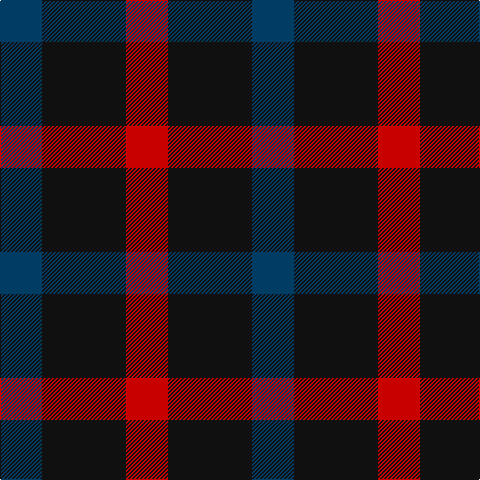

This page is one **sett** — a single exact thread-count. It belongs to the [tartan](/tartans/dt1k2r1/)
(the same proportion at any scale), whose colour order is pattern [BKR](/stripes/bkr/).

Sourced from tartans-authority.  It is a [3 stripe tartan](/stripes/stripes3/).

Original link http://www.tartansauthority.com/tartan-ferret/display/11230/

## Register references

External register numbers recorded for this tartan.

- Scottish Register of Tartans: [11230](https://www.tartanregister.gov.uk/tartanDetails?ref=11230)
- Scottish Tartans Authority (ITI): 11230

## Thread count
DB/42 K84 R/42

## Palette

Palette: <strong>Tartan Register</strong>
<table><thead><tr><th>Colour</th><th>Threads</th><th>Shade</th><th>Base</th><th>OKLCh</th></tr></thead><tbody><tr><td>DB/</td><td style="text-align:right;font-variant-numeric:tabular-nums">42</td><td><code style="background-color:#003C64;">#003C64</code> <small style="color:#888">#003C64</small></td><td>B <code style="background-color:#2A418A;">#2A418A</code></td><td><small style="color:#888">oklch(34.5% 0.089 246.0)</small></td></tr><tr><td>K</td><td style="text-align:right;font-variant-numeric:tabular-nums">84</td><td><code style="background-color:#101010;">#101010</code> <small style="color:#888">#101010</small></td><td>K <code style="background-color:#000000;">#000000</code></td><td><small style="color:#888">oklch(17.3% 0.000 89.9)</small></td></tr><tr><td>R/</td><td style="text-align:right;font-variant-numeric:tabular-nums">42</td><td><code style="background-color:#C80000;">#C80000</code> <small style="color:#888">#C80000</small></td><td>R <code style="background-color:#CC0000;">#CC0000</code></td><td><small style="color:#888">oklch(52.3% 0.215 29.2)</small></td></tr></tbody></table>

# Sample pattern

## Nearest tartans

The nearest existing variants by ΔTartan distance, with this tartan at the top so the swatches line up against it.

ΔTartan

Tartan

Sett

—

<a href="/ttd/edit/#slug=dt1k2r1~x42">Allen, Nicholas (Personal)</a> <a class="nn-out" href="/setts/s3/dt1k2r1~x42/" title="open its dictionary page">↗</a>

1.28

<a href="/ttd/edit/#slug=r4k7g4~x2">Wilson's No.200</a> <a class="nn-out" href="/setts/s3/r4k7g4~x2/" title="open its dictionary page">↗</a>

1.35

<a href="/ttd/edit/#slug=r4k7t4~x2">Wilson's No.198</a> <a class="nn-out" href="/setts/s3/r4k7t4~x2/" title="open its dictionary page">↗</a>

1.52

<a href="/ttd/edit/#slug=r4dg7t4~x2">Wilson's No.061</a> <a class="nn-out" href="/setts/s3/r4dg7t4~x2/" title="open its dictionary page">↗</a>

1.53

<a href="/ttd/edit/#slug=r3k6dy4k6y3~x2">Daks (Black)</a> <a class="nn-out" href="/setts/s5/r3k6dy4k6y3~x2/" title="open its dictionary page">↗</a>

1.78

<a href="/ttd/edit/#slug=p5g4t2~x2">Wilson's, No 209</a> <a class="nn-out" href="/setts/s3/p5g4t2~x2/" title="open its dictionary page">↗</a>

1.80

<a href="/ttd/edit/#slug=r4dg4r1db4r4">Gow</a> <a class="nn-out" href="/setts/s5/r4dg4r1db4r4/" title="open its dictionary page">↗</a>

1.83

<a href="/ttd/edit/#slug=g7k4r4~x2">Wilson's No.202</a> <a class="nn-out" href="/setts/s3/g7k4r4~x2/" title="open its dictionary page">↗</a>

1.90

<a href="/setts/s4/lo5db5k3~x4/">Kazakhstan Relic</a>

1.92

<a href="/ttd/edit/#slug=g4k5g4r2~x2">Wilson's No.094</a> <a class="nn-out" href="/setts/s4/g4k5g4r2~x2/" title="open its dictionary page">↗</a>

1.97

<a href="/ttd/edit/#slug=db53g42r14~x2">Agnew</a> <a class="nn-out" href="/setts/s3/db53g42r14~x2/" title="open its dictionary page">↗</a>

## Neighbour map

Every grey dot is one of 14359 variants placed by the first two principal components of the ΔTartan feature space (44% of its variance). Red is this tartan; blue dots are its nearest — click one to open its page.

<svg viewBox="0 0 640 380" role="img" style="max-width:100%;height:auto;border:1px solid #e0e0e0;border-radius:4px;display:block" xmlns="http://www.w3.org/2000/svg"><image href="/nn/cloud.v1.png" width="640" height="380"/><a href="/setts/s3/r4k7g4~x2/"><circle cx="158.9" cy="366.0" r="4" fill="#3465a4"><title>Wilson's No.200</title></circle></a><a href="/setts/s3/r4k7t4~x2/"><circle cx="142.0" cy="366.0" r="4" fill="#3465a4"><title>Wilson's No.198</title></circle></a><a href="/setts/s3/r4dg7t4~x2/"><circle cx="161.6" cy="366.0" r="4" fill="#3465a4"><title>Wilson's No.061</title></circle></a><a href="/setts/s5/r3k6dy4k6y3~x2/"><circle cx="184.8" cy="350.1" r="4" fill="#3465a4"><title>Daks (Black)</title></circle></a><a href="/setts/s3/p5g4t2~x2/"><circle cx="185.4" cy="363.2" r="4" fill="#3465a4"><title>Wilson's, No 209</title></circle></a><a href="/setts/s5/r4dg4r1db4r4/"><circle cx="238.7" cy="324.0" r="4" fill="#3465a4"><title>Gow</title></circle></a><a href="/setts/s3/g7k4r4~x2/"><circle cx="159.8" cy="366.0" r="4" fill="#3465a4"><title>Wilson's No.202</title></circle></a><a href="/setts/s4/lo5db5k3~x4/"><circle cx="171.5" cy="366.0" r="4" fill="#3465a4"><title>Kazakhstan Relic</title></circle></a><a href="/setts/s4/g4k5g4r2~x2/"><circle cx="199.9" cy="361.1" r="4" fill="#3465a4"><title>Wilson's No.094</title></circle></a><a href="/setts/s3/db53g42r14~x2/"><circle cx="252.0" cy="349.8" r="4" fill="#3465a4"><title>Agnew</title></circle></a><circle cx="207.5" cy="366.0" r="5" fill="#c00000"/></svg>

ID: /setts/s3/dt1k2r1~x42/
