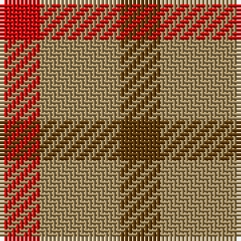

In pattern [GYR](/stripes/gyr/).

This was sourced from tartans-authority.  It is a [3 stripe tartan](/stripes/stripes3/).

Original link http://www.tartansauthority.com/tartan-ferret/display/5040/

## Thread count
R/10 LT20 T/10

## Palette
Each colour and the base-6 reference it is a variant of.

| Colour | Shade | Base |
|---|---|---|
| LT | <code style="background-color:#A08858;">#A08858</code> `oklch(63.7% 0.071 84.0)` <small>#A08858</small> | Y <code style="background-color:#F2BF00;">#F2BF00</code> |
| R | <code style="background-color:#C80000;">#C80000</code> `oklch(52.3% 0.215 29.2)` <small>#C80000</small> | R <code style="background-color:#CC0000;">#CC0000</code> |
| T | <code style="background-color:#603800;">#603800</code> `oklch(38.1% 0.084 66.7)` <small>#603800</small> | G <code style="background-color:#006100;">#006100</code> |

# Sample pattern

## Nearest tartans

The nearest existing variants by ΔTartan distance.

1. [Gearach Woodcock Tweed (Corporate)](/setts/s3/dy2t1lo1~x2/) — ΔT 1.32
1. [Glenmorangie Check](/setts/s3/dy1dy2r1~x10/) — ΔT 1.93
1. [Wilson's, No 207](/setts/s3/r2g2t1~x4/) — ΔT 2.03
1. [Wilson's, No 188](/setts/s3/r4g2t1~x4/) — ΔT 2.18
1. [Glenmorangie Check Corporate Tartan Tartan Number: 1663. Earliest known date: 1988 Accredited by the Scottish Tartans Society in 1988. Glenmorangie is a well known malt whisky. See products available Copyright © Blair Urquhart, Comrie, 2015](/setts/s3/dr1dr2r1~x10/) — ΔT 2.24
1. [Masai Shuka 19 (Artefact)](/setts/s3/b10r10r3~x2/) — ΔT 2.27
1. [Haggis Hostels](/setts/s4/r10t5o5n4~x8/) — ΔT 2.27
1. [Gow (Portrait)](/setts/s5/r3dg3r1db3r3~x12/) — ΔT 2.30
1. [Wilson's, No 61](/setts/s3/r4g7t4~x2/) — ΔT 2.33
1. [Wilson's No.188](/setts/s4/g2r4g2t1~x4/) — ΔT 2.34

## Neighbour map

Every grey dot is one of 14299 variants placed by the first two principal components of the ΔTartan feature space (44% of its variance). Red is this tartan; blue dots are its nearest — click one to open its page.

<svg viewBox="0 0 640 380" role="img" style="max-width:100%;height:auto;border:1px solid #e0e0e0;border-radius:4px;display:block" xmlns="http://www.w3.org/2000/svg"><image href="/nn/cloud.v1.png" width="640" height="380"/><a href="/setts/s3/dy2t1lo1~x2/"><circle cx="224.7" cy="366.0" r="4" fill="#3465a4"><title>Gearach Woodcock Tweed (Corporate)</title></circle></a><a href="/setts/s3/dy1dy2r1~x10/"><circle cx="295.9" cy="366.0" r="4" fill="#3465a4"><title>Glenmorangie Check</title></circle></a><a href="/setts/s3/r2g2t1~x4/"><circle cx="158.4" cy="366.0" r="4" fill="#3465a4"><title>Wilson's, No 207</title></circle></a><a href="/setts/s3/r4g2t1~x4/"><circle cx="308.6" cy="316.3" r="4" fill="#3465a4"><title>Wilson's, No 188</title></circle></a><a href="/setts/s3/dr1dr2r1~x10/"><circle cx="299.2" cy="366.0" r="4" fill="#3465a4"><title>Glenmorangie Check Corporate Tartan Tartan Number: 1663. Earliest known date: 1988 Accredited by the Scottish Tartans Society in 1988. Glenmorangie is a well known malt whisky. See products available Copyright © Blair Urquhart, Comrie, 2015</title></circle></a><a href="/setts/s3/b10r10r3~x2/"><circle cx="237.7" cy="338.1" r="4" fill="#3465a4"><title>Masai Shuka 19 (Artefact)</title></circle></a><a href="/setts/s4/r10t5o5n4~x8/"><circle cx="178.3" cy="344.1" r="4" fill="#3465a4"><title>Haggis Hostels</title></circle></a><a href="/setts/s5/r3dg3r1db3r3~x12/"><circle cx="240.9" cy="342.4" r="4" fill="#3465a4"><title>Gow (Portrait)</title></circle></a><a href="/setts/s3/r4g7t4~x2/"><circle cx="175.1" cy="366.0" r="4" fill="#3465a4"><title>Wilson's, No 61</title></circle></a><a href="/setts/s4/g2r4g2t1~x4/"><circle cx="240.3" cy="313.7" r="4" fill="#3465a4"><title>Wilson's No.188</title></circle></a><circle cx="253.2" cy="366.0" r="5" fill="#c00000"/></svg>

ID: /setts/s3/dy1lo2r1~x10/
