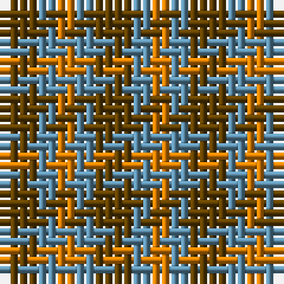

This page is one **sett** — a single exact thread-count. It belongs to the [tartan](/tartans/dy2t1lo1/)
(the same proportion at any scale), whose colour order is pattern [GBY](/stripes/gby/).

Sourced from tartans-authority.  It is a [3 stripe tartan](/stripes/stripes3/).

Original link http://www.tartansauthority.com/tartan-ferret/display/7466/

2 attestations — the source records this cloth was collapsed from (oldest owns this page)

<ul>
<li>2007 — Gearach Woodcock Tweed (Corporate) (tartans-authority, <a href="http://www.tartansauthority.com/tartan-ferret/display/7466/">record</a>)</li>
<li>undated — Gearach Woodcock Tweed (register-of-tartans, <a href="https://www.tartanregister.gov.uk/tartanDetails.aspx?ref=5511">record</a>)</li>
</ul>

## Register references

External register numbers recorded for this tartan.

- Scottish Register of Tartans: [5511](https://www.tartanregister.gov.uk/tartanDetails.aspx?ref=5511)
- Scottish Tartans Authority (ITI): 7466

## Thread count
T/4 B2 O/2

## Palette

Palette: <strong>Tartan Register</strong>
<table><thead><tr><th>Colour</th><th>Threads</th><th>Shade</th><th>Base</th><th>OKLCh</th></tr></thead><tbody><tr><td>T/</td><td style="text-align:right;font-variant-numeric:tabular-nums">4</td><td><code style="background-color:#604000;">#604000</code> <small style="color:#888">#604000</small></td><td>G <code style="background-color:#006100;">#006100</code></td><td><small style="color:#888">oklch(39.8% 0.083 76.8)</small></td></tr><tr><td>B</td><td style="text-align:right;font-variant-numeric:tabular-nums">2</td><td><code style="background-color:#5C8CA8;">#5C8CA8</code> <small style="color:#888">#5C8CA8</small></td><td>B <code style="background-color:#2A418A;">#2A418A</code></td><td><small style="color:#888">oklch(61.7% 0.067 235.0)</small></td></tr><tr><td>O/</td><td style="text-align:right;font-variant-numeric:tabular-nums">2</td><td><code style="background-color:#D87C00;">#D87C00</code> <small style="color:#888">#D87C00</small></td><td>Y <code style="background-color:#F2BF00;">#F2BF00</code></td><td><small style="color:#888">oklch(67.3% 0.155 61.8)</small></td></tr></tbody></table>

# Sample pattern

## Nearest tartans

The nearest existing variants by ΔTartan distance, with this tartan at the top so the swatches line up against it.

ΔTartan

Tartan

Sett

—

<a href="/ttd/edit/#slug=dy2t1lo1~x2">Gearach Woodcock Tweed (Corporate)</a> <a class="nn-out" href="/setts/s3/dy2t1lo1~x2/" title="open its dictionary page">↗</a>

1.11

<a href="/ttd/edit/#slug=r2g2t1~x4">Wilson's, No 207</a> <a class="nn-out" href="/setts/s3/r2g2t1~x4/" title="open its dictionary page">↗</a>

1.17

<a href="/ttd/edit/#slug=r4g7t4~x2">Wilson's, No 61</a> <a class="nn-out" href="/setts/s3/r4g7t4~x2/" title="open its dictionary page">↗</a>

1.31

<a href="/ttd/edit/#slug=dy1lo2r1~x10">Glenmorangie Check (Corporate)</a> <a class="nn-out" href="/setts/s3/dy1lo2r1~x10/" title="open its dictionary page">↗</a>

1.58

<a href="/ttd/edit/#slug=g2r2g2t1~x4">Wilson's No.207</a> <a class="nn-out" href="/setts/s4/g2r2g2t1~x4/" title="open its dictionary page">↗</a>

1.59

<a href="/ttd/edit/#slug=g7t2r4~x2">Wilson's, No 208</a> <a class="nn-out" href="/setts/s3/g7t2r4~x2/" title="open its dictionary page">↗</a>

1.61

<a href="/ttd/edit/#slug=r4dg7t4~x2">Wilson's No.061</a> <a class="nn-out" href="/setts/s3/r4dg7t4~x2/" title="open its dictionary page">↗</a>

1.69

<a href="/ttd/edit/#slug=g2r4g2t1~x4">Wilson's No.188</a> <a class="nn-out" href="/setts/s4/g2r4g2t1~x4/" title="open its dictionary page">↗</a>

1.79

<a href="/ttd/edit/#slug=g7k4r4~x2">Wilson's No.202</a> <a class="nn-out" href="/setts/s3/g7k4r4~x2/" title="open its dictionary page">↗</a>

1.89

<a href="/setts/s4/g7t2r4~x2/">Wilson's No.208</a>

1.94

<a href="/ttd/edit/#slug=lo28r24dg55dp19~x2">Hirstwood (Name)</a> <a class="nn-out" href="/setts/s4/lo28r24dg55dp19~x2/" title="open its dictionary page">↗</a>

## Neighbour map

Every grey dot is one of 14359 variants placed by the first two principal components of the ΔTartan feature space (44% of its variance). Red is this tartan; blue dots are its nearest — click one to open its page.

<svg viewBox="0 0 640 380" role="img" style="max-width:100%;height:auto;border:1px solid #e0e0e0;border-radius:4px;display:block" xmlns="http://www.w3.org/2000/svg"><image href="/nn/cloud.v1.png" width="640" height="380"/><a href="/setts/s3/r2g2t1~x4/"><circle cx="158.1" cy="366.0" r="4" fill="#3465a4"><title>Wilson's, No 207</title></circle></a><a href="/setts/s3/r4g7t4~x2/"><circle cx="174.8" cy="366.0" r="4" fill="#3465a4"><title>Wilson's, No 61</title></circle></a><a href="/setts/s3/dy1lo2r1~x10/"><circle cx="252.7" cy="366.0" r="4" fill="#3465a4"><title>Glenmorangie Check (Corporate)</title></circle></a><a href="/setts/s4/g2r2g2t1~x4/"><circle cx="226.6" cy="366.0" r="4" fill="#3465a4"><title>Wilson's No.207</title></circle></a><a href="/setts/s3/g7t2r4~x2/"><circle cx="268.2" cy="340.4" r="4" fill="#3465a4"><title>Wilson's, No 208</title></circle></a><a href="/setts/s3/r4dg7t4~x2/"><circle cx="161.6" cy="366.0" r="4" fill="#3465a4"><title>Wilson's No.061</title></circle></a><a href="/setts/s4/g2r4g2t1~x4/"><circle cx="239.7" cy="315.2" r="4" fill="#3465a4"><title>Wilson's No.188</title></circle></a><a href="/setts/s3/g7k4r4~x2/"><circle cx="159.8" cy="366.0" r="4" fill="#3465a4"><title>Wilson's No.202</title></circle></a><a href="/setts/s4/g7t2r4~x2/"><circle cx="225.5" cy="317.8" r="4" fill="#3465a4"><title>Wilson's No.208</title></circle></a><a href="/setts/s4/lo28r24dg55dp19~x2/"><circle cx="162.8" cy="322.4" r="4" fill="#3465a4"><title>Hirstwood (Name)</title></circle></a><circle cx="224.3" cy="366.0" r="5" fill="#c00000"/></svg>

ID: /setts/s3/dy2t1lo1~x2/
