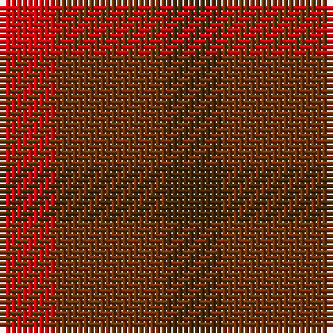

In pattern [GGR](/patterns/ggr/).

This was sourced from register-of-tartans.  It is a [3 stripes tartan](/stripes/stripes3/).

Original link https://www.tartanregister.gov.uk/tartanDetails.aspx?ref=1426

## Thread count
R/10 Ta20 T/10

## Palette
Each colour and its ΔE from the base-6 reference it is a variant of.

| Colour | Shade | Base | ΔE (OKLab) |
|---|---|---|---|
| R | <code style="background-color:#DC0000;">#DC0000</code> `#DC0000` | R <code style="background-color:#CC0000;">#CC0000</code> | 0.03 |
| T | <code style="background-color:#482800;">#482800</code> `#482800` | G <code style="background-color:#006100;">#006100</code> | 0.19 |
| Ta | <code style="background-color:#703200;">#703200</code> `#703200` | G <code style="background-color:#006100;">#006100</code> | 0.18 |

# Sample pattern

## Nearest tartans

The nearest existing variants by ΔTartan distance.

1. [Glenmorangie Check Corporate Tartan Tartan Number: 1663. Earliest known date: 1988 Accredited by the Scottish Tartans Society in 1988. Glenmorangie is a well known malt whisky. See products available Copyright © Blair Urquhart, Comrie, 2015](/setts/s3/b10ba20r10-b480800-ba603030-rc80000/) — ΔT 0.76
1. [Glenmorangie Check (Corporate)](/setts/s3/g10y20r10-g603800-rc80000-ya08858/) — ΔT 1.89
1. [Haggis Hostels](/setts/s4/r80b40ra40ba32-b5c8ca8-ba5c5c5c-r800028-ra888888/) — ΔT 2.82
1. [Gearach Woodcock Tweed (Corporate)](/setts/s3/g2b1y1-b5c8ca8-g604000-yd87c00/) — ΔT 2.88
1. [Blairgowrie Berries and Cherries](/setts/s5/b8g8r8ra24ba8-b440044-ba680028-g006818-ra00000-ra901c38/) — ΔT 2.89
1. [Belladrum Estate](/setts/s5/r32g8ga48gb24r16-g003820-ga5c6428-gb767e52-rb03000/) — ΔT 3.03
1. [Blairgowrie Berries and Cherries](/setts/s5/b4r12ra4g4ba4-b4c0000-ba5a008c-g5c6428-r800028-rac8002c/) — ΔT 3.08
1. [Gow (Portrait)](/setts/s5/r36b36r12g36r36-b1c1c50-g285800-rb40000/) — ΔT 3.09
1. [Mowbray (Personal)](/setts/s5/b32r4b20r28ba10-b5c5c5c-ba5c8ca8-r880000/) — ΔT 3.18
1. [Masai Shuka 19 (Artefact)](/setts/s3/b20r20ra6-b1474b4-rc80000-raac0000/) — ΔT 3.30

## Neighbour map

Every grey dot is one of 15726 variants placed by the first two principal components of the ΔTartan feature space (44% of its variance). Red is this tartan; blue dots are its nearest — click one to open its page.

<svg viewBox="0 0 640 380" role="img" style="max-width:100%;height:auto;border:1px solid #e0e0e0;border-radius:4px;display:block" xmlns="http://www.w3.org/2000/svg"><image href="/nn/cloud.v1.png" width="640" height="380"/><a href="/setts/s3/b10ba20r10-b480800-ba603030-rc80000/"><circle cx="302.6" cy="366.0" r="4" fill="#3465a4"><title>Glenmorangie Check Corporate Tartan Tartan Number: 1663. Earliest known date: 1988 Accredited by the Scottish Tartans Society in 1988. Glenmorangie is a well known malt whisky. See products available Copyright © Blair Urquhart, Comrie, 2015</title></circle></a><a href="/setts/s3/g10y20r10-g603800-rc80000-ya08858/"><circle cx="257.2" cy="366.0" r="4" fill="#3465a4"><title>Glenmorangie Check (Corporate)</title></circle></a><a href="/setts/s4/r80b40ra40ba32-b5c8ca8-ba5c5c5c-r800028-ra888888/"><circle cx="179.1" cy="340.2" r="4" fill="#3465a4"><title>Haggis Hostels</title></circle></a><a href="/setts/s3/g2b1y1-b5c8ca8-g604000-yd87c00/"><circle cx="227.8" cy="366.0" r="4" fill="#3465a4"><title>Gearach Woodcock Tweed (Corporate)</title></circle></a><a href="/setts/s5/b8g8r8ra24ba8-b440044-ba680028-g006818-ra00000-ra901c38/"><circle cx="227.8" cy="301.8" r="4" fill="#3465a4"><title>Blairgowrie Berries and Cherries</title></circle></a><a href="/setts/s5/r32g8ga48gb24r16-g003820-ga5c6428-gb767e52-rb03000/"><circle cx="273.6" cy="306.5" r="4" fill="#3465a4"><title>Belladrum Estate</title></circle></a><a href="/setts/s5/b4r12ra4g4ba4-b4c0000-ba5a008c-g5c6428-r800028-rac8002c/"><circle cx="210.3" cy="290.4" r="4" fill="#3465a4"><title>Blairgowrie Berries and Cherries</title></circle></a><a href="/setts/s5/r36b36r12g36r36-b1c1c50-g285800-rb40000/"><circle cx="244.1" cy="342.2" r="4" fill="#3465a4"><title>Gow (Portrait)</title></circle></a><a href="/setts/s5/b32r4b20r28ba10-b5c5c5c-ba5c8ca8-r880000/"><circle cx="398.5" cy="310.3" r="4" fill="#3465a4"><title>Mowbray (Personal)</title></circle></a><a href="/setts/s3/b20r20ra6-b1474b4-rc80000-raac0000/"><circle cx="240.2" cy="337.8" r="4" fill="#3465a4"><title>Masai Shuka 19 (Artefact)</title></circle></a><circle cx="299.7" cy="366.0" r="5" fill="#c00000"/></svg>

ID: /setts/s3/g10ga20r10-g482800-ga703200-rdc0000/
