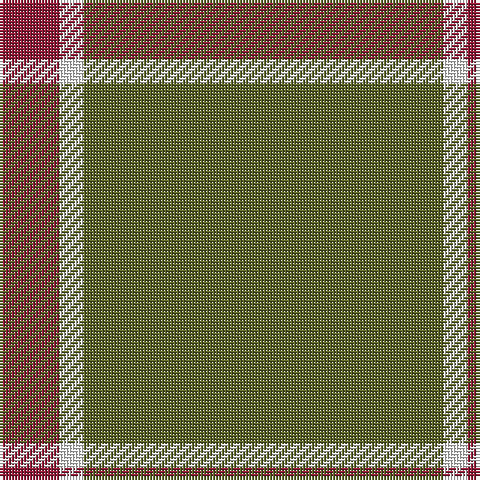

In pattern [GWR](/patterns/gwr/).

This was sourced from tartans-authority.  It is a [3 stripes tartan](/stripes/stripes3/).

Original link http://www.tartansauthority.com/tartan-ferret/display/6227/

## Thread count
DR/20 W8 G/120

## Palette
Each colour and its ΔE from the base-6 reference it is a variant of.

| Colour | Shade | Base | ΔE (OKLab) |
|---|---|---|---|
| DR | <code style="background-color:#901C38;">#901C38</code> `#901C38` | R <code style="background-color:#C80000;">#C80000</code> | 0.12 |
| G | <code style="background-color:#5C6428;">#5C6428</code> `#5C6428` | G <code style="background-color:#006400;">#006400</code> | 0.09 |
| W | <code style="background-color:#FCFCFC;">#FCFCFC</code> `#FCFCFC` | W <code style="background-color:#F4F4F0;">#F4F4F0</code> | 0.03 |

# Sample pattern

ID: /setts/s3/g120w8r20-g5c6428-r901c38-wfcfcfc/
