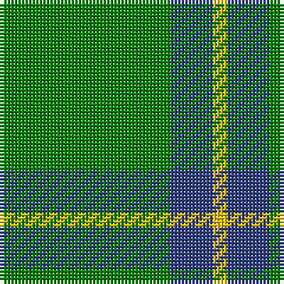

This page is one **sett** — a single exact thread-count. It belongs to the [tartan](/tartans/g12b3y1/)
(the same proportion at any scale), whose colour order is pattern [GBY](/stripes/gby/).

Sourced from weddslist.  It is a [3 stripe tartan](/stripes/stripes3/).

Original link http://www.weddslist.com/cgi-bin/tartans/pg.pl?source=sts

## Also known as

This cloth is also recorded under:

- Unidentified, pattern

## Thread count
G/48 B12 Y/4

## Palette
Each colour and the base-6 reference it is a variant of.

| Colour | Shade | Base |
|---|---|---|
| B | <code style="background-color:#304080;">#304080</code> `oklch(39.4% 0.109 270.2)` <small>#304080</small> | B <code style="background-color:#2A418A;">#2A418A</code> |
| G | <code style="background-color:#008000;">#008000</code> `oklch(52.0% 0.177 142.5)` <small>#008000</small> | G <code style="background-color:#006100;">#006100</code> |
| Y | <code style="background-color:#F0C000;">#F0C000</code> `oklch(82.7% 0.169 90.5)` <small>#F0C000</small> | Y <code style="background-color:#F2BF00;">#F2BF00</code> |

# Sample pattern

## Nearest tartans

The nearest existing variants by ΔTartan distance, with this tartan at the top so the swatches line up against it.

ΔTartan

Tartan

Sett

—

<a href="/ttd/edit/#slug=g12db3ly1~x4">Unidentified, pattern</a> <a class="nn-out" href="/setts/s3/g12db3ly1~x4/" title="open its dictionary page">↗</a>

1.07

<a href="/ttd/edit/#slug=g49w4lo11~x2">Hibernian S3</a> <a class="nn-out" href="/setts/s3/g49w4lo11~x2/" title="open its dictionary page">↗</a>

1.36

<a href="/ttd/edit/#slug=g7r3g23m7~x2">Highland Spring (Green)</a> <a class="nn-out" href="/setts/s4/g7r3g23m7~x2/" title="open its dictionary page">↗</a>

1.44

<a href="/ttd/edit/#slug=g81r10ly20~x2">McMoosie</a> <a class="nn-out" href="/setts/s3/g81r10ly20~x2/" title="open its dictionary page">↗</a>

1.46

<a href="/setts/s4/g12db3g1~x2/">Montgomerie</a>

1.58

<a href="/ttd/edit/#slug=dg12db3ly1~x4">Unidentified pattern #2</a> <a class="nn-out" href="/setts/s3/dg12db3ly1~x4/" title="open its dictionary page">↗</a>

1.70

<a href="/ttd/edit/#slug=dp7g23r3g7~x2">Highland Spring (1997) (Corporate)</a> <a class="nn-out" href="/setts/s4/dp7g23r3g7~x2/" title="open its dictionary page">↗</a>

1.78

<a href="/ttd/edit/#slug=r2g1r1g11w1~x8">Welsh, National</a> <a class="nn-out" href="/setts/s5/r2g1r1g11w1~x8/" title="open its dictionary page">↗</a>

1.80

<a href="/ttd/edit/#slug=g9o4ly1~x4">Ledford Family Tartan Tartan Number: 835. Earliest known date: 1987 A quantity of this cloth was woven in 1998 for a Ledford family in the USA. See products available Copyright © Blair Urquhart, Comrie, 2015</a> <a class="nn-out" href="/setts/s3/g9o4ly1~x4/" title="open its dictionary page">↗</a>

1.82

<a href="/ttd/edit/#slug=g50k6db11g25ly4~x2">Glen of Daviot (Dalgleish)</a> <a class="nn-out" href="/setts/s5/g50k6db11g25ly4~x2/" title="open its dictionary page">↗</a>

1.85

<a href="/ttd/edit/#slug=g9o20g46lg5~x2">O'Neill, Red (Corporate?)</a> <a class="nn-out" href="/setts/s4/g9o20g46lg5~x2/" title="open its dictionary page">↗</a>

## Neighbour map

Every grey dot is one of 14299 variants placed by the first two principal components of the ΔTartan feature space (44% of its variance). Red is this tartan; blue dots are its nearest — click one to open its page.

<svg viewBox="0 0 640 380" role="img" style="max-width:100%;height:auto;border:1px solid #e0e0e0;border-radius:4px;display:block" xmlns="http://www.w3.org/2000/svg"><image href="/nn/cloud.v1.png" width="640" height="380"/><a href="/setts/s3/g49w4lo11~x2/"><circle cx="492.4" cy="257.0" r="4" fill="#3465a4"><title>Hibernian S3</title></circle></a><a href="/setts/s4/g7r3g23m7~x2/"><circle cx="474.2" cy="288.5" r="4" fill="#3465a4"><title>Highland Spring (Green)</title></circle></a><a href="/setts/s3/g81r10ly20~x2/"><circle cx="441.5" cy="273.7" r="4" fill="#3465a4"><title>McMoosie</title></circle></a><a href="/setts/s4/g12db3g1~x2/"><circle cx="486.0" cy="285.2" r="4" fill="#3465a4"><title>Montgomerie</title></circle></a><a href="/setts/s3/dg12db3ly1~x4/"><circle cx="516.3" cy="286.5" r="4" fill="#3465a4"><title>Unidentified pattern #2</title></circle></a><a href="/setts/s4/dp7g23r3g7~x2/"><circle cx="471.7" cy="289.2" r="4" fill="#3465a4"><title>Highland Spring (1997) (Corporate)</title></circle></a><a href="/setts/s5/r2g1r1g11w1~x8/"><circle cx="491.4" cy="219.6" r="4" fill="#3465a4"><title>Welsh, National</title></circle></a><a href="/setts/s3/g9o4ly1~x4/"><circle cx="415.8" cy="303.5" r="4" fill="#3465a4"><title>Ledford Family Tartan Tartan Number: 835. Earliest known date: 1987 A quantity of this cloth was woven in 1998 for a Ledford family in the USA. See products available Copyright © Blair Urquhart, Comrie, 2015</title></circle></a><a href="/setts/s5/g50k6db11g25ly4~x2/"><circle cx="462.7" cy="229.3" r="4" fill="#3465a4"><title>Glen of Daviot (Dalgleish)</title></circle></a><a href="/setts/s4/g9o20g46lg5~x2/"><circle cx="463.7" cy="288.5" r="4" fill="#3465a4"><title>O'Neill, Red (Corporate?)</title></circle></a><circle cx="495.9" cy="275.1" r="5" fill="#c00000"/></svg>

ID: /setts/s3/g12db3ly1~x4/
