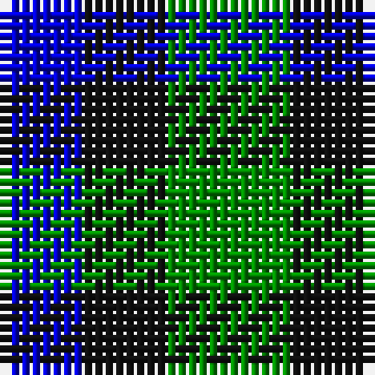

In pattern [BKG](/patterns/bkg/).

This was sourced from register-of-tartans.  It is a [3 stripes tartan](/stripes/stripes3/).

Original link https://www.tartanregister.gov.uk/tartanDetails.aspx?ref=5457

## Thread count
B/8 K8 G/12

## Palette
Each colour and its ΔE from the base-6 reference it is a variant of.

| Colour | Shade | Base | ΔE (OKLab) |
|---|---|---|---|
| B | <code style="background-color:#0000CD;">#0000CD</code> `#0000CD` | B <code style="background-color:#2A418A;">#2A418A</code> | 0.14 |
| G | <code style="background-color:#008B00;">#008B00</code> `#008B00` | G <code style="background-color:#006100;">#006100</code> | 0.13 |
| K | <code style="background-color:#101010;">#101010</code> `#101010` | K <code style="background-color:#000000;">#000000</code> | 0.17 |

# Sample pattern

## Nearest tartans

The nearest existing variants by ΔTartan distance.

1. [Glen Lyon (District)](/setts/s3/k10g8b6-b2888c4-g006818-k101010/) — ΔT 0.94
1. [Glen Lyon](/setts/s3/g12k8b8-b304080-g30a010-k000000/) — ΔT 1.15
1. [Mull (District)](/setts/s3/k10g8b6-b5c8ca8-g006818-k101010/) — ΔT 1.19
1. [Wilson's, No 52](/setts/s3/g14k8b8-b5480b0-g008000-k000000/) — ΔT 1.37
1. [Wilson's No.052](/setts/s3/g14k8b8-b2888c4-g006818-k101010/) — ΔT 1.38
1. [Shepherd, Derek (Wandering)](/setts/s5/w40k40g40w20k20-g008040-k0a0a0a-w7aa9dd/) — ΔT 1.69
1. [Glen Lyon](/setts/s3/b16g14k16-b304080-g008000-k000000/) — ΔT 1.86
1. [Mull](/setts/s3/k10g8b4-b5c8ca8-g006818-k101010/) — ΔT 1.87
1. [Mull, or Glenlyon](/setts/s3/k10g8b4-b5480b0-g008000-k000000/) — ΔT 1.96
1. [Kazakhstan Relic (Artefact)](/setts/s3/y20b20k12-b202060-k101010-ybc8c00/) — ΔT 1.97

## Neighbour map

Every grey dot is one of 15726 variants placed by the first two principal components of the ΔTartan feature space (44% of its variance). Red is this tartan; blue dots are its nearest — click one to open its page.

<svg viewBox="0 0 640 380" role="img" style="max-width:100%;height:auto;border:1px solid #e0e0e0;border-radius:4px;display:block" xmlns="http://www.w3.org/2000/svg"><image href="/nn/cloud.v1.png" width="640" height="380"/><a href="/setts/s3/k10g8b6-b2888c4-g006818-k101010/"><circle cx="112.9" cy="366.0" r="4" fill="#3465a4"><title>Glen Lyon (District)</title></circle></a><a href="/setts/s3/g12k8b8-b304080-g30a010-k000000/"><circle cx="78.4" cy="366.0" r="4" fill="#3465a4"><title>Glen Lyon</title></circle></a><a href="/setts/s3/k10g8b6-b5c8ca8-g006818-k101010/"><circle cx="115.2" cy="366.0" r="4" fill="#3465a4"><title>Mull (District)</title></circle></a><a href="/setts/s3/g14k8b8-b5480b0-g008000-k000000/"><circle cx="119.0" cy="366.0" r="4" fill="#3465a4"><title>Wilson's, No 52</title></circle></a><a href="/setts/s3/g14k8b8-b2888c4-g006818-k101010/"><circle cx="154.4" cy="366.0" r="4" fill="#3465a4"><title>Wilson's No.052</title></circle></a><a href="/setts/s5/w40k40g40w20k20-g008040-k0a0a0a-w7aa9dd/"><circle cx="81.4" cy="343.5" r="4" fill="#3465a4"><title>Shepherd, Derek (Wandering)</title></circle></a><a href="/setts/s3/b16g14k16-b304080-g008000-k000000/"><circle cx="24.7" cy="366.0" r="4" fill="#3465a4"><title>Glen Lyon</title></circle></a><a href="/setts/s3/k10g8b4-b5c8ca8-g006818-k101010/"><circle cx="178.8" cy="366.0" r="4" fill="#3465a4"><title>Mull</title></circle></a><a href="/setts/s3/k10g8b4-b5480b0-g008000-k000000/"><circle cx="141.5" cy="360.0" r="4" fill="#3465a4"><title>Mull, or Glenlyon</title></circle></a><a href="/setts/s3/y20b20k12-b202060-k101010-ybc8c00/"><circle cx="96.5" cy="366.0" r="4" fill="#3465a4"><title>Kazakhstan Relic (Artefact)</title></circle></a><circle cx="90.0" cy="366.0" r="5" fill="#c00000"/></svg>

ID: /setts/s3/g12k8b8-b0000cd-g008b00-k101010/
