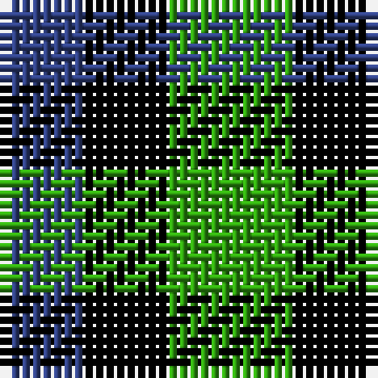

In pattern [BKG](/patterns/bkg/).

This was sourced from weddslist.  It is a [3 stripes tartan](/stripes/stripes3/).

Original link http://www.weddslist.com/cgi-bin/tartans/pg.pl?source=sts

## Thread count
B/8 K8 G/12

## Palette
Each colour and its ΔE from the base-6 reference it is a variant of.

| Colour | Shade | Base | ΔE (OKLab) |
|---|---|---|---|
| B | <code style="background-color:#304080;">#304080</code> `#304080` | B <code style="background-color:#2C4084;">#2C4084</code> | 0.01 |
| G | <code style="background-color:#30A010;">#30A010</code> `#30A010` | G <code style="background-color:#006400;">#006400</code> | 0.19 |
| K | <code style="background-color:#000000;">#000000</code> `#000000` | K <code style="background-color:#000000;">#000000</code> | 0.00 |

# Sample pattern

## Nearest tartans

The nearest existing variants by ΔTartan distance.

1. [Wilson's, No 52](/setts/s3/g14k8b8-b5480b0-g008000-k000000/) — ΔT 0.79
1. [Glenlyon #2](/setts/s3/g12k8b8-b0000cd-g008b00-k101010/) — ΔT 1.15
1. [Mull (District)](/setts/s3/k10g8b6-b5c8ca8-g006818-k101010/) — ΔT 1.24
1. [Glen Lyon (District)](/setts/s3/k10g8b6-b2888c4-g006818-k101010/) — ΔT 1.25
1. [Mull, or Glenlyon](/setts/s3/k10g8b4-b5480b0-g008000-k000000/) — ΔT 1.46
1. [Wilson's No.052](/setts/s3/g14k8b8-b2888c4-g006818-k101010/) — ΔT 1.66
1. [Wilson's, No 202](/setts/s3/g14k8r8-g008000-k000000-rc00000/) — ΔT 1.70
1. [Kazakhstan Relic (Artefact)](/setts/s3/y20b20k12-b202060-k101010-ybc8c00/) — ΔT 1.77
1. [Glen Lyon](/setts/s3/b16g14k16-b304080-g008000-k000000/) — ΔT 1.82
1. [Glen Lyon, or Mull (No.53)](/setts/s3/k10g6b4-b5480b0-g008000-k000000/) — ΔT 1.82

## Neighbour map

Every grey dot is one of 15726 variants placed by the first two principal components of the ΔTartan feature space (44% of its variance). Red is this tartan; blue dots are its nearest — click one to open its page.

<svg viewBox="0 0 640 380" role="img" style="max-width:100%;height:auto;border:1px solid #e0e0e0;border-radius:4px;display:block" xmlns="http://www.w3.org/2000/svg"><image href="/nn/cloud.v1.png" width="640" height="380"/><a href="/setts/s3/g14k8b8-b5480b0-g008000-k000000/"><circle cx="119.0" cy="366.0" r="4" fill="#3465a4"><title>Wilson's, No 52</title></circle></a><a href="/setts/s3/g12k8b8-b0000cd-g008b00-k101010/"><circle cx="90.0" cy="366.0" r="4" fill="#3465a4"><title>Glenlyon #2</title></circle></a><a href="/setts/s3/k10g8b6-b5c8ca8-g006818-k101010/"><circle cx="115.2" cy="366.0" r="4" fill="#3465a4"><title>Mull (District)</title></circle></a><a href="/setts/s3/k10g8b6-b2888c4-g006818-k101010/"><circle cx="112.9" cy="366.0" r="4" fill="#3465a4"><title>Glen Lyon (District)</title></circle></a><a href="/setts/s3/k10g8b4-b5480b0-g008000-k000000/"><circle cx="141.5" cy="360.0" r="4" fill="#3465a4"><title>Mull, or Glenlyon</title></circle></a><a href="/setts/s3/g14k8b8-b2888c4-g006818-k101010/"><circle cx="154.4" cy="366.0" r="4" fill="#3465a4"><title>Wilson's No.052</title></circle></a><a href="/setts/s3/g14k8r8-g008000-k000000-rc00000/"><circle cx="128.5" cy="366.0" r="4" fill="#3465a4"><title>Wilson's, No 202</title></circle></a><a href="/setts/s3/y20b20k12-b202060-k101010-ybc8c00/"><circle cx="96.5" cy="366.0" r="4" fill="#3465a4"><title>Kazakhstan Relic (Artefact)</title></circle></a><a href="/setts/s3/b16g14k16-b304080-g008000-k000000/"><circle cx="24.7" cy="366.0" r="4" fill="#3465a4"><title>Glen Lyon</title></circle></a><a href="/setts/s3/k10g6b4-b5480b0-g008000-k000000/"><circle cx="165.5" cy="355.5" r="4" fill="#3465a4"><title>Glen Lyon, or Mull (No.53)</title></circle></a><circle cx="78.4" cy="366.0" r="5" fill="#c00000"/></svg>

ID: /setts/s3/g12k8b8-b304080-g30a010-k000000/
