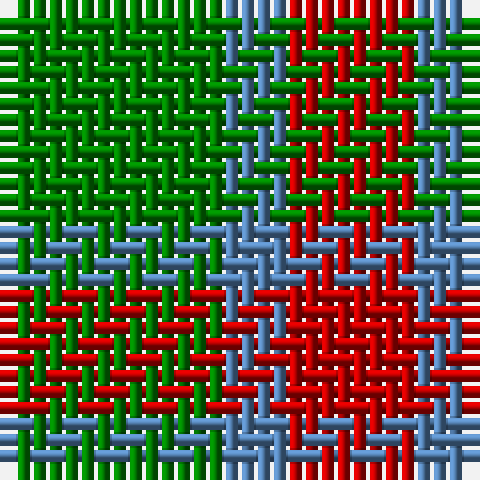

In pattern [GBR](/patterns/gbr/).

This was sourced from weddslist.  It is a [3 stripes tartan](/stripes/stripes3/).

Original link http://www.weddslist.com/cgi-bin/tartans/pg.pl?source=sts

## Thread count
G/14 B4 R/8

## Palette
Each colour and its ΔE from the base-6 reference it is a variant of.

| Colour | Shade | Base | ΔE (OKLab) |
|---|---|---|---|
| B | <code style="background-color:#5480B0;">#5480B0</code> `#5480B0` | B <code style="background-color:#2C4084;">#2C4084</code> | 0.20 |
| G | <code style="background-color:#008000;">#008000</code> `#008000` | G <code style="background-color:#006400;">#006400</code> | 0.09 |
| R | <code style="background-color:#C00000;">#C00000</code> `#C00000` | R <code style="background-color:#C80000;">#C80000</code> | 0.02 |

# Sample pattern

## Nearest tartans

The nearest existing variants by ΔTartan distance.

1. [Wilson's No.208](/setts/s4/g14b4r8b4-b2888c4-g006818-rc80000/) — ΔT 1.31
1. [Wilson's, No 201](/setts/s3/b8g16y4-b800080-g008000-yf0c000/) — ΔT 1.39
1. [Wilson's No.188](/setts/s4/g8r16g8b4-b2888c4-g006818-rc80000/) — ΔT 1.47
1. [Wilson's No.201](/setts/s3/b8g16y4-b440044-g006818-ye8c000/) — ΔT 1.55
1. [Gearach Woodcock Tweed (Corporate)](/setts/s3/g2b1y1-b5c8ca8-g604000-yd87c00/) — ΔT 1.58
1. [Royal Guard of Oman 4th Band Squadro](/setts/s4/g76r48k18r18-g006818-k101010-rc80000/) — ΔT 1.67
1. [Royal Guard of Oman 4th Band Squadron](/setts/s4/g76r48k18r18-g006400-k101010-r880000/) — ΔT 1.70
1. [Agnew](/setts/s3/b53g42r14-b304080-g008000-rc00000/) — ΔT 1.72
1. [Cub Scouts of America](/setts/s5/g40b8r32y8g20-b00008c-g146400-r8c0000-yc88c00/) — ΔT 1.74
1. [Wilson's No.212](/setts/s4/b8r8g36r8-b2888c4-g006818-rc80000/) — ΔT 1.76

## Neighbour map

Every grey dot is one of 15726 variants placed by the first two principal components of the ΔTartan feature space (44% of its variance). Red is this tartan; blue dots are its nearest — click one to open its page.

<svg viewBox="0 0 640 380" role="img" style="max-width:100%;height:auto;border:1px solid #e0e0e0;border-radius:4px;display:block" xmlns="http://www.w3.org/2000/svg"><image href="/nn/cloud.v1.png" width="640" height="380"/><a href="/setts/s4/g14b4r8b4-b2888c4-g006818-rc80000/"><circle cx="226.3" cy="314.8" r="4" fill="#3465a4"><title>Wilson's No.208</title></circle></a><a href="/setts/s3/b8g16y4-b800080-g008000-yf0c000/"><circle cx="263.4" cy="312.0" r="4" fill="#3465a4"><title>Wilson's, No 201</title></circle></a><a href="/setts/s4/g8r16g8b4-b2888c4-g006818-rc80000/"><circle cx="242.2" cy="313.6" r="4" fill="#3465a4"><title>Wilson's No.188</title></circle></a><a href="/setts/s3/b8g16y4-b440044-g006818-ye8c000/"><circle cx="266.3" cy="317.7" r="4" fill="#3465a4"><title>Wilson's No.201</title></circle></a><a href="/setts/s3/g2b1y1-b5c8ca8-g604000-yd87c00/"><circle cx="227.8" cy="366.0" r="4" fill="#3465a4"><title>Gearach Woodcock Tweed (Corporate)</title></circle></a><a href="/setts/s4/g76r48k18r18-g006818-k101010-rc80000/"><circle cx="260.2" cy="296.3" r="4" fill="#3465a4"><title>Royal Guard of Oman 4th Band Squadro</title></circle></a><a href="/setts/s4/g76r48k18r18-g006400-k101010-r880000/"><circle cx="287.6" cy="314.7" r="4" fill="#3465a4"><title>Royal Guard of Oman 4th Band Squadron</title></circle></a><a href="/setts/s3/b53g42r14-b304080-g008000-rc00000/"><circle cx="248.6" cy="343.9" r="4" fill="#3465a4"><title>Agnew</title></circle></a><a href="/setts/s5/g40b8r32y8g20-b00008c-g146400-r8c0000-yc88c00/"><circle cx="279.8" cy="280.0" r="4" fill="#3465a4"><title>Cub Scouts of America</title></circle></a><a href="/setts/s4/b8r8g36r8-b2888c4-g006818-rc80000/"><circle cx="344.4" cy="286.4" r="4" fill="#3465a4"><title>Wilson's No.212</title></circle></a><circle cx="270.8" cy="338.1" r="5" fill="#c00000"/></svg>

ID: /setts/s3/g14b4r8-b5480b0-g008000-rc00000/
