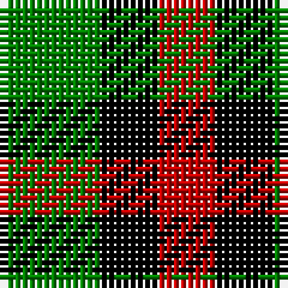

In pattern [GKR](/patterns/gkr/).

This was sourced from weddslist.  It is a [3 stripes tartan](/stripes/stripes3/).

Original link http://www.weddslist.com/cgi-bin/tartans/pg.pl?source=sts

## Thread count
G/14 K8 R/8

## Palette
Each colour and its ΔE from the base-6 reference it is a variant of.

| Colour | Shade | Base | ΔE (OKLab) |
|---|---|---|---|
| G | <code style="background-color:#008000;">#008000</code> `#008000` | G <code style="background-color:#006100;">#006100</code> | 0.10 |
| K | <code style="background-color:#000000;">#000000</code> `#000000` | K <code style="background-color:#000000;">#000000</code> | 0.00 |
| R | <code style="background-color:#C00000;">#C00000</code> `#C00000` | R <code style="background-color:#CC0000;">#CC0000</code> | 0.03 |

# Sample pattern

## Nearest tartans

The nearest existing variants by ΔTartan distance.

1. [Wilson's, No 94](/setts/s3/k10g8r4-g008000-k000000-rc00000/) — ΔT 1.14
1. [Wilson's, No 200](/setts/s3/g8k14r8-g008000-k000000-rc00000/) — ΔT 1.16
1. [Wilson's No.202](/setts/s3/g14k8r8-g006818-k101010-rc80000/) — ΔT 1.20
1. [Wilson's No.200](/setts/s3/g8k14r8-g006818-k101010-rc80000/) — ΔT 1.38
1. [Glen Lyon](/setts/s3/k12g10r4-g008000-k000000-rc00000/) — ΔT 1.46
1. [Wilson's, No 52](/setts/s3/g14k8b8-b5480b0-g008000-k000000/) — ΔT 1.59
1. [Glen Lyon](/setts/s3/g12k8b8-b304080-g30a010-k000000/) — ΔT 1.70
1. [Mull, or Glenlyon](/setts/s3/k10g8b4-b5480b0-g008000-k000000/) — ΔT 1.70
1. [Hage-West (Personal)](/setts/s6/g16k16g16y12k6y12-g003820-k101010-ye8c000/) — ΔT 1.72
1. [Wilson's No.094](/setts/s4/g8k10g8r4-g408060-k101010-rc80000/) — ΔT 1.77

## Neighbour map

Every grey dot is one of 15726 variants placed by the first two principal components of the ΔTartan feature space (44% of its variance). Red is this tartan; blue dots are its nearest — click one to open its page.

<svg viewBox="0 0 640 380" role="img" style="max-width:100%;height:auto;border:1px solid #e0e0e0;border-radius:4px;display:block" xmlns="http://www.w3.org/2000/svg"><image href="/nn/cloud.v1.png" width="640" height="380"/><a href="/setts/s3/k10g8r4-g008000-k000000-rc00000/"><circle cx="149.5" cy="356.0" r="4" fill="#3465a4"><title>Wilson's, No 94</title></circle></a><a href="/setts/s3/g8k14r8-g008000-k000000-rc00000/"><circle cx="131.3" cy="366.0" r="4" fill="#3465a4"><title>Wilson's, No 200</title></circle></a><a href="/setts/s3/g14k8r8-g006818-k101010-rc80000/"><circle cx="162.6" cy="366.0" r="4" fill="#3465a4"><title>Wilson's No.202</title></circle></a><a href="/setts/s3/g8k14r8-g006818-k101010-rc80000/"><circle cx="161.7" cy="366.0" r="4" fill="#3465a4"><title>Wilson's No.200</title></circle></a><a href="/setts/s3/k12g10r4-g008000-k000000-rc00000/"><circle cx="169.7" cy="343.3" r="4" fill="#3465a4"><title>Glen Lyon</title></circle></a><a href="/setts/s3/g14k8b8-b5480b0-g008000-k000000/"><circle cx="119.0" cy="366.0" r="4" fill="#3465a4"><title>Wilson's, No 52</title></circle></a><a href="/setts/s3/g12k8b8-b304080-g30a010-k000000/"><circle cx="78.4" cy="366.0" r="4" fill="#3465a4"><title>Glen Lyon</title></circle></a><a href="/setts/s3/k10g8b4-b5480b0-g008000-k000000/"><circle cx="141.5" cy="360.0" r="4" fill="#3465a4"><title>Mull, or Glenlyon</title></circle></a><a href="/setts/s6/g16k16g16y12k6y12-g003820-k101010-ye8c000/"><circle cx="97.3" cy="328.2" r="4" fill="#3465a4"><title>Hage-West (Personal)</title></circle></a><a href="/setts/s4/g8k10g8r4-g408060-k101010-rc80000/"><circle cx="202.2" cy="359.6" r="4" fill="#3465a4"><title>Wilson's No.094</title></circle></a><circle cx="128.5" cy="366.0" r="5" fill="#c00000"/></svg>

ID: /setts/s3/g14k8r8-g008000-k000000-rc00000/
