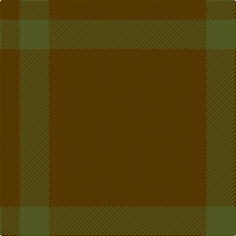

In pattern [GGG](/patterns/ggg/).

This was sourced from tartans-authority.  It is a [3 stripes tartan](/stripes/stripes3/).

Original link http://www.tartansauthority.com/tartan-ferret/display/5987/

## Thread count
T/20 G30 T/160

## Palette
Each colour and its ΔE from the base-6 reference it is a variant of.

| Colour | Shade | Base | ΔE (OKLab) |
|---|---|---|---|
| G | <code style="background-color:#5C6428;">#5C6428</code> `#5C6428` | G <code style="background-color:#006400;">#006400</code> | 0.09 |
| T | <code style="background-color:#604000;">#604000</code> `#604000` | G <code style="background-color:#006400;">#006400</code> | 0.14 |

# Sample pattern

ID: /setts/s3/g160ga30g20-g604000-ga5c6428/
