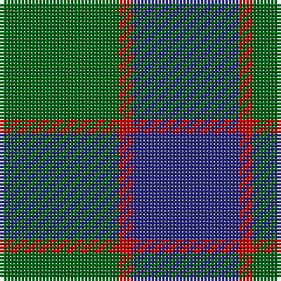

This page is one **sett** — a single exact thread-count. It belongs to the [tartan](/tartans/g17r2db15/)
(the same proportion at any scale), whose colour order is pattern [BRG](/stripes/brg/).

Sourced from tartans-authority.  It is a [3 stripe tartan](/stripes/stripes3/).

Original link http://www.tartansauthority.com/tartan-ferret/display/503/

## Also known as

This cloth is also recorded under:

- Ferguson,

3 attestations — the source records this cloth was collapsed from (oldest owns this page)

<ul>
<li>pre 1950 — Ferguson - 1930 (Old) (tartans-authority, <a href="http://www.tartansauthority.com/tartan-ferret/display/503/">record</a>)</li>
<li>undated — Ferguson, (Old) (weddslist, <a href="http://www.weddslist.com/cgi-bin/tartans/pg.pl?source=sts">record</a>)</li>
<li>undated — Ferguson (Old) Clan Tartan Tartan Number: 503. Earliest known date: 1830 Count revised by G. Newnham 1986 See products available Copyright © Blair Urquhart, Comrie, 2015 (house-of-tartan, <a href="http://www.house-of-tartan.scotland.net/house/TartanViewjs.asp?colr=Def&tnam=503">record</a>)</li>
</ul>

## Thread count
G/34 R4 DB/30

## Palette
Each colour and the base-6 reference it is a variant of.

| Colour | Shade | Base |
|---|---|---|
| DB | <code style="background-color:#2C2C80;">#2C2C80</code> `oklch(35.0% 0.138 276.6)` <small>#2C2C80</small> | B <code style="background-color:#2A418A;">#2A418A</code> |
| G | <code style="background-color:#006818;">#006818</code> `oklch(45.0% 0.142 145.0)` <small>#006818</small> | G <code style="background-color:#006100;">#006100</code> |
| R | <code style="background-color:#C80000;">#C80000</code> `oklch(52.3% 0.215 29.2)` <small>#C80000</small> | R <code style="background-color:#CC0000;">#CC0000</code> |

# Sample pattern

## Nearest tartans

The nearest existing variants by ΔTartan distance, with this tartan at the top so the swatches line up against it.

ΔTartan

Tartan

Sett

—

<a href="/ttd/edit/#slug=g17r2db15~x2">Ferguson - 1930 (Old)</a> <a class="nn-out" href="/setts/s3/g17r2db15~x2/" title="open its dictionary page">↗</a>

0.79

<a href="/ttd/edit/#slug=db6g5r1~x4">Ferguson</a> <a class="nn-out" href="/setts/s3/db6g5r1~x4/" title="open its dictionary page">↗</a>

0.86

<a href="/ttd/edit/#slug=db13r2g13~x2">Wilson's No 62, (Ferguson)</a> <a class="nn-out" href="/setts/s3/db13r2g13~x2/" title="open its dictionary page">↗</a>

1.00

<a href="/ttd/edit/#slug=db2dg7db7w1~x2">Unidentified No 78</a> <a class="nn-out" href="/setts/s4/db2dg7db7w1~x2/" title="open its dictionary page">↗</a>

1.06

<a href="/ttd/edit/#slug=db5g6r1~x4">Wilson's No 84, Ferguson</a> <a class="nn-out" href="/setts/s3/db5g6r1~x4/" title="open its dictionary page">↗</a>

1.09

<a href="/ttd/edit/#slug=g6dp5t1~x4">Wilson's No.055</a> <a class="nn-out" href="/setts/s3/g6dp5t1~x4/" title="open its dictionary page">↗</a>

1.28

<a href="/ttd/edit/#slug=db2g7db7w1~x2">Unnamed No 78</a> <a class="nn-out" href="/setts/s4/db2g7db7w1~x2/" title="open its dictionary page">↗</a>

1.29

<a href="/ttd/edit/#slug=db6dg5r1~x4">Ferguson</a> <a class="nn-out" href="/setts/s3/db6dg5r1~x4/" title="open its dictionary page">↗</a>

1.41

<a href="/setts/s4/db13r2g13~x2/">Wilson's No.062</a>

1.44

<a href="/ttd/edit/#slug=dg17r2db15~x2">Ferguson (Old)</a> <a class="nn-out" href="/setts/s3/dg17r2db15~x2/" title="open its dictionary page">↗</a>

1.46

<a href="/ttd/edit/#slug=db11g2db15g18w2~x2">Hamilton, hunting</a> <a class="nn-out" href="/setts/s5/db11g2db15g18w2~x2/" title="open its dictionary page">↗</a>

## Neighbour map

Every grey dot is one of 14299 variants placed by the first two principal components of the ΔTartan feature space (44% of its variance). Red is this tartan; blue dots are its nearest — click one to open its page.

<svg viewBox="0 0 640 380" role="img" style="max-width:100%;height:auto;border:1px solid #e0e0e0;border-radius:4px;display:block" xmlns="http://www.w3.org/2000/svg"><image href="/nn/cloud.v1.png" width="640" height="380"/><a href="/setts/s3/db6g5r1~x4/"><circle cx="293.4" cy="323.6" r="4" fill="#3465a4"><title>Ferguson</title></circle></a><a href="/setts/s3/db13r2g13~x2/"><circle cx="288.7" cy="320.2" r="4" fill="#3465a4"><title>Wilson's No 62, (Ferguson)</title></circle></a><a href="/setts/s4/db2dg7db7w1~x2/"><circle cx="333.1" cy="303.9" r="4" fill="#3465a4"><title>Unidentified No 78</title></circle></a><a href="/setts/s3/db5g6r1~x4/"><circle cx="291.6" cy="323.6" r="4" fill="#3465a4"><title>Wilson's No 84, Ferguson</title></circle></a><a href="/setts/s3/g6dp5t1~x4/"><circle cx="289.9" cy="319.0" r="4" fill="#3465a4"><title>Wilson's No.055</title></circle></a><a href="/setts/s4/db2g7db7w1~x2/"><circle cx="304.3" cy="287.4" r="4" fill="#3465a4"><title>Unnamed No 78</title></circle></a><a href="/setts/s3/db6dg5r1~x4/"><circle cx="331.1" cy="344.2" r="4" fill="#3465a4"><title>Ferguson</title></circle></a><a href="/setts/s4/db13r2g13~x2/"><circle cx="273.1" cy="284.4" r="4" fill="#3465a4"><title>Wilson's No.062</title></circle></a><a href="/setts/s3/dg17r2db15~x2/"><circle cx="365.7" cy="334.7" r="4" fill="#3465a4"><title>Ferguson (Old)</title></circle></a><a href="/setts/s5/db11g2db15g18w2~x2/"><circle cx="328.6" cy="270.2" r="4" fill="#3465a4"><title>Hamilton, hunting</title></circle></a><circle cx="326.9" cy="313.2" r="5" fill="#c00000"/></svg>

ID: /setts/s3/g17r2db15~x2/
