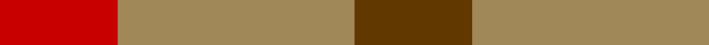

In pattern [GYR](/patterns/gyr/).

This was sourced from tartans-authority.  It is a [3 stripes tartan](/stripes/stripes3/).

Original link http://www.tartansauthority.com/tartan-ferret/display/5040/

## Thread count
R/10 LT20 T/10

## Palette
Each colour and its ΔE from the base-6 reference it is a variant of.

| Colour | Shade | Base | ΔE (OKLab) |
|---|---|---|---|
| LT | <code style="background-color:#A08858;">#A08858</code> `#A08858` | Y <code style="background-color:#F2BF00;">#F2BF00</code> | 0.21 |
| R | <code style="background-color:#C80000;">#C80000</code> `#C80000` | R <code style="background-color:#CC0000;">#CC0000</code> | 0.01 |
| T | <code style="background-color:#603800;">#603800</code> `#603800` | G <code style="background-color:#006100;">#006100</code> | 0.16 |

# Sample pattern

## Nearest tartans

The nearest existing variants by ΔTartan distance.

1. [Gearach Woodcock Tweed (Corporate)](/setts/s3/g2b1y1~b5c8ca8-g604000-yd87c00/) — ΔT 1.32
1. [Glenmorangie Check](/setts/s3/g1ga2r1x10~g482800-ga703200-rdc0000/) — ΔT 1.93
1. [Wilson's, No 207](/setts/s3/r2g2b1x4~b5480b0-g008000-rc00000/) — ΔT 2.03
1. [Wilson's, No 188](/setts/s3/r4g2b1x4~b5480b0-g008000-rc00000/) — ΔT 2.19
1. [Glenmorangie Check Corporate Tartan Tartan Number: 1663. Earliest known date: 1988 Accredited by the Scottish Tartans Society in 1988. Glenmorangie is a well known malt whisky. See products available Copyright © Blair Urquhart, Comrie, 2015](/setts/s3/b1ba2r1x10~b480800-ba603030-rc80000/) — ΔT 2.24
1. [Masai Shuka 19 (Artefact)](/setts/s3/b10r10ra3x2~b1474b4-rc80000-raac0000/) — ΔT 2.27
1. [Haggis Hostels](/setts/s4/r10b5ra5ba4x8~b5c8ca8-ba5c5c5c-r800028-ra888888/) — ΔT 2.27
1. [Gow (Portrait)](/setts/s5/r3b3r1g3r3x12~b1c1c50-g285800-rb40000/) — ΔT 2.30
1. [Wilson's, No 61](/setts/s3/b4g7r4x2~b5480b0-g008000-rc00000/) — ΔT 2.32
1. [Wilson's No.188](/setts/s4/g2r4g2b1x4~b2888c4-g006818-rc80000/) — ΔT 2.34

## Neighbour map

Every grey dot is one of 15726 variants placed by the first two principal components of the ΔTartan feature space (44% of its variance). Red is this tartan; blue dots are its nearest — click one to open its page.

<svg viewBox="0 0 640 380" role="img" style="max-width:100%;height:auto;border:1px solid #e0e0e0;border-radius:4px;display:block" xmlns="http://www.w3.org/2000/svg"><image href="/nn/cloud.v1.png" width="640" height="380"/><a href="/setts/s3/g2b1y1~b5c8ca8-g604000-yd87c00/"><circle cx="224.1" cy="366.0" r="4" fill="#3465a4"><title>Gearach Woodcock Tweed (Corporate)</title></circle></a><a href="/setts/s3/g1ga2r1x10~g482800-ga703200-rdc0000/"><circle cx="297.2" cy="366.0" r="4" fill="#3465a4"><title>Glenmorangie Check</title></circle></a><a href="/setts/s3/r2g2b1x4~b5480b0-g008000-rc00000/"><circle cx="157.4" cy="366.0" r="4" fill="#3465a4"><title>Wilson's, No 207</title></circle></a><a href="/setts/s3/r4g2b1x4~b5480b0-g008000-rc00000/"><circle cx="308.8" cy="319.4" r="4" fill="#3465a4"><title>Wilson's, No 188</title></circle></a><a href="/setts/s3/b1ba2r1x10~b480800-ba603030-rc80000/"><circle cx="300.3" cy="366.0" r="4" fill="#3465a4"><title>Glenmorangie Check Corporate Tartan Tartan Number: 1663. Earliest known date: 1988 Accredited by the Scottish Tartans Society in 1988. Glenmorangie is a well known malt whisky. See products available Copyright © Blair Urquhart, Comrie, 2015</title></circle></a><a href="/setts/s3/b10r10ra3x2~b1474b4-rc80000-raac0000/"><circle cx="237.3" cy="339.0" r="4" fill="#3465a4"><title>Masai Shuka 19 (Artefact)</title></circle></a><a href="/setts/s4/r10b5ra5ba4x8~b5c8ca8-ba5c5c5c-r800028-ra888888/"><circle cx="177.6" cy="338.4" r="4" fill="#3465a4"><title>Haggis Hostels</title></circle></a><a href="/setts/s5/r3b3r1g3r3x12~b1c1c50-g285800-rb40000/"><circle cx="240.8" cy="343.7" r="4" fill="#3465a4"><title>Gow (Portrait)</title></circle></a><a href="/setts/s3/b4g7r4x2~b5480b0-g008000-rc00000/"><circle cx="173.6" cy="366.0" r="4" fill="#3465a4"><title>Wilson's, No 61</title></circle></a><a href="/setts/s4/g2r4g2b1x4~b2888c4-g006818-rc80000/"><circle cx="239.4" cy="315.0" r="4" fill="#3465a4"><title>Wilson's No.188</title></circle></a><circle cx="253.9" cy="366.0" r="5" fill="#c00000"/></svg>

ID: /setts/s3/g1y2r1x10~g603800-rc80000-ya08858/
