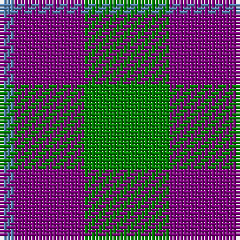

In pattern [BBG](/patterns/bbg/).

This was sourced from weddslist.  It is a [3 stripes tartan](/stripes/stripes3/).

Original link http://www.weddslist.com/cgi-bin/tartans/pg.pl?source=sts

## Thread count
B/4 P20 G/24

## Palette
Each colour and its ΔE from the base-6 reference it is a variant of.

| Colour | Shade | Base | ΔE (OKLab) |
|---|---|---|---|
| B | <code style="background-color:#5480B0;">#5480B0</code> `#5480B0` | B <code style="background-color:#2A418A;">#2A418A</code> | 0.19 |
| G | <code style="background-color:#008000;">#008000</code> `#008000` | G <code style="background-color:#006100;">#006100</code> | 0.10 |
| P | <code style="background-color:#800080;">#800080</code> `#800080` | B <code style="background-color:#2A418A;">#2A418A</code> | 0.17 |

# Sample pattern

## Nearest tartans

The nearest existing variants by ΔTartan distance.

1. [Wilson's, No 81](/setts/s3/b20g24y4-b800080-g008000-yf0c000/) — ΔT 0.67
1. [Wilson's No.055](/setts/s3/g24b20ba4-b440044-ba5c8ca8-g006818/) — ΔT 0.97
1. [Ferguson](/setts/s3/b24g20r4-b304080-g008000-rc00000/) — ΔT 1.20
1. [Agnew](/setts/s3/b53g42r14-b304080-g008000-rc00000/) — ΔT 1.28
1. [Wilson's No 62, (Ferguson)](/setts/s3/b26r4g26-b304080-g008000-rc00000/) — ΔT 1.39
1. [Wilson's No 84, Ferguson](/setts/s3/b20g24r4-b304080-g008000-rc00000/) — ΔT 1.39
1. [Agnew](/setts/s3/b106g84r28-b2c2c80-g006818-rc80000/) — ΔT 1.41
1. [Agnew Family Tartan Tartan Number: 182. Earliest known date: 1978 Nothing See products available Copyright © Blair Urquhart, Comrie, 2015](/setts/s3/b53g42r14-b2c2c80-g006818-rc80000/) — ΔT 1.41
1. [MacNab 7](/setts/s4/g30r6b22ba4-b800080-ba5480b0-g008000-rc00000/) — ΔT 1.46
1. [MacNab WI2](/setts/s4/g15r3b11w2-b5a3094-g004c00-rc80000-wd0d0d0/) — ΔT 1.49

## Neighbour map

Every grey dot is one of 15726 variants placed by the first two principal components of the ΔTartan feature space (44% of its variance). Red is this tartan; blue dots are its nearest — click one to open its page.

<svg viewBox="0 0 640 380" role="img" style="max-width:100%;height:auto;border:1px solid #e0e0e0;border-radius:4px;display:block" xmlns="http://www.w3.org/2000/svg"><image href="/nn/cloud.v1.png" width="640" height="380"/><a href="/setts/s3/b20g24y4-b800080-g008000-yf0c000/"><circle cx="261.0" cy="296.2" r="4" fill="#3465a4"><title>Wilson's, No 81</title></circle></a><a href="/setts/s3/g24b20ba4-b440044-ba5c8ca8-g006818/"><circle cx="290.1" cy="317.0" r="4" fill="#3465a4"><title>Wilson's No.055</title></circle></a><a href="/setts/s3/b24g20r4-b304080-g008000-rc00000/"><circle cx="293.4" cy="320.7" r="4" fill="#3465a4"><title>Ferguson</title></circle></a><a href="/setts/s3/b53g42r14-b304080-g008000-rc00000/"><circle cx="248.6" cy="343.9" r="4" fill="#3465a4"><title>Agnew</title></circle></a><a href="/setts/s3/b26r4g26-b304080-g008000-rc00000/"><circle cx="288.3" cy="317.1" r="4" fill="#3465a4"><title>Wilson's No 62, (Ferguson)</title></circle></a><a href="/setts/s3/b20g24r4-b304080-g008000-rc00000/"><circle cx="291.6" cy="320.7" r="4" fill="#3465a4"><title>Wilson's No 84, Ferguson</title></circle></a><a href="/setts/s3/b106g84r28-b2c2c80-g006818-rc80000/"><circle cx="252.6" cy="345.5" r="4" fill="#3465a4"><title>Agnew</title></circle></a><a href="/setts/s3/b53g42r14-b2c2c80-g006818-rc80000/"><circle cx="252.6" cy="345.5" r="4" fill="#3465a4"><title>Agnew Family Tartan Tartan Number: 182. Earliest known date: 1978 Nothing See products available Copyright © Blair Urquhart, Comrie, 2015</title></circle></a><a href="/setts/s4/g30r6b22ba4-b800080-ba5480b0-g008000-rc00000/"><circle cx="251.6" cy="248.0" r="4" fill="#3465a4"><title>MacNab 7</title></circle></a><a href="/setts/s4/g15r3b11w2-b5a3094-g004c00-rc80000-wd0d0d0/"><circle cx="252.1" cy="253.2" r="4" fill="#3465a4"><title>MacNab WI2</title></circle></a><circle cx="274.6" cy="304.3" r="5" fill="#c00000"/></svg>

ID: /setts/s3/g24b20ba4-b800080-ba5480b0-g008000/
