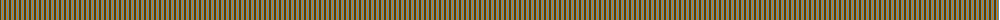
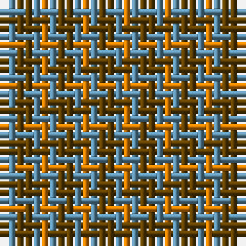

In pattern [GBY](/patterns/gby/).

This was sourced from tartans-authority.  It is a [3 stripes tartan](/stripes/stripes3/).

Original link http://www.tartansauthority.com/tartan-ferret/display/7466/

## Attestations

This cloth appears in 2 source records; the oldest owns this page.

- 2007 — Gearach Woodcock Tweed (Corporate) (tartans-authority, [record](http://www.tartansauthority.com/tartan-ferret/display/7466/))
- undated — Gearach Woodcock Tweed (register-of-tartans, [record](https://www.tartanregister.gov.uk/tartanDetails.aspx?ref=5511))

## Thread count
O/1 B1 T/2

## Palette
Each colour and its ΔE from the base-6 reference it is a variant of.

| Colour | Shade | Base | ΔE (OKLab) |
|---|---|---|---|
| B | <code style="background-color:#5C8CA8;">#5C8CA8</code> `#5C8CA8` | B <code style="background-color:#2C4084;">#2C4084</code> | 0.23 |
| O | <code style="background-color:#D87C00;">#D87C00</code> `#D87C00` | Y <code style="background-color:#E8C000;">#E8C000</code> | 0.17 |
| T | <code style="background-color:#604000;">#604000</code> `#604000` | G <code style="background-color:#006400;">#006400</code> | 0.14 |

# Sample pattern

ID: /setts/s3/g2b1y1-b5c8ca8-g604000-yd87c00/
