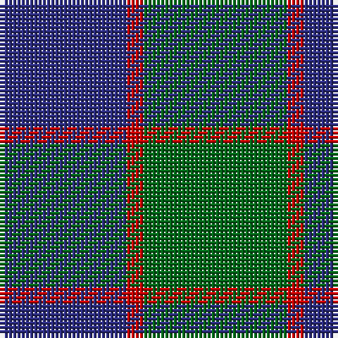

In pattern [BRG](/patterns/brg/).

This was sourced from tartans-authority.  It is a [3 stripes tartan](/stripes/stripes3/).

Original link http://www.tartansauthority.com/tartan-ferret/display/503/

## Attestations

This cloth appears in 2 source records; the oldest owns this page.

- pre 1950 — Ferguson - 1930 (Old) (tartans-authority, [record](http://www.tartansauthority.com/tartan-ferret/display/503/))
- undated — Ferguson (Old) Clan Tartan Tartan Number: 503. Earliest known date: 1830 Count revised by G. Newnham 1986 See products available Copyright © Blair Urquhart, Comrie, 2015 (house-of-tartan, [record](http://www.house-of-tartan.scotland.net/house/TartanViewjs.asp?colr=Def&tnam=503))

## Thread count
DB/30 R4 G/34

## Palette
Each colour and its ΔE from the base-6 reference it is a variant of.

| Colour | Shade | Base | ΔE (OKLab) |
|---|---|---|---|
| DB | <code style="background-color:#2C2C80;">#2C2C80</code> `#2C2C80` | B <code style="background-color:#2A418A;">#2A418A</code> | 0.06 |
| G | <code style="background-color:#006818;">#006818</code> `#006818` | G <code style="background-color:#006100;">#006100</code> | 0.02 |
| R | <code style="background-color:#C80000;">#C80000</code> `#C80000` | R <code style="background-color:#CC0000;">#CC0000</code> | 0.01 |

# Sample pattern

## Nearest tartans

The nearest existing variants by ΔTartan distance.

1. [Ferguson](/setts/s3/b24g20r4-b304080-g008000-rc00000/) — ΔT 0.78
1. [Ferguson, (Old)](/setts/s3/g34r4b30-b304080-g008000-rc00000/) — ΔT 0.82
1. [Wilson's No 62, (Ferguson)](/setts/s3/b26r4g26-b304080-g008000-rc00000/) — ΔT 0.85
1. [Unidentified No 78](/setts/s4/b4g14b14w2-b2c4084-g005020-we0e0e0/) — ΔT 1.00
1. [Wilson's No 84, Ferguson](/setts/s3/b20g24r4-b304080-g008000-rc00000/) — ΔT 1.06
1. [Wilson's No.055](/setts/s3/g24b20ba4-b440044-ba5c8ca8-g006818/) — ΔT 1.08
1. [Unnamed No 78](/setts/s4/b4g14b14w2-b304080-g008000-we0e0e0/) — ΔT 1.27
1. [Ferguson](/setts/s3/b24g20r4-b2c4084-g005020-rdc0000/) — ΔT 1.27
1. [Hamilton Hunting Clan Tartan Tartan Number: 139. Earliest known date: pre 2003 Sample presented to the Scottish Tartans Society by Wiebe Stodel. See products available Copyright © Blair Urquhart, Comrie, 2015](/setts/s5/b40g16b40g64w8-b2c2c80-g006818-we0e0e0/) — ΔT 1.29
1. [Ferguson (Old)](/setts/s3/g34r4b30-b2c4084-g005020-rdc0000/) — ΔT 1.40

## Neighbour map

Every grey dot is one of 15726 variants placed by the first two principal components of the ΔTartan feature space (44% of its variance). Red is this tartan; blue dots are its nearest — click one to open its page.

<svg viewBox="0 0 640 380" role="img" style="max-width:100%;height:auto;border:1px solid #e0e0e0;border-radius:4px;display:block" xmlns="http://www.w3.org/2000/svg"><image href="/nn/cloud.v1.png" width="640" height="380"/><a href="/setts/s3/b24g20r4-b304080-g008000-rc00000/"><circle cx="293.4" cy="320.7" r="4" fill="#3465a4"><title>Ferguson</title></circle></a><a href="/setts/s3/g34r4b30-b304080-g008000-rc00000/"><circle cx="317.9" cy="305.6" r="4" fill="#3465a4"><title>Ferguson, (Old)</title></circle></a><a href="/setts/s3/b26r4g26-b304080-g008000-rc00000/"><circle cx="288.3" cy="317.1" r="4" fill="#3465a4"><title>Wilson's No 62, (Ferguson)</title></circle></a><a href="/setts/s4/b4g14b14w2-b2c4084-g005020-we0e0e0/"><circle cx="331.8" cy="299.2" r="4" fill="#3465a4"><title>Unidentified No 78</title></circle></a><a href="/setts/s3/b20g24r4-b304080-g008000-rc00000/"><circle cx="291.6" cy="320.7" r="4" fill="#3465a4"><title>Wilson's No 84, Ferguson</title></circle></a><a href="/setts/s3/g24b20ba4-b440044-ba5c8ca8-g006818/"><circle cx="290.1" cy="317.0" r="4" fill="#3465a4"><title>Wilson's No.055</title></circle></a><a href="/setts/s4/b4g14b14w2-b304080-g008000-we0e0e0/"><circle cx="303.4" cy="285.2" r="4" fill="#3465a4"><title>Unnamed No 78</title></circle></a><a href="/setts/s3/b24g20r4-b2c4084-g005020-rdc0000/"><circle cx="330.7" cy="338.1" r="4" fill="#3465a4"><title>Ferguson</title></circle></a><a href="/setts/s5/b40g16b40g64w8-b2c2c80-g006818-we0e0e0/"><circle cx="287.7" cy="281.9" r="4" fill="#3465a4"><title>Hamilton Hunting Clan Tartan Tartan Number: 139. Earliest known date: pre 2003 Sample presented to the Scottish Tartans Society by Wiebe Stodel. See products available Copyright © Blair Urquhart, Comrie, 2015</title></circle></a><a href="/setts/s3/g34r4b30-b2c4084-g005020-rdc0000/"><circle cx="364.8" cy="327.5" r="4" fill="#3465a4"><title>Ferguson (Old)</title></circle></a><circle cx="326.2" cy="309.2" r="5" fill="#c00000"/></svg>

ID: /setts/s3/g34r4b30-b2c2c80-g006818-rc80000/
