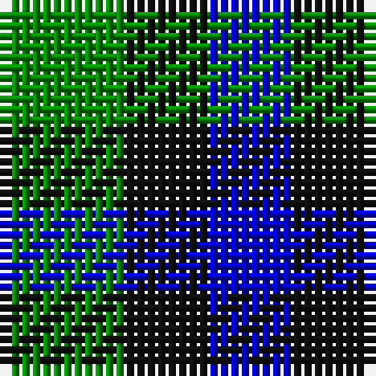

In pattern [BKG](/stripes/bkg/).

This was sourced from register-of-tartans.  It is a [3 stripe tartan](/stripes/stripes3/).

Original link https://www.tartanregister.gov.uk/tartanDetails.aspx?ref=5457

## Also known as

This cloth is also recorded under:

- Glenlyon #2

## Attestations

This cloth appears in 2 source records; the oldest owns this page.

- 01/01/1800 — Glenlyon #2 (register-of-tartans, [record](https://www.tartanregister.gov.uk/tartanDetails.aspx?ref=5457))
- undated — Glen Lyon (weddslist, [record](http://www.weddslist.com/cgi-bin/tartans/pg.pl?source=sts))

## Register references

External register numbers recorded for this tartan.

- Scottish Register of Tartans: [5457](https://www.tartanregister.gov.uk/tartanDetails.aspx?ref=5457)
- Scottish Tartans World Register: 15

## Thread count
G/12 K8 B/8

## Palette
Each colour and the base-6 reference it is a variant of.

| Colour | Shade | Base |
|---|---|---|
| B | <code style="background-color:#0000CD;">#0000CD</code> `oklch(38.3% 0.266 264.1)` <small>#0000CD</small> | B <code style="background-color:#2A418A;">#2A418A</code> |
| G | <code style="background-color:#008B00;">#008B00</code> `oklch(55.2% 0.188 142.5)` <small>#008B00</small> | G <code style="background-color:#006100;">#006100</code> |
| K | <code style="background-color:#101010;">#101010</code> `oklch(17.3% 0.000 89.9)` <small>#101010</small> | K <code style="background-color:#000000;">#000000</code> |

# Sample pattern

## Nearest tartans

The nearest existing variants by ΔTartan distance, with this tartan at the top so the swatches line up against it.

ΔTartan

Tartan

Sett

—

<a href="/ttd/edit/#slug=g3k2db2~x4">Glenlyon #2</a> <a class="nn-out" href="/setts/s3/g3k2db2~x4/" title="open its dictionary page">↗</a>

0.95

<a href="/ttd/edit/#slug=k5g4t3~x2">Glen Lyon (District)</a> <a class="nn-out" href="/setts/s3/k5g4t3~x2/" title="open its dictionary page">↗</a>

1.39

<a href="/ttd/edit/#slug=g7k4t4~x2">Wilson's No.052</a> <a class="nn-out" href="/setts/s3/g7k4t4~x2/" title="open its dictionary page">↗</a>

1.70

<a href="/ttd/edit/#slug=lb2k2g2lb1k1~x20">Shepherd, Derek (Wandering)</a> <a class="nn-out" href="/setts/s5/lb2k2g2lb1k1~x20/" title="open its dictionary page">↗</a>

1.87

<a href="/ttd/edit/#slug=k8g7db8~x2">Glen Lyon</a> <a class="nn-out" href="/setts/s3/k8g7db8~x2/" title="open its dictionary page">↗</a>

1.88

<a href="/ttd/edit/#slug=k5g4t2~x2">Mull</a> <a class="nn-out" href="/setts/s3/k5g4t2~x2/" title="open its dictionary page">↗</a>

1.98

<a href="/ttd/edit/#slug=lo5db5k3~x4">Kazakhstan Relic (Artefact)</a> <a class="nn-out" href="/setts/s3/lo5db5k3~x4/" title="open its dictionary page">↗</a>

2.20

<a href="/ttd/edit/#slug=k5g3t2~x2">Glen Lyon, or Mull (No.53)</a> <a class="nn-out" href="/setts/s3/k5g3t2~x2/" title="open its dictionary page">↗</a>

2.24

<a href="/ttd/edit/#slug=g4dp5g4t2~x2">Wilson's No.209</a> <a class="nn-out" href="/setts/s4/g4dp5g4t2~x2/" title="open its dictionary page">↗</a>

2.26

<a href="/setts/s4/lo5db5k3~x4/">Kazakhstan Relic</a>

2.34

<a href="/ttd/edit/#slug=g4k5g4r2~x2">Wilson's No.094</a> <a class="nn-out" href="/setts/s4/g4k5g4r2~x2/" title="open its dictionary page">↗</a>

## Neighbour map

Every grey dot is one of 14299 variants placed by the first two principal components of the ΔTartan feature space (44% of its variance). Red is this tartan; blue dots are its nearest — click one to open its page.

<svg viewBox="0 0 640 380" role="img" style="max-width:100%;height:auto;border:1px solid #e0e0e0;border-radius:4px;display:block" xmlns="http://www.w3.org/2000/svg"><image href="/nn/cloud.v1.png" width="640" height="380"/><a href="/setts/s3/k5g4t3~x2/"><circle cx="111.9" cy="366.0" r="4" fill="#3465a4"><title>Glen Lyon (District)</title></circle></a><a href="/setts/s3/g7k4t4~x2/"><circle cx="153.6" cy="366.0" r="4" fill="#3465a4"><title>Wilson's No.052</title></circle></a><a href="/setts/s5/lb2k2g2lb1k1~x20/"><circle cx="81.5" cy="342.4" r="4" fill="#3465a4"><title>Shepherd, Derek (Wandering)</title></circle></a><a href="/setts/s3/k8g7db8~x2/"><circle cx="23.0" cy="366.0" r="4" fill="#3465a4"><title>Glen Lyon</title></circle></a><a href="/setts/s3/k5g4t2~x2/"><circle cx="178.2" cy="366.0" r="4" fill="#3465a4"><title>Mull</title></circle></a><a href="/setts/s3/lo5db5k3~x4/"><circle cx="94.3" cy="366.0" r="4" fill="#3465a4"><title>Kazakhstan Relic (Artefact)</title></circle></a><a href="/setts/s3/k5g3t2~x2/"><circle cx="165.0" cy="354.5" r="4" fill="#3465a4"><title>Glen Lyon, or Mull (No.53)</title></circle></a><a href="/setts/s4/g4dp5g4t2~x2/"><circle cx="217.4" cy="366.0" r="4" fill="#3465a4"><title>Wilson's No.209</title></circle></a><a href="/setts/s4/lo5db5k3~x4/"><circle cx="171.7" cy="366.0" r="4" fill="#3465a4"><title>Kazakhstan Relic</title></circle></a><a href="/setts/s4/g4k5g4r2~x2/"><circle cx="200.2" cy="359.2" r="4" fill="#3465a4"><title>Wilson's No.094</title></circle></a><circle cx="89.4" cy="366.0" r="5" fill="#c00000"/></svg>

ID: /setts/s3/g3k2db2~x4/
