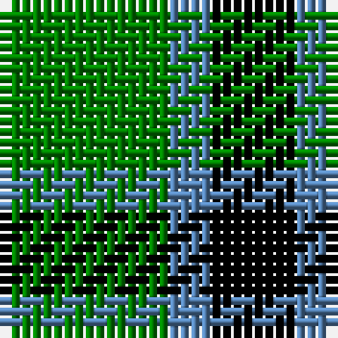

In pattern [GBK](/patterns/gbk/).

This was sourced from weddslist.  It is a [3 stripes tartan](/stripes/stripes3/).

Original link http://www.weddslist.com/cgi-bin/tartans/pg.pl?source=sts

## Thread count
G/16 B4 K/8

## Palette
Each colour and its ΔE from the base-6 reference it is a variant of.

| Colour | Shade | Base | ΔE (OKLab) |
|---|---|---|---|
| B | <code style="background-color:#5480B0;">#5480B0</code> `#5480B0` | B <code style="background-color:#2A418A;">#2A418A</code> | 0.19 |
| G | <code style="background-color:#008000;">#008000</code> `#008000` | G <code style="background-color:#006100;">#006100</code> | 0.10 |
| K | <code style="background-color:#000000;">#000000</code> `#000000` | K <code style="background-color:#000000;">#000000</code> | 0.00 |

# Sample pattern

## Nearest tartans

The nearest existing variants by ΔTartan distance.

1. [Kincaid, of Kincaid](/setts/s3/k4g6r1~g008000-k000000-rc00000~x10/) — ΔT 1.03
1. [Wilson's, No 2/53 or Mull](/setts/s3/k5g4y1~g008000-k000000-yf0c000~x2/) — ΔT 1.27
1. [Wilson's No.201](/setts/s3/b2g4y1~b440044-g006818-ye8c000~x4/) — ΔT 1.34
1. [Wilson's, No 197](/setts/s3/g6y1k6~g008000-k000000-yf0c000~x4/) — ΔT 1.38
1. [Zwijnenberg, Frans (Personal)](/setts/s3/k23g8y8~g006818-k101010-yfccc00~x4/) — ΔT 1.40
1. [Wilson's, No 50](/setts/s3/g5k6b1~b5480b0-g008000-k000000~x4/) — ΔT 1.41
1. [Wilson's No.053 #2](/setts/s4/g4k5g4y1~g006818-k101010-yd8b000~x2/) — ΔT 1.52
1. [Kincaid](/setts/s3/k11g17r3~g004c00-k000000-rc80000/) — ΔT 1.75
1. [MacArthur](/setts/s5/k9g3k3g12y2~g006818-k101010-ye8c000~x4/) — ΔT 1.79
1. [Scotch Tape 2 (Corporate)](/setts/s4/k3g15k20y3~g006818-k101010-ye8c000~x2/) — ΔT 1.82

## Neighbour map

Every grey dot is one of 15726 variants placed by the first two principal components of the ΔTartan feature space (44% of its variance). Red is this tartan; blue dots are its nearest — click one to open its page.

<svg viewBox="0 0 640 380" role="img" style="max-width:100%;height:auto;border:1px solid #e0e0e0;border-radius:4px;display:block" xmlns="http://www.w3.org/2000/svg"><image href="/nn/cloud.v1.png" width="640" height="380"/><a href="/setts/s3/k4g6r1~g008000-k000000-rc00000~x10/"><circle cx="255.1" cy="304.3" r="4" fill="#3465a4"><title>Kincaid, of Kincaid</title></circle></a><a href="/setts/s3/k5g4y1~g008000-k000000-yf0c000~x2/"><circle cx="214.7" cy="314.8" r="4" fill="#3465a4"><title>Wilson's, No 2/53 or Mull</title></circle></a><a href="/setts/s3/b2g4y1~b440044-g006818-ye8c000~x4/"><circle cx="262.8" cy="320.9" r="4" fill="#3465a4"><title>Wilson's No.201</title></circle></a><a href="/setts/s3/g6y1k6~g008000-k000000-yf0c000~x4/"><circle cx="217.9" cy="305.4" r="4" fill="#3465a4"><title>Wilson's, No 197</title></circle></a><a href="/setts/s3/k23g8y8~g006818-k101010-yfccc00~x4/"><circle cx="238.9" cy="325.6" r="4" fill="#3465a4"><title>Zwijnenberg, Frans (Personal)</title></circle></a><a href="/setts/s3/g5k6b1~b5480b0-g008000-k000000~x4/"><circle cx="235.1" cy="310.1" r="4" fill="#3465a4"><title>Wilson's, No 50</title></circle></a><a href="/setts/s4/g4k5g4y1~g006818-k101010-yd8b000~x2/"><circle cx="277.0" cy="328.8" r="4" fill="#3465a4"><title>Wilson's No.053 #2</title></circle></a><a href="/setts/s3/k11g17r3~g004c00-k000000-rc80000/"><circle cx="280.8" cy="317.9" r="4" fill="#3465a4"><title>Kincaid</title></circle></a><a href="/setts/s5/k9g3k3g12y2~g006818-k101010-ye8c000~x4/"><circle cx="279.6" cy="279.6" r="4" fill="#3465a4"><title>MacArthur</title></circle></a><a href="/setts/s4/k3g15k20y3~g006818-k101010-ye8c000~x2/"><circle cx="309.2" cy="281.0" r="4" fill="#3465a4"><title>Scotch Tape 2 (Corporate)</title></circle></a><circle cx="239.3" cy="322.5" r="5" fill="#c00000"/></svg>

ID: /setts/s3/g4b1k2~b5480b0-g008000-k000000~x4/
