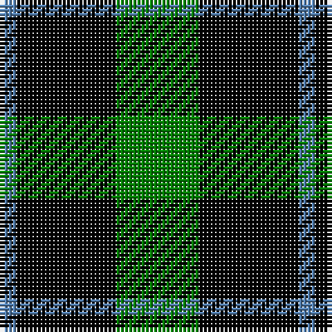

In pattern [BKG](/patterns/bkg/).

This was sourced from weddslist.  It is a [3 stripes tartan](/stripes/stripes3/).

Original link http://www.weddslist.com/cgi-bin/tartans/pg.pl?source=sts

## Thread count
B/4 K24 G/20

## Palette
Each colour and its ΔE from the base-6 reference it is a variant of.

| Colour | Shade | Base | ΔE (OKLab) |
|---|---|---|---|
| B | <code style="background-color:#5480B0;">#5480B0</code> `#5480B0` | B <code style="background-color:#2A418A;">#2A418A</code> | 0.19 |
| G | <code style="background-color:#008000;">#008000</code> `#008000` | G <code style="background-color:#006100;">#006100</code> | 0.10 |
| K | <code style="background-color:#000000;">#000000</code> `#000000` | K <code style="background-color:#000000;">#000000</code> | 0.00 |

# Sample pattern

## Nearest tartans

The nearest existing variants by ΔTartan distance.

1. [Wilson's, No 2/53 or Mull](/setts/s3/k5g4y1x2~g008000-k000000-yf0c000/) — ΔT 0.65
1. [Wilson's, No 197](/setts/s3/g6y1k6x4~g008000-k000000-yf0c000/) — ΔT 0.70
1. [Kincaid, of Kincaid](/setts/s3/k4g6r1x10~g008000-k000000-rc00000/) — ΔT 0.91
1. [Innes, hunting](/setts/s4/k30b7g36k5x2~b304080-g008000-k000000/) — ΔT 1.02
1. [Kincaid](/setts/s3/k11g17r3~g004c00-k000000-rc80000/) — ΔT 1.10
1. [Wallace Htg (Clan)](/setts/s4/k1g8k8y1x4~g006818-k000000-ydcbc00/) — ΔT 1.28
1. [Wallace, hunting](/setts/s4/k4g33k33y4x2~g008000-k000000-yf0c000/) — ΔT 1.35
1. [Wilson's, No 45](/setts/s3/g4b1k2x4~b5480b0-g008000-k000000/) — ΔT 1.41
1. [Kincaid](/setts/s3/k11g17r3x2~g11450d-k000000-raa0000/) — ΔT 1.44
1. [Kincaid](/setts/s3/k11g17r3~g11450d-k000000-raa0000/) — ΔT 1.44

## Neighbour map

Every grey dot is one of 15726 variants placed by the first two principal components of the ΔTartan feature space (44% of its variance). Red is this tartan; blue dots are its nearest — click one to open its page.

<svg viewBox="0 0 640 380" role="img" style="max-width:100%;height:auto;border:1px solid #e0e0e0;border-radius:4px;display:block" xmlns="http://www.w3.org/2000/svg"><image href="/nn/cloud.v1.png" width="640" height="380"/><a href="/setts/s3/k5g4y1x2~g008000-k000000-yf0c000/"><circle cx="214.7" cy="314.8" r="4" fill="#3465a4"><title>Wilson's, No 2/53 or Mull</title></circle></a><a href="/setts/s3/g6y1k6x4~g008000-k000000-yf0c000/"><circle cx="217.9" cy="305.4" r="4" fill="#3465a4"><title>Wilson's, No 197</title></circle></a><a href="/setts/s3/k4g6r1x10~g008000-k000000-rc00000/"><circle cx="255.1" cy="304.3" r="4" fill="#3465a4"><title>Kincaid, of Kincaid</title></circle></a><a href="/setts/s4/k30b7g36k5x2~b304080-g008000-k000000/"><circle cx="239.7" cy="274.3" r="4" fill="#3465a4"><title>Innes, hunting</title></circle></a><a href="/setts/s3/k11g17r3~g004c00-k000000-rc80000/"><circle cx="280.8" cy="317.9" r="4" fill="#3465a4"><title>Kincaid</title></circle></a><a href="/setts/s4/k1g8k8y1x4~g006818-k000000-ydcbc00/"><circle cx="277.3" cy="265.8" r="4" fill="#3465a4"><title>Wallace Htg (Clan)</title></circle></a><a href="/setts/s4/k4g33k33y4x2~g008000-k000000-yf0c000/"><circle cx="269.9" cy="260.4" r="4" fill="#3465a4"><title>Wallace, hunting</title></circle></a><a href="/setts/s3/g4b1k2x4~b5480b0-g008000-k000000/"><circle cx="239.3" cy="322.5" r="4" fill="#3465a4"><title>Wilson's, No 45</title></circle></a><a href="/setts/s3/k11g17r3x2~g11450d-k000000-raa0000/"><circle cx="292.4" cy="322.2" r="4" fill="#3465a4"><title>Kincaid</title></circle></a><a href="/setts/s3/k11g17r3~g11450d-k000000-raa0000/"><circle cx="292.4" cy="322.2" r="4" fill="#3465a4"><title>Kincaid</title></circle></a><circle cx="235.1" cy="310.1" r="5" fill="#c00000"/></svg>

ID: /setts/s3/g5k6b1x4~b5480b0-g008000-k000000/
