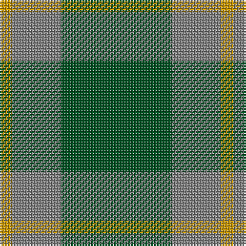

In pattern [GGY](/patterns/ggy/).

This was sourced from register-of-tartans.  It is a [3 stripes tartan](/stripes/stripes3/).

Original link https://www.tartanregister.gov.uk/tartanDetails.aspx?ref=2079

## Thread count
DY/8 N32 G/72

## Palette
Each colour and its ΔE from the base-6 reference it is a variant of.

| Colour | Shade | Base | ΔE (OKLab) |
|---|---|---|---|
| DY | <code style="background-color:#C89600;">#C89600</code> `#C89600` | Y <code style="background-color:#F2BF00;">#F2BF00</code> | 0.13 |
| G | <code style="background-color:#005020;">#005020</code> `#005020` | G <code style="background-color:#006100;">#006100</code> | 0.07 |
| N | <code style="background-color:#808080;">#808080</code> `#808080` | G <code style="background-color:#006100;">#006100</code> | 0.23 |

# Sample pattern

## Nearest tartans

The nearest existing variants by ΔTartan distance.

1. [Ledford Family Tartan Tartan Number: 835. Earliest known date: 1987 A quantity of this cloth was woven in 1998 for a Ledford family in the USA. See products available Copyright © Blair Urquhart, Comrie, 2015](/setts/s3/g36r16y4-g006818-r888888-ye8c000/) — ΔT 0.78
1. [O'Neill (Australia) (Name)](/setts/s4/g18r40g80w10-g006818-r98481c-we0e0e0/) — ΔT 1.07
1. [O'Neill, Red (Corporate?)](/setts/s4/g18r40g92y10-g006818-rb84c00-y48a4c0/) — ΔT 1.19
1. [Wilson's, No 212](/setts/s3/g36r8b8-b5480b0-g008000-rc00000/) — ΔT 1.52
1. [Montgomery](/setts/s4/g24b8g4b8-b2c2c80-g006818/) — ΔT 1.61
1. [Montgomery - 1842 (VS](/setts/s4/g48b16g8b16-b2c2c80-g006818/) — ΔT 1.61
1. [Unidentified pattern #2](/setts/s3/g48b12y4-b2c4084-g005020-ye8c000/) — ΔT 1.64
1. [Scotch Tape (Corporate)](/setts/s3/g60k40g6-g006818-k101010/) — ΔT 1.66
1. [Highland Spring (1997) (Corporate)](/setts/s4/b14g46r6g14-b440044-g006818-rc80000/) — ΔT 1.67
1. [Ferguson, (Old)](/setts/s3/g34r4b30-b304080-g008000-rc00000/) — ΔT 1.67

## Neighbour map

Every grey dot is one of 15726 variants placed by the first two principal components of the ΔTartan feature space (44% of its variance). Red is this tartan; blue dots are its nearest — click one to open its page.

<svg viewBox="0 0 640 380" role="img" style="max-width:100%;height:auto;border:1px solid #e0e0e0;border-radius:4px;display:block" xmlns="http://www.w3.org/2000/svg"><image href="/nn/cloud.v1.png" width="640" height="380"/><a href="/setts/s3/g36r16y4-g006818-r888888-ye8c000/"><circle cx="416.4" cy="299.3" r="4" fill="#3465a4"><title>Ledford Family Tartan Tartan Number: 835. Earliest known date: 1987 A quantity of this cloth was woven in 1998 for a Ledford family in the USA. See products available Copyright © Blair Urquhart, Comrie, 2015</title></circle></a><a href="/setts/s4/g18r40g80w10-g006818-r98481c-we0e0e0/"><circle cx="414.1" cy="283.8" r="4" fill="#3465a4"><title>O'Neill (Australia) (Name)</title></circle></a><a href="/setts/s4/g18r40g92y10-g006818-rb84c00-y48a4c0/"><circle cx="464.4" cy="283.7" r="4" fill="#3465a4"><title>O'Neill, Red (Corporate?)</title></circle></a><a href="/setts/s3/g36r8b8-b5480b0-g008000-rc00000/"><circle cx="416.3" cy="315.5" r="4" fill="#3465a4"><title>Wilson's, No 212</title></circle></a><a href="/setts/s4/g24b8g4b8-b2c2c80-g006818/"><circle cx="426.6" cy="325.5" r="4" fill="#3465a4"><title>Montgomery</title></circle></a><a href="/setts/s4/g48b16g8b16-b2c2c80-g006818/"><circle cx="426.6" cy="325.5" r="4" fill="#3465a4"><title>Montgomery - 1842 (VS</title></circle></a><a href="/setts/s3/g48b12y4-b2c4084-g005020-ye8c000/"><circle cx="516.4" cy="281.8" r="4" fill="#3465a4"><title>Unidentified pattern #2</title></circle></a><a href="/setts/s3/g60k40g6-g006818-k101010/"><circle cx="420.7" cy="320.1" r="4" fill="#3465a4"><title>Scotch Tape (Corporate)</title></circle></a><a href="/setts/s4/b14g46r6g14-b440044-g006818-rc80000/"><circle cx="472.9" cy="286.5" r="4" fill="#3465a4"><title>Highland Spring (1997) (Corporate)</title></circle></a><a href="/setts/s3/g34r4b30-b304080-g008000-rc00000/"><circle cx="317.9" cy="305.6" r="4" fill="#3465a4"><title>Ferguson, (Old)</title></circle></a><circle cx="421.9" cy="301.9" r="5" fill="#c00000"/></svg>

ID: /setts/s3/g72ga32y8-g005020-ga808080-yc89600/
