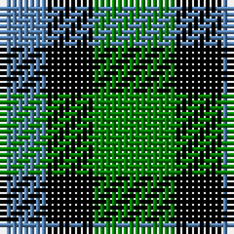

In pattern [BKG](/patterns/bkg/).

This was sourced from weddslist.  It is a [3 stripes tartan](/stripes/stripes3/).

Original link http://www.weddslist.com/cgi-bin/tartans/pg.pl?source=sts

## Thread count
B/8 K8 G/14

## Palette
Each colour and its ΔE from the base-6 reference it is a variant of.

| Colour | Shade | Base | ΔE (OKLab) |
|---|---|---|---|
| B | <code style="background-color:#5480B0;">#5480B0</code> `#5480B0` | B <code style="background-color:#2A418A;">#2A418A</code> | 0.19 |
| G | <code style="background-color:#008000;">#008000</code> `#008000` | G <code style="background-color:#006100;">#006100</code> | 0.10 |
| K | <code style="background-color:#000000;">#000000</code> `#000000` | K <code style="background-color:#000000;">#000000</code> | 0.00 |

# Sample pattern

## Nearest tartans

The nearest existing variants by ΔTartan distance.

1. [Glen Lyon](/setts/s3/g3k2b2x4~b304080-g30a010-k000000/) — ΔT 0.80
1. [Mull, or Glenlyon](/setts/s3/k5g4b2x2~b5480b0-g008000-k000000/) — ΔT 1.18
1. [Wilson's No.052](/setts/s3/g7k4b4x2~b2888c4-g006818-k101010/) — ΔT 1.33
1. [Glenlyon #2](/setts/s3/g3k2b2x4~b0000cd-g008b00-k101010/) — ΔT 1.37
1. [Mull (District)](/setts/s3/k5g4b3x2~b5c8ca8-g006818-k101010/) — ΔT 1.38
1. [Glen Lyon (District)](/setts/s3/k5g4b3x2~b2888c4-g006818-k101010/) — ΔT 1.41
1. [Mull](/setts/s3/k5g4b2x2~b5c8ca8-g006818-k101010/) — ΔT 1.46
1. [Glen Lyon, or Mull (No.53)](/setts/s3/k5g3b2x2~b5480b0-g008000-k000000/) — ΔT 1.51
1. [Glen Lyon or Mull (No.53) District Tartan Tartan Number: 24. Earliest known date: 1820 Appears to be No 185 in Wilson's '1819' See products available Copyright © Blair Urquhart, Comrie, 2015](/setts/s3/k5g3b2x2~b5c8ca8-g006818-k101010/) — ΔT 1.57
1. [Wilson's, No 202](/setts/s3/g7k4r4x2~g008000-k000000-rc00000/) — ΔT 1.59

## Neighbour map

Every grey dot is one of 15726 variants placed by the first two principal components of the ΔTartan feature space (44% of its variance). Red is this tartan; blue dots are its nearest — click one to open its page.

<svg viewBox="0 0 640 380" role="img" style="max-width:100%;height:auto;border:1px solid #e0e0e0;border-radius:4px;display:block" xmlns="http://www.w3.org/2000/svg"><image href="/nn/cloud.v1.png" width="640" height="380"/><a href="/setts/s3/g3k2b2x4~b304080-g30a010-k000000/"><circle cx="73.4" cy="366.0" r="4" fill="#3465a4"><title>Glen Lyon</title></circle></a><a href="/setts/s3/k5g4b2x2~b5480b0-g008000-k000000/"><circle cx="137.4" cy="362.9" r="4" fill="#3465a4"><title>Mull, or Glenlyon</title></circle></a><a href="/setts/s3/g7k4b4x2~b2888c4-g006818-k101010/"><circle cx="150.4" cy="366.0" r="4" fill="#3465a4"><title>Wilson's No.052</title></circle></a><a href="/setts/s3/g3k2b2x4~b0000cd-g008b00-k101010/"><circle cx="85.4" cy="366.0" r="4" fill="#3465a4"><title>Glenlyon #2</title></circle></a><a href="/setts/s3/k5g4b3x2~b5c8ca8-g006818-k101010/"><circle cx="110.8" cy="366.0" r="4" fill="#3465a4"><title>Mull (District)</title></circle></a><a href="/setts/s3/k5g4b3x2~b2888c4-g006818-k101010/"><circle cx="108.6" cy="366.0" r="4" fill="#3465a4"><title>Glen Lyon (District)</title></circle></a><a href="/setts/s3/k5g4b2x2~b5c8ca8-g006818-k101010/"><circle cx="175.1" cy="366.0" r="4" fill="#3465a4"><title>Mull</title></circle></a><a href="/setts/s3/k5g3b2x2~b5480b0-g008000-k000000/"><circle cx="161.4" cy="358.7" r="4" fill="#3465a4"><title>Glen Lyon, or Mull (No.53)</title></circle></a><a href="/setts/s3/k5g3b2x2~b5c8ca8-g006818-k101010/"><circle cx="195.8" cy="366.0" r="4" fill="#3465a4"><title>Glen Lyon or Mull (No.53) District Tartan Tartan Number: 24. Earliest known date: 1820 Appears to be No 185 in Wilson's '1819' See products available Copyright © Blair Urquhart, Comrie, 2015</title></circle></a><a href="/setts/s3/g7k4r4x2~g008000-k000000-rc00000/"><circle cx="123.6" cy="366.0" r="4" fill="#3465a4"><title>Wilson's, No 202</title></circle></a><circle cx="114.4" cy="366.0" r="5" fill="#c00000"/></svg>

ID: /setts/s3/g7k4b4x2~b5480b0-g008000-k000000/
