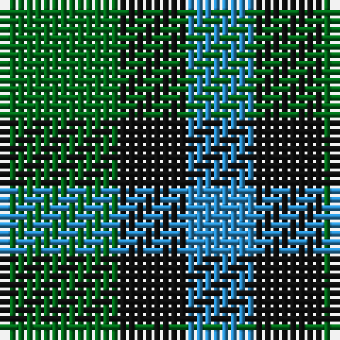

This page is one **sett** — a single exact thread-count. It belongs to the [tartan](/tartans/g7k4t4/)
(the same proportion at any scale), whose colour order is pattern [BKG](/stripes/bkg/).

Sourced from register-of-tartans.  It is a [3 stripe tartan](/stripes/stripes3/).

Original link https://www.tartanregister.gov.uk/tartanDetails.aspx?ref=4656

## Also known as

This cloth is also recorded under:

- Wilson's, No 52

2 attestations — the source records this cloth was collapsed from (oldest owns this page)

<ul>
<li>01/01/1819 — Wilson's No.052 (register-of-tartans, <a href="https://www.tartanregister.gov.uk/tartanDetails.aspx?ref=4656">record</a>)</li>
<li>undated — Wilson's, No 52 (weddslist, <a href="http://www.weddslist.com/cgi-bin/tartans/pg.pl?source=sts">record</a>)</li>
</ul>

## Register references

External register numbers recorded for this tartan.

- Scottish Register of Tartans: [4656](https://www.tartanregister.gov.uk/tartanDetails.aspx?ref=4656)
- Scottish Tartans Authority (ITI): 1930
- Scottish Tartans World Register: 1930

## Thread count
G/14 K8 B/8

## Palette

Palette: <strong>Tartan Register</strong>
<table><thead><tr><th>Colour</th><th>Threads</th><th>Shade</th><th>Base</th><th>OKLCh</th></tr></thead><tbody><tr><td>G/</td><td style="text-align:right;font-variant-numeric:tabular-nums">14</td><td><code style="background-color:#006818;">#006818</code> <small style="color:#888">#006818</small></td><td>G <code style="background-color:#006100;">#006100</code></td><td><small style="color:#888">oklch(45.0% 0.142 145.0)</small></td></tr><tr><td>K</td><td style="text-align:right;font-variant-numeric:tabular-nums">8</td><td><code style="background-color:#101010;">#101010</code> <small style="color:#888">#101010</small></td><td>K <code style="background-color:#000000;">#000000</code></td><td><small style="color:#888">oklch(17.3% 0.000 89.9)</small></td></tr><tr><td>B/</td><td style="text-align:right;font-variant-numeric:tabular-nums">8</td><td><code style="background-color:#2888C4;">#2888C4</code> <small style="color:#888">#2888C4</small></td><td>B <code style="background-color:#2A418A;">#2A418A</code></td><td><small style="color:#888">oklch(60.1% 0.125 241.5)</small></td></tr></tbody></table>

# Sample pattern

## Nearest tartans

The nearest existing variants by ΔTartan distance, with this tartan at the top so the swatches line up against it.

ΔTartan

Tartan

Sett

—

<a href="/ttd/edit/#slug=g7k4t4~x2">Wilson's No.052</a> <a class="nn-out" href="/setts/s3/g7k4t4~x2/" title="open its dictionary page">↗</a>

0.95

<a href="/ttd/edit/#slug=k5g4t3~x2">Glen Lyon (District)</a> <a class="nn-out" href="/setts/s3/k5g4t3~x2/" title="open its dictionary page">↗</a>

1.00

<a href="/ttd/edit/#slug=k5g4t2~x2">Mull</a> <a class="nn-out" href="/setts/s3/k5g4t2~x2/" title="open its dictionary page">↗</a>

1.36

<a href="/ttd/edit/#slug=g4dp5g4t2~x2">Wilson's No.209</a> <a class="nn-out" href="/setts/s4/g4dp5g4t2~x2/" title="open its dictionary page">↗</a>

1.39

<a href="/ttd/edit/#slug=g3k2db2~x4">Glenlyon #2</a> <a class="nn-out" href="/setts/s3/g3k2db2~x4/" title="open its dictionary page">↗</a>

1.68

<a href="/ttd/edit/#slug=g4k5g4r2~x2">Wilson's No.094</a> <a class="nn-out" href="/setts/s4/g4k5g4r2~x2/" title="open its dictionary page">↗</a>

1.77

<a href="/ttd/edit/#slug=r4dg7t4~x2">Wilson's No.061</a> <a class="nn-out" href="/setts/s3/r4dg7t4~x2/" title="open its dictionary page">↗</a>

1.80

<a href="/ttd/edit/#slug=db4g7k4g7ly4~x2">Daks (House)</a> <a class="nn-out" href="/setts/s5/db4g7k4g7ly4~x2/" title="open its dictionary page">↗</a>

1.83

<a href="/ttd/edit/#slug=r4g7t4~x2">Wilson's, No 61</a> <a class="nn-out" href="/setts/s3/r4g7t4~x2/" title="open its dictionary page">↗</a>

1.87

<a href="/ttd/edit/#slug=g7k4r4~x2">Wilson's No.202</a> <a class="nn-out" href="/setts/s3/g7k4r4~x2/" title="open its dictionary page">↗</a>

1.89

<a href="/setts/s4/k6g5r2~x2/">Glen Lyon #1</a>

## Neighbour map

Every grey dot is one of 14359 variants placed by the first two principal components of the ΔTartan feature space (44% of its variance). Red is this tartan; blue dots are its nearest — click one to open its page.

<svg viewBox="0 0 640 380" role="img" style="max-width:100%;height:auto;border:1px solid #e0e0e0;border-radius:4px;display:block" xmlns="http://www.w3.org/2000/svg"><image href="/nn/cloud.v1.png" width="640" height="380"/><a href="/setts/s3/k5g4t3~x2/"><circle cx="112.1" cy="366.0" r="4" fill="#3465a4"><title>Glen Lyon (District)</title></circle></a><a href="/setts/s3/k5g4t2~x2/"><circle cx="178.2" cy="366.0" r="4" fill="#3465a4"><title>Mull</title></circle></a><a href="/setts/s4/g4dp5g4t2~x2/"><circle cx="217.3" cy="366.0" r="4" fill="#3465a4"><title>Wilson's No.209</title></circle></a><a href="/setts/s3/g3k2db2~x4/"><circle cx="89.5" cy="366.0" r="4" fill="#3465a4"><title>Glenlyon #2</title></circle></a><a href="/setts/s4/g4k5g4r2~x2/"><circle cx="199.9" cy="361.1" r="4" fill="#3465a4"><title>Wilson's No.094</title></circle></a><a href="/setts/s3/r4dg7t4~x2/"><circle cx="161.6" cy="366.0" r="4" fill="#3465a4"><title>Wilson's No.061</title></circle></a><a href="/setts/s5/db4g7k4g7ly4~x2/"><circle cx="132.1" cy="348.3" r="4" fill="#3465a4"><title>Daks (House)</title></circle></a><a href="/setts/s3/r4g7t4~x2/"><circle cx="174.8" cy="366.0" r="4" fill="#3465a4"><title>Wilson's, No 61</title></circle></a><a href="/setts/s3/g7k4r4~x2/"><circle cx="159.8" cy="366.0" r="4" fill="#3465a4"><title>Wilson's No.202</title></circle></a><a href="/setts/s4/k6g5r2~x2/"><circle cx="243.2" cy="362.1" r="4" fill="#3465a4"><title>Glen Lyon #1</title></circle></a><circle cx="153.7" cy="366.0" r="5" fill="#c00000"/></svg>

ID: /setts/s3/g7k4t4~x2/
