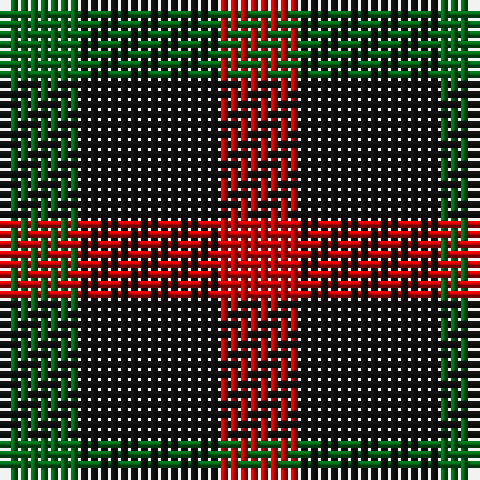

In pattern [GKR](/patterns/gkr/).

This was sourced from register-of-tartans.  It is a [3 stripes tartan](/stripes/stripes3/).

Original link https://www.tartanregister.gov.uk/tartanDetails.aspx?ref=4732

## Thread count
G/8 K14 R/8

## Palette
Each colour and its ΔE from the base-6 reference it is a variant of.

| Colour | Shade | Base | ΔE (OKLab) |
|---|---|---|---|
| DG | <code style="background-color:#003820;">#003820</code> `#003820` | G <code style="background-color:#006100;">#006100</code> | 0.15 |
| G | <code style="background-color:#006818;">#006818</code> `#006818` | G <code style="background-color:#006100;">#006100</code> | 0.02 |
| K | <code style="background-color:#101010;">#101010</code> `#101010` | K <code style="background-color:#000000;">#000000</code> | 0.17 |
| R | <code style="background-color:#C80000;">#C80000</code> `#C80000` | R <code style="background-color:#CC0000;">#CC0000</code> | 0.01 |

# Sample pattern

## Nearest tartans

The nearest existing variants by ΔTartan distance.

1. [Wilson's No.202](/setts/s3/g14k8r8-g006818-k101010-rc80000/) — ΔT 0.79
1. [Wilson's No.061](/setts/s3/b8g14r8-b5c8ca8-g003820-rc80000/) — ΔT 1.07
1. [Wilson's, No 200](/setts/s3/g8k14r8-g008000-k000000-rc00000/) — ΔT 1.24
1. [Wilson's No.198](/setts/s3/b8k14r8-b2888c4-k101010-rc80000/) — ΔT 1.27
1. [Allen, Nicholas (Personal)](/setts/s3/b42k84r42-b003c64-k101010-rc80000/) — ΔT 1.28
1. [Glen Lyon District Tartan Tartan Number: 23. Earliest known date: 1820 Appears to be No 185 in Wilson's '1819' See products available Copyright © Blair Urquhart, Comrie, 2015](/setts/s3/k12g10r4-g006818-k101010-rc80000/) — ΔT 1.35
1. [Wilson's, No 202](/setts/s3/g14k8r8-g008000-k000000-rc00000/) — ΔT 1.38
1. [Kazakhstan Relic (Artefact)](/setts/s3/y20b20k12-b202060-k101010-ybc8c00/) — ΔT 1.41
1. [Wilson's No.094](/setts/s4/g8k10g8r4-g408060-k101010-rc80000/) — ΔT 1.54
1. [Wilson's, No 94](/setts/s3/k10g8r4-g008000-k000000-rc00000/) — ΔT 1.59

## Neighbour map

Every grey dot is one of 15726 variants placed by the first two principal components of the ΔTartan feature space (44% of its variance). Red is this tartan; blue dots are its nearest — click one to open its page.

<svg viewBox="0 0 640 380" role="img" style="max-width:100%;height:auto;border:1px solid #e0e0e0;border-radius:4px;display:block" xmlns="http://www.w3.org/2000/svg"><image href="/nn/cloud.v1.png" width="640" height="380"/><a href="/setts/s3/g14k8r8-g006818-k101010-rc80000/"><circle cx="162.6" cy="366.0" r="4" fill="#3465a4"><title>Wilson's No.202</title></circle></a><a href="/setts/s3/b8g14r8-b5c8ca8-g003820-rc80000/"><circle cx="164.4" cy="366.0" r="4" fill="#3465a4"><title>Wilson's No.061</title></circle></a><a href="/setts/s3/g8k14r8-g008000-k000000-rc00000/"><circle cx="131.3" cy="366.0" r="4" fill="#3465a4"><title>Wilson's, No 200</title></circle></a><a href="/setts/s3/b8k14r8-b2888c4-k101010-rc80000/"><circle cx="144.7" cy="366.0" r="4" fill="#3465a4"><title>Wilson's No.198</title></circle></a><a href="/setts/s3/b42k84r42-b003c64-k101010-rc80000/"><circle cx="209.6" cy="366.0" r="4" fill="#3465a4"><title>Allen, Nicholas (Personal)</title></circle></a><a href="/setts/s3/k12g10r4-g006818-k101010-rc80000/"><circle cx="208.1" cy="356.0" r="4" fill="#3465a4"><title>Glen Lyon District Tartan Tartan Number: 23. Earliest known date: 1820 Appears to be No 185 in Wilson's '1819' See products available Copyright © Blair Urquhart, Comrie, 2015</title></circle></a><a href="/setts/s3/g14k8r8-g008000-k000000-rc00000/"><circle cx="128.5" cy="366.0" r="4" fill="#3465a4"><title>Wilson's, No 202</title></circle></a><a href="/setts/s3/y20b20k12-b202060-k101010-ybc8c00/"><circle cx="96.5" cy="366.0" r="4" fill="#3465a4"><title>Kazakhstan Relic (Artefact)</title></circle></a><a href="/setts/s4/g8k10g8r4-g408060-k101010-rc80000/"><circle cx="202.2" cy="359.6" r="4" fill="#3465a4"><title>Wilson's No.094</title></circle></a><a href="/setts/s3/k10g8r4-g008000-k000000-rc00000/"><circle cx="149.5" cy="356.0" r="4" fill="#3465a4"><title>Wilson's, No 94</title></circle></a><circle cx="161.7" cy="366.0" r="5" fill="#c00000"/></svg>

ID: /setts/s3/g8k14r8-g006818-k101010-rc80000/
