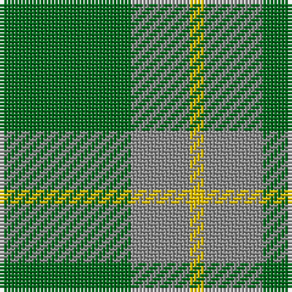

This page is one **sett** — a single exact thread-count. It belongs to the [tartan](/tartans/g9n4y1/)
(the same proportion at any scale), whose colour order is pattern [GRY](/stripes/gry/).

Sourced from house-of-tartan.  It is a [3 stripe tartan](/stripes/stripes3/).

Original link http://www.house-of-tartan.scotland.net/house/TartanViewjs.asp?colr=Def&tnam=835

## Thread count
G/36 N16 Y/4

## Palette
Each colour and the base-6 reference it is a variant of.

| Colour | Shade | Base |
|---|---|---|
| G | <code style="background-color:#006818;">#006818</code> `oklch(45.0% 0.142 145.0)` <small>#006818</small> | G <code style="background-color:#006100;">#006100</code> |
| N | <code style="background-color:#888888;">#888888</code> `oklch(62.7% 0.000 89.9)` <small>#888888</small> | R <code style="background-color:#CC0000;">#CC0000</code> |
| Y | <code style="background-color:#E8C000;">#E8C000</code> `oklch(81.9% 0.168 93.7)` <small>#E8C000</small> | Y <code style="background-color:#F2BF00;">#F2BF00</code> |

# Sample pattern

## Nearest tartans

The nearest existing variants by ΔTartan distance, with this tartan at the top so the swatches line up against it.

ΔTartan

Tartan

Sett

—

<a href="/ttd/edit/#slug=g9o4ly1~x4">Ledford Family Tartan Tartan Number: 835. Earliest known date: 1987 A quantity of this cloth was woven in 1998 for a Ledford family in the USA. See products available Copyright © Blair Urquhart, Comrie, 2015</a> <a class="nn-out" href="/setts/s3/g9o4ly1~x4/" title="open its dictionary page">↗</a>

0.78

<a href="/ttd/edit/#slug=dg9y4lo1~x8">Ledford</a> <a class="nn-out" href="/setts/s3/dg9y4lo1~x8/" title="open its dictionary page">↗</a>

0.98

<a href="/ttd/edit/#slug=g9o20g40w5~x2">O'Neill (Australia) (Name)</a> <a class="nn-out" href="/setts/s4/g9o20g40w5~x2/" title="open its dictionary page">↗</a>

1.11

<a href="/ttd/edit/#slug=g9o20g46lg5~x2">O'Neill, Red (Corporate?)</a> <a class="nn-out" href="/setts/s4/g9o20g46lg5~x2/" title="open its dictionary page">↗</a>

1.23

<a href="/ttd/edit/#slug=g9r2t2~x4">Wilson's, No 212</a> <a class="nn-out" href="/setts/s3/g9r2t2~x4/" title="open its dictionary page">↗</a>

1.31

<a href="/ttd/edit/#slug=g9lo20g40w5~x2">O'Neill</a> <a class="nn-out" href="/setts/s4/g9lo20g40w5~x2/" title="open its dictionary page">↗</a>

1.62

<a href="/ttd/edit/#slug=g56dy13lo13lo5~x2">Colonial Marine (Corporate)</a> <a class="nn-out" href="/setts/s4/g56dy13lo13lo5~x2/" title="open its dictionary page">↗</a>

1.65

<a href="/ttd/edit/#slug=g7r3g23m7~x2">Highland Spring (Green)</a> <a class="nn-out" href="/setts/s4/g7r3g23m7~x2/" title="open its dictionary page">↗</a>

1.71

<a href="/ttd/edit/#slug=o20g40w5g40o20g9~x2">O'Neill (Australia)</a> <a class="nn-out" href="/setts/s6/o20g40w5g40o20g9~x2/" title="open its dictionary page">↗</a>

1.73

<a href="/setts/s4/g12db3g1~x2/">Montgomerie</a>

1.79

<a href="/ttd/edit/#slug=g46o20g9o20g46lg5~x2">O'Neill, Red</a> <a class="nn-out" href="/setts/s6/g46o20g9o20g46lg5~x2/" title="open its dictionary page">↗</a>

## Neighbour map

Every grey dot is one of 14299 variants placed by the first two principal components of the ΔTartan feature space (44% of its variance). Red is this tartan; blue dots are its nearest — click one to open its page.

<svg viewBox="0 0 640 380" role="img" style="max-width:100%;height:auto;border:1px solid #e0e0e0;border-radius:4px;display:block" xmlns="http://www.w3.org/2000/svg"><image href="/nn/cloud.v1.png" width="640" height="380"/><a href="/setts/s3/dg9y4lo1~x8/"><circle cx="421.5" cy="306.5" r="4" fill="#3465a4"><title>Ledford</title></circle></a><a href="/setts/s4/g9o20g40w5~x2/"><circle cx="413.2" cy="286.9" r="4" fill="#3465a4"><title>O'Neill (Australia) (Name)</title></circle></a><a href="/setts/s4/g9o20g46lg5~x2/"><circle cx="463.7" cy="288.5" r="4" fill="#3465a4"><title>O'Neill, Red (Corporate?)</title></circle></a><a href="/setts/s3/g9r2t2~x4/"><circle cx="414.8" cy="318.5" r="4" fill="#3465a4"><title>Wilson's, No 212</title></circle></a><a href="/setts/s4/g9lo20g40w5~x2/"><circle cx="405.5" cy="281.2" r="4" fill="#3465a4"><title>O'Neill</title></circle></a><a href="/setts/s4/g56dy13lo13lo5~x2/"><circle cx="459.4" cy="280.9" r="4" fill="#3465a4"><title>Colonial Marine (Corporate)</title></circle></a><a href="/setts/s4/g7r3g23m7~x2/"><circle cx="474.2" cy="288.5" r="4" fill="#3465a4"><title>Highland Spring (Green)</title></circle></a><a href="/setts/s6/o20g40w5g40o20g9~x2/"><circle cx="421.9" cy="295.0" r="4" fill="#3465a4"><title>O'Neill (Australia)</title></circle></a><a href="/setts/s4/g12db3g1~x2/"><circle cx="486.0" cy="285.2" r="4" fill="#3465a4"><title>Montgomerie</title></circle></a><a href="/setts/s6/g46o20g9o20g46lg5~x2/"><circle cx="455.5" cy="286.0" r="4" fill="#3465a4"><title>O'Neill, Red</title></circle></a><circle cx="415.8" cy="303.5" r="5" fill="#c00000"/></svg>

ID: /setts/s3/g9o4ly1~x4/
